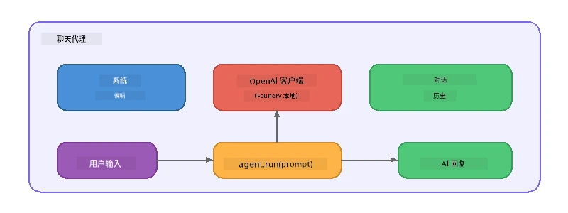

# 第五部分：使用代理框架构建 AI 代理

> **目标：** 使用 Foundry Local 通过本地模型构建带有持久指令和定义角色的第一个 AI 代理。

## 什么是 AI 代理？

AI 代理将语言模型与定义其行为、个性和限制的<strong>系统指令</strong>结合在一起。与单次聊天补全调用不同，代理提供：

- <strong>角色</strong> - 一致的身份（“你是一个有帮助的代码审查员”）
- <strong>记忆</strong> - 跨轮次的对话历史
- <strong>专门化</strong> - 由精心设计的指令驱动的聚焦行为



---

## Microsoft 代理框架

**Microsoft 代理框架**（AGF）提供跨不同模型后端工作的标准代理抽象。在本次研讨会上，我们将其与 Foundry Local 配合使用，因此所有内容都在您的机器上运行——无需云端。

| 概念 | 说明 |
|---------|-------------|
| `FoundryLocalClient` | Python：处理服务启动、模型下载/加载，并创建代理 |
| `client.as_agent()` | Python：从 Foundry Local 客户端创建代理 |
| `AsAIAgent()` | C#：`ChatClient` 的扩展方法 - 创建一个 `AIAgent` |
| `instructions` | 形成代理行为的系统提示 |
| `name` | 人类可读标签，多代理场景中非常有用 |
| `agent.run(prompt)` / `RunAsync()` | 发送用户消息并返回代理响应 |

> **备注：** 代理框架有 Python 和 .NET SDK。对于 JavaScript，我们实现了一个轻量级 `ChatAgent` 类，直接使用 OpenAI SDK 模拟相同模式。

---

## 练习

### 练习 1 - 理解代理模式

在编写代码之前，学习代理的关键组件：

1. <strong>模型客户端</strong> - 连接 Foundry Local 的兼容 OpenAI API
2. <strong>系统指令</strong> - “个性”提示
3. <strong>运行循环</strong> - 发送用户输入，接收输出

> **思考：** 系统指令与普通用户消息有何不同？如果更改它们，会发生什么？

---

### 练习 2 - 运行单代理示例

<details>
<summary><strong>🐍 Python</strong></summary>

**先决条件：**
```bash
cd python
python -m venv venv

# Windows（PowerShell）：
venv\Scripts\Activate.ps1
# macOS：
source venv/bin/activate

pip install -r requirements.txt
```

**运行：**
```bash
python foundry-local-with-agf.py
```

<strong>代码讲解</strong>（`python/foundry-local-with-agf.py`）：

```python
import asyncio
from agent_framework_foundry_local import FoundryLocalClient

async def main():
    alias = "phi-4-mini"

    # FoundryLocalClient 处理服务启动、模型下载和加载
    client = FoundryLocalClient(model_id=alias)
    print(f"Client Model ID: {client.model_id}")

    # 使用系统指令创建一个代理
    agent = client.as_agent(
        name="Joker",
        instructions="You are good at telling jokes.",
    )

    # 非流式：一次性获取完整响应
    result = await agent.run("Tell me a joke about a pirate.")
    print(f"Agent: {result}")

    # 流式：在生成时获取结果
    async for chunk in agent.run("Tell me another joke.", stream=True):
        if chunk.text:
            print(chunk.text, end="", flush=True)

asyncio.run(main())
```

**要点：**
- `FoundryLocalClient(model_id=alias)` 一步处理服务启动、下载和模型加载
- `client.as_agent()` 创建带有系统指令和名称的代理
- `agent.run()` 支持非流和流式两种模式
- 通过 `pip install agent-framework-foundry-local --pre` 安装

</details>

<details>
<summary><strong>📦 JavaScript</strong></summary>

**先决条件：**
```bash
cd javascript
npm install
```

**运行：**
```bash
node foundry-local-with-agent.mjs
```

<strong>代码讲解</strong>（`javascript/foundry-local-with-agent.mjs`）：

```javascript
import { OpenAI } from "openai";
import { FoundryLocalManager } from "foundry-local-sdk";

class ChatAgent {
  constructor({ client, modelId, instructions, name }) {
    this.client = client;
    this.modelId = modelId;
    this.instructions = instructions;
    this.name = name;
    this.history = [];
  }

  async run(userMessage) {
    const messages = [
      { role: "system", content: this.instructions },
      ...this.history,
      { role: "user", content: userMessage },
    ];
    const response = await this.client.chat.completions.create({
      model: this.modelId,
      messages,
    });
    const assistantMessage = response.choices[0].message.content;

    // 保留对话历史以便多轮交互
    this.history.push({ role: "user", content: userMessage });
    this.history.push({ role: "assistant", content: assistantMessage });
    return { text: assistantMessage };
  }
}

async function main() {
  FoundryLocalManager.create({ appName: "FoundryLocalWorkshop" });
  const manager = FoundryLocalManager.instance;
  await manager.startWebService();

  const catalog = manager.catalog;
  const model = await catalog.getModel("phi-3.5-mini");
  if (!model.isCached) {
    console.log("Downloading model: phi-3.5-mini...");
    await model.download();
  }
  await model.load();

  const client = new OpenAI({
    baseURL: manager.urls[0] + "/v1",
    apiKey: "foundry-local",
  });

  const agent = new ChatAgent({
    client,
    modelId: model.id,
    instructions: "You are good at telling jokes.",
    name: "Joker",
  });

  const result = await agent.run("Tell me a joke about a pirate.");
  console.log(result.text);
}

main();
```

**要点：**
- JavaScript 构建自己的 `ChatAgent` 类，模仿 Python AGF 模式
- `this.history` 存储对话轮次，支持多轮对话
- 显式调用 `startWebService()` → 缓存检查 → `model.download()` → `model.load()`，提供完整可见性

</details>

<details>
<summary><strong>💜 C#</strong></summary>

**先决条件：**
```bash
cd csharp
dotnet restore
```

**运行：**
```bash
dotnet run agent
```

<strong>代码讲解</strong>（`csharp/SingleAgent.cs`）：

```csharp
using Microsoft.AI.Foundry.Local;
using Microsoft.Extensions.Logging.Abstractions;
using Microsoft.Agents.AI;
using OpenAI;
using System.ClientModel;

// 1. Start Foundry Local and load a model
var alias = "phi-3.5-mini";
await FoundryLocalManager.CreateAsync(
    new Configuration
    {
        AppName = "FoundryLocalSamples",
        Web = new Configuration.WebService { Urls = "http://127.0.0.1:0" }
    }, NullLogger.Instance, default);
var manager = FoundryLocalManager.Instance;
await manager.StartWebServiceAsync(default);

var catalog = await manager.GetCatalogAsync(default);
var model = await catalog.GetModelAsync(alias, default);

var isCached = await model.IsCachedAsync(default);
if (!isCached)
{
    Console.WriteLine($"Downloading model: {alias}...");
    await model.DownloadAsync(null, default);
}
await model.LoadAsync(default);

var key = new ApiKeyCredential("foundry-local");
var client = new OpenAIClient(key, new OpenAIClientOptions
{
    Endpoint = new Uri(manager.Urls[0] + "/v1")
});

// 2. Create an AIAgent using the Agent Framework extension method
AIAgent joker = client
    .GetChatClient(model.Id)
    .AsAIAgent(
        instructions: "You are good at telling jokes. Keep your jokes short and family-friendly.",
        name: "Joker"
    );

// 3. Run the agent (non-streaming)
var response = await joker.RunAsync("Tell me a joke about a pirate.");
Console.WriteLine($"Joker: {response}");

// 4. Run with streaming
await foreach (var update in joker.RunStreamingAsync("Tell me another joke."))
{
    Console.Write(update);
}
```

**要点：**
- `AsAIAgent()` 是来自 `Microsoft.Agents.AI.OpenAI` 的扩展方法——无需自定义 `ChatAgent` 类
- `RunAsync()` 返回完整响应；`RunStreamingAsync()` 按标记流式返回
- 通过 `dotnet add package Microsoft.Agents.AI.OpenAI --version 1.0.0-rc3` 安装

</details>

---

### 练习 3 - 更改角色

修改代理的 `instructions`，创建不同的角色。试试下面的每一个，观察输出变化：

| 角色 | 指令 |
|---------|-------------|
| 代码审查员 | `"你是一个专业的代码审查员。提供聚焦于可读性、性能和正确性的建设性反馈。"` |
| 旅游向导 | `"你是一个友好的旅游向导。为目的地、活动和当地美食提供个性化推荐。"` |
| 苏格拉底导师 | `"你是一个苏格拉底式导师。永远不给出直接答案——而是用深思熟虑的问题引导学生。"` |
| 技术写作员 | `"你是一个技术写作员。清晰简洁地解释概念。使用示例。避免术语。"` |

**试试操作：**
1. 从表中选择一个角色
2. 替换代码中的 `instructions` 字符串
3. 调整用户提示以匹配（例如，叫代码审查员审查一个函数）
4. 重新运行示例，比较输出效果

> **提示：** 代理质量很大程度上取决于指令。具体且结构良好的指令比模糊的指令效果更好。

---

### 练习 4 - 添加多轮对话

扩展示例，支持多轮聊天循环，和代理进行来回对话。

<details>
<summary><strong>🐍 Python - 多轮循环</strong></summary>

```python
import asyncio
from agent_framework_foundry_local import FoundryLocalClient

async def main():
    client = FoundryLocalClient(model_id="phi-4-mini")

    agent = client.as_agent(
        name="Assistant",
        instructions="You are a helpful assistant.",
    )

    print("Chat with the agent (type 'quit' to exit):\n")
    while True:
        user_input = input("You: ")
        if user_input.strip().lower() in ("quit", "exit"):
            break
        result = await agent.run(user_input)
        print(f"Agent: {result}\n")

asyncio.run(main())
```

</details>

<details>
<summary><strong>📦 JavaScript - 多轮循环</strong></summary>

```javascript
import { OpenAI } from "openai";
import { FoundryLocalManager } from "foundry-local-sdk";
import * as readline from "node:readline/promises";

// （重用练习2中的ChatAgent类）

async function main() {
  FoundryLocalManager.create({ appName: "FoundryLocalWorkshop" });
  const manager = FoundryLocalManager.instance;
  await manager.startWebService();

  const catalog = manager.catalog;
  const model = await catalog.getModel("phi-3.5-mini");
  if (!model.isCached) {
    console.log("Downloading model: phi-3.5-mini...");
    await model.download();
  }
  await model.load();

  const client = new OpenAI({
    baseURL: manager.urls[0] + "/v1",
    apiKey: "foundry-local",
  });

  const agent = new ChatAgent({
    client,
    modelId: model.id,
    instructions: "You are a helpful assistant.",
    name: "Assistant",
  });

  const rl = readline.createInterface({
    input: process.stdin,
    output: process.stdout,
  });

  console.log("Chat with the agent (type 'quit' to exit):\n");
  while (true) {
    const userInput = await rl.question("You: ");
    if (["quit", "exit"].includes(userInput.trim().toLowerCase())) break;
    const result = await agent.run(userInput);
    console.log(`Agent: ${result.text}\n`);
  }
  rl.close();
}

main();
```

</details>

<details>
<summary><strong>💜 C# - 多轮循环</strong></summary>

```csharp
using Microsoft.AI.Foundry.Local;
using Microsoft.Extensions.Logging.Abstractions;
using Microsoft.Agents.AI;
using OpenAI;
using System.ClientModel;

var alias = "phi-3.5-mini";
var config = new Configuration
{
    AppName = "FoundryLocalSamples",
    Web = new Configuration.WebService { Urls = "http://127.0.0.1:0" }
};
await FoundryLocalManager.CreateAsync(config, NullLogger.Instance, default);
var manager = FoundryLocalManager.Instance;
await manager.StartWebServiceAsync(default);

var catalog = await manager.GetCatalogAsync(default);
var model = await catalog.GetModelAsync(alias, default);

var isCached = await model.IsCachedAsync(default);
if (!isCached)
{
    Console.WriteLine($"Downloading model: {alias}...");
    await model.DownloadAsync(null, default);
}
await model.LoadAsync(default);

var key = new ApiKeyCredential("foundry-local");
var client = new OpenAIClient(key, new OpenAIClientOptions
{
    Endpoint = new Uri(manager.Urls[0] + "/v1")
});

AIAgent agent = client
    .GetChatClient(model.Id)
    .AsAIAgent(
        instructions: "You are a helpful assistant.",
        name: "Assistant"
    );

Console.WriteLine("Chat with the agent (type 'quit' to exit):\n");
while (true)
{
    Console.Write("You: ");
    var userInput = Console.ReadLine();
    if (string.IsNullOrWhiteSpace(userInput) ||
        userInput.Equals("quit", StringComparison.OrdinalIgnoreCase) ||
        userInput.Equals("exit", StringComparison.OrdinalIgnoreCase))
        break;

    var result = await agent.RunAsync(userInput);
    Console.WriteLine($"Agent: {result}\n");
}
```

</details>

注意代理如何记住之前的轮次 —— 问一个后续问题，看看上下文是否连续。

---

### 练习 5 - 结构化输出

指示代理总是以特定格式（例如 JSON）回复，并解析结果：

<details>
<summary><strong>🐍 Python - JSON 输出</strong></summary>

```python
import asyncio
import json
from agent_framework_foundry_local import FoundryLocalClient

async def main():
    client = FoundryLocalClient(model_id="phi-4-mini")

    agent = client.as_agent(
        name="SentimentAnalyzer",
        instructions=(
            "You are a sentiment analysis agent. "
            "For every user message, respond ONLY with valid JSON in this format: "
            '{"sentiment": "positive|negative|neutral", "confidence": 0.0-1.0, "summary": "brief reason"}'
        ),
    )

    result = await agent.run("I absolutely loved the new restaurant downtown!")
    print("Raw:", result)

    try:
        parsed = json.loads(str(result))
        print(f"Sentiment: {parsed['sentiment']} (confidence: {parsed['confidence']})")
    except json.JSONDecodeError:
        print("Agent did not return valid JSON - try refining the instructions.")

asyncio.run(main())
```

</details>

<details>
<summary><strong>💜 C# - JSON 输出</strong></summary>

```csharp
using System.Text.Json;

AIAgent analyzer = chatClient.AsAIAgent(
    name: "SentimentAnalyzer",
    instructions:
        "You are a sentiment analysis agent. " +
        "For every user message, respond ONLY with valid JSON in this format: " +
        "{\"sentiment\": \"positive|negative|neutral\", \"confidence\": 0.0-1.0, \"summary\": \"brief reason\"}"
);

var response = await analyzer.RunAsync("I absolutely loved the new restaurant downtown!");
Console.WriteLine($"Raw: {response}");

try
{
    var parsed = JsonSerializer.Deserialize<JsonElement>(response.ToString());
    Console.WriteLine($"Sentiment: {parsed.GetProperty("sentiment")} " +
                      $"(confidence: {parsed.GetProperty("confidence")})");
}
catch (JsonException)
{
    Console.WriteLine("Agent did not return valid JSON - try refining the instructions.");
}
```

</details>

> **备注：** 体积小的本地模型可能无法总是生成完美的 JSON。你可以通过在指令中包含示例，并明确预期格式，提高可靠性。

---

## 关键收获

| 概念 | 你学到了什么 |
|---------|-----------------|
| 代理 vs. 原始 LLM 调用 | 代理用指令和记忆包裹模型 |
| 系统指令 | 控制代理行为最重要的杠杆 |
| 多轮对话 | 代理能跨多个用户交互保持上下文 |
| 结构化输出 | 指令可强制输出格式（JSON、markdown 等） |
| 本地执行 | 通过 Foundry Local 完全本地运行，无需云端 |

---

## 下一步

在 **[第六部分：多代理工作流](part6-multi-agent-workflows.md)** 中，你将把多个代理组合成协调流程，每个代理都有专门的角色。