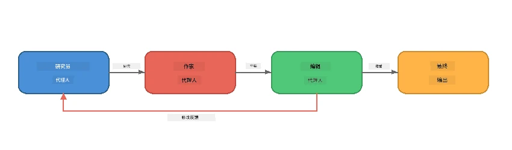
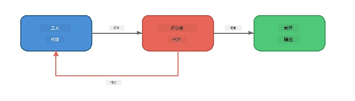
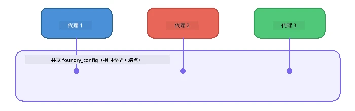

# 第6部分：多代理工作流

> **目标：** 将多个专业代理组合成协调的流水线，在协作代理之间划分复杂任务——所有运行均本地通过 Foundry Local 实现。

## 为什么选择多代理？

单个代理可以处理许多任务，但复杂的工作流更适合<strong>专业化</strong>。与其让一个代理同时进行研究、写作和编辑，不如将工作分割成专注的角色：



| 模式 | 描述 |
|---------|-------------|
| <strong>顺序</strong> | 代理A的输出作为代理B的输入 → 代理C |
| <strong>反馈回路</strong> | 评估代理可以将工作发回修改 |
| <strong>共享上下文</strong> | 所有代理使用相同模型/端点，但指令不同 |
| <strong>类型化输出</strong> | 代理生成结构化结果（JSON），保证可靠交接 |

---

## 练习

### 练习1 - 运行多代理流水线

工作坊包含完整的研究者 → 作家 → 编辑工作流。

<details>
<summary><strong>🐍 Python</strong></summary>

**设置：**
```bash
cd python
python -m venv venv

# Windows（PowerShell）：
venv\Scripts\Activate.ps1
# macOS：
source venv/bin/activate

pip install -r requirements.txt
```

**运行：**
```bash
python foundry-local-multi-agent.py
```

**会发生什么：**
1. <strong>研究者</strong> 接收主题并返回要点事实
2. <strong>作家</strong> 利用研究内容撰写博客文章草稿（3-4段落）
3. <strong>编辑</strong> 审核文章质量并返回 接受 或 修改

</details>

<details>
<summary><strong>📦 JavaScript</strong></summary>

**设置：**
```bash
cd javascript
npm install
```

**运行：**
```bash
node foundry-local-multi-agent.mjs
```

<strong>同样的三阶段流水线</strong> - 研究者 → 作家 → 编辑。

</details>

<details>
<summary><strong>💜 C#</strong></summary>

**设置：**
```bash
cd csharp
dotnet restore
```

**运行：**
```bash
dotnet run multi
```

<strong>同样的三阶段流水线</strong> - 研究者 → 作家 → 编辑。

</details>

---

### 练习2 - 流水线结构分析

研究代理的定义和连接方式：

**1. 共享模型客户端**

所有代理共享相同的 Foundry Local 模型：

```python
# Python - FoundryLocalClient 处理所有事务
from agent_framework_foundry_local import FoundryLocalClient

client = FoundryLocalClient(model_id="phi-3.5-mini")
```

```javascript
// JavaScript - OpenAI SDK 指向 Foundry 本地
const client = new OpenAI({
  baseURL: manager.urls[0] + "/v1",
  apiKey: "foundry-local",
});
```

```csharp
// C# - OpenAIClient pointed at Foundry Local
var key = new ApiKeyCredential("foundry-local");
var client = new OpenAIClient(key, new OpenAIClientOptions
{
    Endpoint = new Uri(manager.Urls[0] + "/v1")
});
var chatClient = client.GetChatClient(model.Id);
```

**2. 专业化指令**

每个代理拥有独特角色：

| 代理 | 指令（摘要） |
|-------|----------------------|
| 研究者 | “提供关键事实、统计数据和背景。以要点形式组织。” |
| 作家 | “根据研究笔记撰写吸引人的博客文章（3-4段）。不得编造事实。” |
| 编辑 | “审查清晰度、语法及事实一致性。裁定：接受 或 修改。” |

**3. 代理间的数据流**

```python
# 第一步 - 研究人员的输出成为作者的输入
research_result = await researcher.run(f"Research: {topic}")

# 第二步 - 作者的输出成为编辑的输入
writer_result = await writer.run(f"Write using:\n{research_result}")

# 第三步 - 编辑审查研究和文章
editor_result = await editor.run(
    f"Research:\n{research_result}\n\nArticle:\n{writer_result}"
)
```

```csharp
// C# - same pattern, async calls with AIAgent
var researchNotes = await researcher.RunAsync(
    $"Research the following topic and provide key facts:\n{topic}");

var draft = await writer.RunAsync(
    $"Write a blog post based on these research notes:\n\n{researchNotes}");

var verdict = await editor.RunAsync(
    $"Review this article for quality and accuracy.\n\n" +
    $"Research notes:\n{researchNotes}\n\n" +
    $"Article:\n{draft}");
```

> **关键见解：** 每个代理接收之前代理累计的上下文。编辑同时看到原始研究和草稿——这让它能检查事实一致性。

---

### 练习3 - 添加第四个代理

通过添加新代理来扩展流水线。选择一种：

| 代理 | 目的 | 指令 |
|-------|---------|-------------|
| <strong>事实核查者</strong> | 核实文章中的声明 | `"你核实事实声明。对每个声明说明是否由研究笔记支持。返回包含已验证/未验证项目的JSON。"` |
| <strong>标题作家</strong> | 创造吸引人的标题 | `"生成文章的5个标题选项。风格多样：信息型、吸引点击、提问、列表型、情感型。"` |
| <strong>社交媒体</strong> | 创建推广帖子 | `"创建3条推广本文的社交媒体帖子：一条适合Twitter（280字符），一条适合LinkedIn（专业语气），一条适合Instagram（随意含表情建议）。"` |

<details>
<summary><strong>🐍 Python - 添加标题作家</strong></summary>

```python
headline_agent = client.as_agent(
    name="HeadlineWriter",
    instructions=(
        "You are a headline specialist. Given an article, generate exactly "
        "5 headline options. Vary the style: informative, question-based, "
        "listicle, emotional, and provocative. Return them as a numbered list."
    ),
)

# 编辑器接受后，生成标题
headline_result = await headline_agent.run(
    f"Generate headlines for this article:\n\n{writer_result}"
)
print(f"\n--- Headlines ---\n{headline_result}")
```

</details>

<details>
<summary><strong>📦 JavaScript - 添加标题作家</strong></summary>

```javascript
const headlineAgent = new ChatAgent({
  client,
  modelId: modelInfo.id,
  instructions:
    "You are a headline specialist. Given an article, generate exactly " +
    "5 headline options. Vary the style: informative, question-based, " +
    "listicle, emotional, and provocative. Return them as a numbered list.",
  name: "HeadlineWriter",
});

const headlineResult = await headlineAgent.run(
  `Generate headlines for this article:\n\n${writerResult.text}`
);
console.log(`\n--- Headlines ---\n${headlineResult.text}`);
```

</details>

<details>
<summary><strong>💜 C# - 添加标题作家</strong></summary>

```csharp
AIAgent headlineAgent = chatClient.AsAIAgent(
    name: "HeadlineWriter",
    instructions:
        "You are a headline specialist. Given an article, generate exactly " +
        "5 headline options. Vary the style: informative, question-based, " +
        "listicle, emotional, and provocative. Return them as a numbered list."
);

// After the editor accepts, generate headlines
var headlines = await headlineAgent.RunAsync(
    $"Generate headlines for this article:\n\n{draft}");
Console.WriteLine($"\n--- Headlines ---\n{headlines}");
```

</details>

---

### 练习4 - 设计你自己的工作流

设计一个不同领域的多代理流水线。以下是一些思路：

| 领域 | 代理 | 流程 |
|--------|--------|------|
| <strong>代码审查</strong> | 分析器 → 审查者 → 摘要器 | 分析代码结构 → 审查问题 → 生成总结报告 |
| <strong>客户支持</strong> | 分类器 → 回复者 → 质检 | 对工单分类 → 草拟回复 → 检查质量 |
| <strong>教育</strong> | 测验制作器 → 学生模拟者 → 评分者 | 生成测验 → 模拟回答 → 评分与解释 |
| <strong>数据分析</strong> | 解释器 → 分析师 → 报告者 | 解释数据请求 → 分析模式 → 编写报告 |

**步骤：**
1. 定义3个或更多代理及其不同的`instructions`
2. 决定数据流——每个代理接收和产生什么？
3. 使用练习1-3中的模式实现流水线
4. 如果需要，一个代理可对另一个代理的工作进行评估并添加反馈回路

---

## 编排模式

这些是适用于任何多代理系统的编排模式（将在[第7部分](part7-zava-creative-writer.md)深入探讨）：

### 顺序流水线


每个代理处理前一个代理的输出。简单且可预测。

### 反馈回路



评估代理可以触发早期阶段的重新执行。Zava 作家使用此方法：编辑者可以将反馈发送回研究者和作家。

### 共享上下文



所有代理共享单一`foundry_config`，以使用相同的模型和端点。

---

## 关键要点

| 概念 | 你学到了什么 |
|---------|-----------------|
| 代理专业化 | 每个代理专注做好一件事，指令明确 |
| 数据交接 | 一个代理的输出成为下一个代理的输入 |
| 反馈回路 | 评估者可触发重试以提升质量 |
| 结构化输出 | JSON格式响应保证可靠的代理间通信 |
| 编排 | 协调者管理流水线序列及错误处理 |
| 生产模式 | 应用于[第7部分：Zava 创意作家](part7-zava-creative-writer.md) |

---

## 下一步

继续阅读[第7部分：Zava 创意作家 - 结业应用](part7-zava-creative-writer.md)，探索一个包含4个专业代理、流式输出、产品搜索和反馈回路的完整生产级多代理应用——提供Python、JavaScript和C#版本。