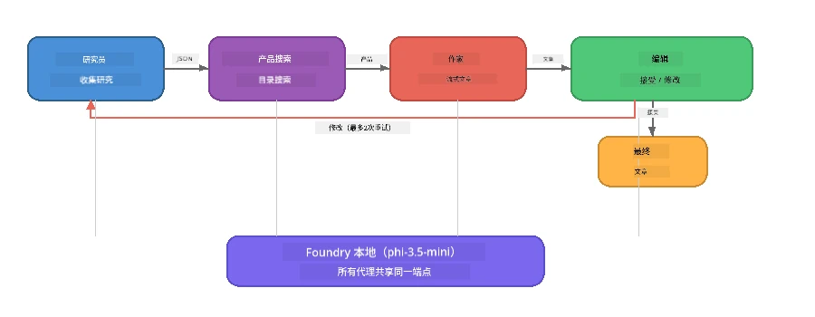

# 第7部分：Zava 创意写作器 - 终极应用

> **目标：** 探索一个生产级多智能体应用，四个专门化智能体协作，生成适用于Zava Retail DIY的杂志级文章——完全在您的设备上通过 Foundry Local 运行。

这是本工作坊的<strong>终极实验</strong>。它将您所学的一切整合起来——SDK 集成（第3部分）、本地数据检索（第4部分）、智能体角色设定（第5部分）、多智能体编排（第6部分）——形成一个完整的应用，提供 **Python**、**JavaScript** 和 **C#** 版本。

---

## 您将探索的内容

| 概念 | 在 Zava Writer 中的位置 |
|---------|----------------------------|
| 四步模型加载 | 共享配置模块启动 Foundry Local |
| RAG 风格检索 | 产品智能体搜索本地产品目录 |
| 智能体专业化 | 四个智能体，拥有不同的系统提示 |
| 流式输出 | Writer 实时生成标记 |
| 结构化交接 | 研究者 → JSON，编辑 → JSON 决策 |
| 反馈循环 | 编辑可触发重试（最多2次） |

---

## 架构

Zava 创意写作器采用<strong>顺序管道与评价者驱动的反馈机制</strong>。三种语言实现均遵循相同架构：



### 四个智能体

| 智能体 | 输入 | 输出 | 目的 |
|-------|-------|--------|---------|
| **Researcher（研究者）** | 主题 + 可选反馈 | `{"web": [{url, name, description}, ...]}` | 通过 LLM 收集背景资料 |
| **Product Search（产品搜索）** | 产品上下文字符串 | 匹配产品列表 | 由 LLM 生成查询 + 本地目录关键词搜索 |
| **Writer（写作员）** | 研究 + 产品 + 任务 + 反馈 | 实时流式文章文本（以 `---` 分割） | 实时草拟杂志级文章 |
| **Editor（编辑）** | 文章 + 写作员自我反馈 | `{"decision": "accept/revise", "editorFeedback": "...", "researchFeedback": "..."}` | 审阅质量，必要时触发重试 |

### 管道流程

1. <strong>研究者</strong>接收主题，生成结构化研究笔记（JSON）
2. <strong>产品搜索</strong> 使用 LLM 生成的搜索词查询本地产品目录
3. <strong>写作员</strong> 将研究 + 产品 + 任务结合，生成流式文章，并在 `---` 分隔符后附加自我反馈
4. <strong>编辑</strong> 审核文章，返回 JSON 判决：
   - `"accept"` → 管道完成
   - `"revise"` → 反馈返回给研究者和写作员（最多2次重试）

---

## 先决条件

- 完成[第6部分：多智能体工作流](part6-multi-agent-workflows.md)
- 已安装 Foundry Local CLI 并下载`phi-3.5-mini`模型

---

## 练习

### 练习1 - 运行 Zava 创意写作器

选择您喜欢的语言运行应用：

<details>
<summary><strong>🐍 Python - FastAPI Web 服务</strong></summary>

Python 版本以<strong>Web 服务</strong>形式运行，提供 REST API，展示如何构建生产后台。

**安装：**
```bash
cd zava-creative-writer-local/src/api
python -m venv venv

# Windows（PowerShell）：
venv\Scripts\Activate.ps1
# macOS：
source venv/bin/activate

pip install -r requirements.txt
```

**启动：**
```bash
uvicorn main:app --reload
```

**测试：**
```bash
curl -X POST http://localhost:8000/api/article \
  -H "Content-Type: application/json" \
  -d '{
    "research": "DIY home improvement trends",
    "products": "power tools and paints",
    "assignment": "Write an article about weekend renovation projects for DIY enthusiasts"
  }'
```

响应流式返回以换行符分隔的 JSON 消息，显示每个智能体的进度。

</details>

<details>
<summary><strong>📦 JavaScript - Node.js CLI</strong></summary>

JavaScript 版本以<strong>CLI 应用</strong>方式运行，直接在控制台打印智能体进度和文章。

**安装：**
```bash
cd zava-creative-writer-local/src/javascript
npm install
```

**启动：**
```bash
node main.mjs
```

您将看到：
1. Foundry Local 模型加载（下载时带进度条）
2. 各智能体按顺序执行及状态消息
3. 实时流式输出的文章
4. 编辑的接受/修订决定

</details>

<details>
<summary><strong>💜 C# - .NET 控制台应用</strong></summary>

C# 版本作为<strong>.NET 控制台应用</strong>运行，拥有相同管道与流式输出。

**安装：**
```bash
cd zava-creative-writer-local/src/csharp
dotnet restore
```

**启动：**
```bash
dotnet run
```

输出模式同 JavaScript 版本——智能体状态消息、流式文章、编辑判决。

</details>

---

### 练习2 - 研究代码结构

每种语言实现拥有相同的逻辑组件。对比结构：

**Python** (`src/api/`):
| 文件 | 功能 |
|------|---------|
| `foundry_config.py` | 共享 Foundry Local 管理器、模型和客户端（四步初始化） |
| `orchestrator.py` | 管道协调含反馈循环 |
| `main.py` | FastAPI 端点（`POST /api/article`） |
| `agents/researcher/researcher.py` | 基于 LLM 的研究，输出 JSON |
| `agents/product/product.py` | LLM生成查询 + 关键词搜索 |
| `agents/writer/writer.py` | 流式文章生成 |
| `agents/editor/editor.py` | JSON式接受/修订决策 |

**JavaScript** (`src/javascript/`):
| 文件 | 功能 |
|------|---------|
| `foundryConfig.mjs` | 共享 Foundry Local 配置（带进度条的四步初始化） |
| `main.mjs` | 协调器及 CLI 入口 |
| `researcher.mjs` | 基于 LLM 的研究智能体 |
| `product.mjs` | LLM 查询生成 + 关键词搜索 |
| `writer.mjs` | 流式文章生成（异步生成器） |
| `editor.mjs` | JSON接受/修订决策 |
| `products.mjs` | 产品目录数据 |

**C#** (`src/csharp/`):
| 文件 | 功能 |
|------|---------|
| `Program.cs` | 完整管道：模型加载、智能体、协调器、反馈循环 |
| `ZavaCreativeWriter.csproj` | .NET 9 项目，含 Foundry Local + OpenAI 包 |

> **设计说明：** Python 将每个智能体分成独立文件/目录（适合大团队）。JavaScript 每个智能体一个模块（适合中型项目）。C# 全部保存在同一文件内，使用局部函数（适合自包含示例）。生产环境请选择符合团队习惯的模式。

---

### 练习3 - 跟踪共享配置

管道中所有智能体共享同一个 Foundry Local 模型客户端。研究各语言如何设置：

<details>
<summary><strong>🐍 Python - foundry_config.py</strong></summary>

```python
from foundry_local import FoundryLocalManager

MODEL_ALIAS = "phi-3.5-mini"

# 第1步：创建管理器并启动Foundry本地服务
manager = FoundryLocalManager()
manager.start_service()

# 第2步：检查模型是否已下载
cached = manager.list_cached_models()
catalog_info = manager.get_model_info(MODEL_ALIAS)
is_cached = any(m.id == catalog_info.id for m in cached) if catalog_info else False

if not is_cached:
    manager.download_model(MODEL_ALIAS)

# 第3步：将模型加载到内存中
manager.load_model(MODEL_ALIAS)
model_id = manager.get_model_info(MODEL_ALIAS).id

# 共享OpenAI客户端
client = openai.OpenAI(base_url=manager.endpoint, api_key=manager.api_key)
```

所有智能体导入 `from foundry_config import client, model_id`。

</details>

<details>
<summary><strong>📦 JavaScript - foundryConfig.mjs</strong></summary>

```javascript
import { FoundryLocalManager } from "foundry-local-sdk";
import { OpenAI } from "openai";

FoundryLocalManager.create({ appName: "ZavaCreativeWriter" });
const manager = FoundryLocalManager.instance;
await manager.startWebService();

// 检查缓存 → 下载 → 加载（新 SDK 模式）
const catalog = manager.catalog;
const model = await catalog.getModel(MODEL_ALIAS);
if (!model.isCached) {
  console.log(`Downloading model: ${MODEL_ALIAS}...`);
  await model.download();
}
await model.load();

const client = new OpenAI({ baseURL: manager.urls[0] + "/v1", apiKey: "foundry-local" });
const modelId = model.id;
export { client, modelId };
```

所有智能体导入 `{ client, modelId } from "./foundryConfig.mjs"`。

</details>

<details>
<summary><strong>💜 C# - Program.cs 顶部</strong></summary>

```csharp
await FoundryLocalManager.CreateAsync(
    new Configuration
    {
        AppName = "ZavaCreativeWriter",
        Web = new Configuration.WebService { Urls = "http://127.0.0.1:0" }
    }, NullLogger.Instance, default);
var manager = FoundryLocalManager.Instance;
await manager.StartWebServiceAsync(default);

var catalog = await manager.GetCatalogAsync(default);
var catalogModel = await catalog.GetModelAsync(alias, default);
var isCached = await catalogModel.IsCachedAsync(default);
if (!isCached)
    await catalogModel.DownloadAsync(null, default);

await catalogModel.LoadAsync(default);
var key = new ApiKeyCredential("foundry-local");
var chatClient = new OpenAIClient(key, new OpenAIClientOptions
{
    Endpoint = new Uri(manager.Urls[0] + "/v1")
}).GetChatClient(catalogModel.Id);
```

`chatClient` 传递给同一文件的所有智能体函数。

</details>

> **关键模式：** 模型加载流程（启动服务 → 检查缓存 → 下载 → 加载）确保用户有清晰进度提示，且模型仅下载一次。这是任何 Foundry Local 应用的最佳实践。

---

### 练习4 - 理解反馈循环

反馈循环使得此管道“智能”——编辑可以将工作退回修订。追踪其逻辑：

```
Orchestrator:
  1. researcher.research(topic, "No Feedback")    ← first pass
  2. product.findProducts(productContext)
  3. writer.write(research, products, assignment)  ← streams article
  4. Split article at "---" → article + writerFeedback
  5. editor.edit(article, writerFeedback)

  WHILE editor says "revise" AND retryCount < 2:
    6. researcher.research(topic, editor.researchFeedback)  ← refined
    7. writer.write(research, products, editor.editorFeedback)
    8. editor.edit(newArticle, newWriterFeedback)
    9. retryCount++
```

**思考问题：**
- 为什么重试次数限制为2？增加会怎样？
- 为什么研究者获得 `researchFeedback`，写作员获得 `editorFeedback`？
- 如果编辑总说“修订”，会发生什么？

---

### 练习5 - 修改某个智能体

尝试更改智能体行为，观察对管道的影响：

| 修改 | 变更内容 |
|-------------|----------------|
| <strong>更严格的编辑</strong> | 更改编辑系统提示，始终要求至少一次修订 |
| <strong>更长的文章</strong> | 修改写作员提示，从“800-1000字”改为“1500-2000字” |
| <strong>不同的产品</strong> | 添加或修改产品目录中的产品 |
| <strong>新的研究主题</strong> | 将默认 `researchContext` 改成其他主题 |
| **仅返回JSON的研究者** | 使研究者返回10条数据，而非3-5条 |

> **提示：** 三种语言实现相同架构，您可在任意熟悉语言中做相同改动。

---

### 练习6 - 添加第五个智能体

扩展管道增加新智能体。示例：

| 智能体 | 管道位置 | 目的 |
|-------|-------------------|---------|
| <strong>事实核查者</strong> | 写作员之后，编辑之前 | 根据研究数据核对声明 |
| **SEO 优化器** | 编辑接受后 | 添加元描述、关键词和索引别名 |
| <strong>插画师</strong> | 编辑接受后 | 生成文章图片提示 |
| <strong>翻译者</strong> | 编辑接受后 | 将文章翻译成另一种语言 |

**步骤：**
1. 编写智能体系统提示
2. 创建智能体函数（符合您语言的现有模式）
3. 在协调器中适当位置插入
4. 更新输出/日志显示新智能体贡献

---

## Foundry Local 与智能体框架如何协同工作

此应用展示了使用 Foundry Local 构建多智能体系统的推荐模式：

| 层级 | 组件 | 作用 |
|-------|-----------|------|
| <strong>运行时</strong> | Foundry Local | 本地下载、管理并提供模型服务 |
| <strong>客户端</strong> | OpenAI SDK | 向本地端点发送聊天补全请求 |
| <strong>智能体</strong> | 系统提示 + 聊天调用 | 通过专注指令实现特定行为 |
| <strong>协调器</strong> | 管道协调器 | 管理数据流、执行顺序和反馈循环 |
| <strong>框架</strong> | Microsoft Agent Framework | 提供 `ChatAgent` 抽象及设计模式 |

关键见解：**Foundry Local 替代云端后端，而非应用架构。** 云端托管模型使用的智能体模式、编排策略和结构化交接，同样适用于本地模型 —— 只需将客户端指向本地端点替代 Azure 端点。

---

## 关键要点

| 概念 | 您学到的内容 |
|---------|-----------------|
| 生产架构 | 如何构建共享配置、分离智能体的多智能体应用 |
| 四步模型加载 | 初始化 Foundry Local 的用户可见最佳实践 |
| 智能体专业化 | 四个智能体拥有专注指令和特定输出格式 |
| 流式生成 | 写作员实时输出标记，实现响应式界面 |
| 反馈循环 | 编辑引导的重试提升输出质量，无需人工介入 |
| 跨语言模式 | 相同架构在 Python、JavaScript 和 C# 中均适用 |
| 本地即生产级 | Foundry Local 提供与云端相同的 OpenAI 兼容 API |

---

## 下一步

继续前往[第8部分：基于评估的开发](part8-evaluation-led-development.md)，为您的智能体构建系统化评估框架，利用黄金数据集、规则检测和 LLM 作为评分评判器。