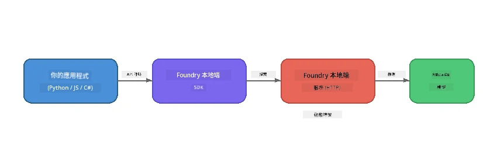

# Part 1: Getting Started with Foundry Local


## What is Foundry Local?

[Foundry Local](https://foundrylocal.ai) 讓你能夠 <strong>直接在你的電腦上</strong> 運行開源 AI 語言模型 — 不需網絡連接、無雲端費用，且完全保障資料私隱。它：

- <strong>下載並本地運行模型</strong>，自動進行硬件優化（GPU、CPU 或 NPU）
- **提供兼容 OpenAI 的 API**，令你可使用熟悉的 SDK 和工具
- **無需 Azure 訂閱** 或註冊 — 只需安裝即可開始構建

可以把它想像成你私人的 AI，完全在你的機器上運行。

## Learning Objectives

完成本實驗後，你將能夠：

- 在你的作業系統上安裝 Foundry Local CLI
- 了解模型別名是什麼及其運作方式
- 下載並運行你的第一個本地 AI 模型
- 從命令行向本地模型發送聊天訊息
- 了解本地與雲端託管 AI 模型的區別

---

## Prerequisites

### System Requirements

| Requirement | Minimum | Recommended |
|-------------|---------|-------------|
| **RAM** | 8 GB | 16 GB |
| **Disk Space** | 5 GB (for models) | 10 GB |
| **CPU** | 4 cores | 8+ cores |
| **GPU** | Optional | NVIDIA with CUDA 11.8+ |
| **OS** | Windows 10/11 (x64/ARM), Windows Server 2025, macOS 13+ | - |

> **Note:** Foundry Local 會自動選擇最適合你硬件的模型變體。如果你有 NVIDIA GPU，會使用 CUDA 加速；如果有 Qualcomm NPU，會使用該硬件。否則會退回使用優化的 CPU 變體。

### Install Foundry Local CLI

**Windows** (PowerShell):
```powershell
winget install Microsoft.FoundryLocal
```

**macOS** (Homebrew):
```bash
brew tap microsoft/foundrylocal
brew install foundrylocal
```

> **Note:** Foundry Local 目前只支援 Windows 和 macOS。不支援 Linux。

驗證安裝：
```bash
foundry --version
```

---

## Lab Exercises

### Exercise 1: Explore Available Models

Foundry Local 包含一個預優化的開源模型目錄。列出它們：

```bash
foundry model list
```

你會看到以下模型：
- `phi-3.5-mini` — 微軟的 3.8B 參數模型（快速、品質好）
- `phi-4-mini` — 更新、功能更強的 Phi 模型
- `phi-4-mini-reasoning` — 帶有鏈式思考推理 (`<think>` 標籤) 的 Phi 模型
- `phi-4` — 微軟最大的 Phi 模型（10.4 GB）
- `qwen2.5-0.5b` — 非常小且快速（適合低資源設備）
- `qwen2.5-7b` — 強大的通用模型，支援呼叫工具
- `qwen2.5-coder-7b` — 專為程式碼生成優化
- `deepseek-r1-7b` — 強大的推理模型
- `gpt-oss-20b` — 大型開源模型（MIT 授權，12.5 GB）
- `whisper-base` — 語音轉文字轉錄（383 MB）
- `whisper-large-v3-turbo` — 高精度轉錄（9 GB）

> **What is a model alias?** 像 `phi-3.5-mini` 這樣的別名是快捷方式。使用別名時，Foundry Local 會自動下載最適合你硬件的變體（NVIDIA GPU 使用 CUDA，加速，否則使用 CPU 優化版本）。你不需要擔心選擇正確的變體。

### Exercise 2: Run Your First Model

下載並開始與模型進行互動聊天：

```bash
foundry model run phi-3.5-mini
```

第一次運行時，Foundry Local 會：
1. 偵測你的硬件
2. 下載最優模型變體（可能需要幾分鐘）
3. 將模型載入記憶體
4. 開啟互動聊天會話

嘗試問它一些問題：
```
You: What is the golden ratio?
You: Can you explain it as if I were 10 years old?
You: Write a haiku about mathematics
```

輸入 `exit` 或按下 `Ctrl+C` 離開。

### Exercise 3: Pre-download a Model

如果想在不啟動聊天的情況下下載模型：

```bash
foundry model download phi-3.5-mini
```

查看你的機器上已下載的模型：

```bash
foundry cache list
```

### Exercise 4: Understand the Architecture

Foundry Local 作為<strong>本地 HTTP 服務</strong>運行，並暴露兼容 OpenAI 的 REST API。這表示：

1. 服務會在<strong>動態端口</strong>啟動（每次端口不同）
2. 你使用 SDK 發現實際的端點 URL
3. 你可以用任何兼容 OpenAI 的客戶端庫訪問它



> **Important:** Foundry Local 每次啟動都會分配一個<strong>動態端口</strong>。切勿硬編碼端口號，如 `localhost:5272`。始終使用 SDK 發現當前的 URL（例如 Python 中的 `manager.endpoint` 或 JavaScript 的 `manager.urls[0]`）。

---

## Key Takeaways

| Concept | What You Learned |
|---------|------------------|
| On-device AI | Foundry Local 全程在你的設備上運行模型，無需雲端，無 API 密鑰，無成本 |
| Model aliases | 像 `phi-3.5-mini` 的別名會自動選擇適合你硬件的最佳版本 |
| Dynamic ports | 服務在動態端口運行，必須通過 SDK 發現端點 |
| CLI and SDK | 你可以透過 CLI (`foundry model run`) 或 SDK 程式化互動模型 |

---

## Next Steps

繼續閱讀[Part 2: Foundry Local SDK Deep Dive](part2-foundry-local-sdk.md)，精通程式化管理模型、服務及快取的 SDK API。