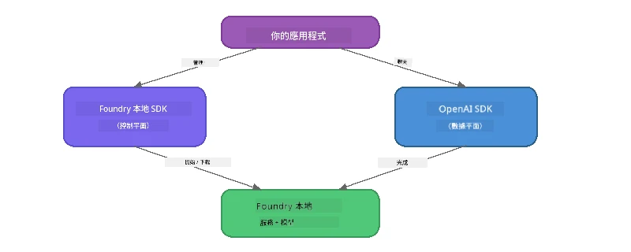

# 第三部分：使用 Foundry Local SDK 與 OpenAI

## 概述

在第一部分，你使用 Foundry Local CLI 以互動方式運行模型。在第二部分，你探索了完整的 SDK API 表面。現在你將學習如何使用 SDK 和相容 OpenAI 的 API **將 Foundry Local 整合到你的應用中**。

Foundry Local 提供三種語言的 SDK。選擇你最熟悉的一種——三種語言的概念都是相同的。

## 學習目標

完成本實驗後，你將能夠：

- 安裝你所選語言的 Foundry Local SDK（Python、JavaScript 或 C#）
- 初始化 `FoundryLocalManager` 以啟動服務、檢查快取、下載並載入模型
- 使用 OpenAI SDK 連接本地模型
- 發送聊天補全並處理串流回應
- 理解動態埠口架構

---

## 先備條件

請先完成 [第一部分：Foundry Local 快速入門](part1-getting-started.md) 及 [第二部分：Foundry Local SDK 深入解析](part2-foundry-local-sdk.md)。

安裝以下 <strong>其中一個</strong> 語言執行環境：
- **Python 3.9+** - [python.org/downloads](https://www.python.org/downloads/)
- **Node.js 18+** - [nodejs.org](https://nodejs.org/)
- **.NET 9.0+** - [dot.net/download](https://dotnet.microsoft.com/download)

---

## 概念：SDK 的運作方式

Foundry Local SDK 負責 <strong>控制平面</strong>（啟動服務、下載模型），而 OpenAI SDK 處理 <strong>資料平面</strong>（發送提示、接收補全）。



---

## 實驗練習

### 練習 1：設定你的環境

<details>
<summary><b>🐍 Python</b></summary>

```bash
cd python
python -m venv venv

# 啟動虛擬環境：
# Windows (PowerShell)：
venv\Scripts\Activate.ps1
# Windows (命令提示字元)：
venv\Scripts\activate.bat
# macOS：
source venv/bin/activate

pip install -r requirements.txt
```

`requirements.txt` 安裝：
- `foundry-local-sdk` - Foundry Local SDK（以 `foundry_local` 匯入）
- `openai` - OpenAI Python SDK
- `agent-framework` - Microsoft Agent Framework（後續部分會使用）

</details>

<details>
<summary><b>📘 JavaScript</b></summary>

```bash
cd javascript
npm install
```

`package.json` 安裝：
- `foundry-local-sdk` - Foundry Local SDK
- `openai` - OpenAI Node.js SDK

</details>

<details>
<summary><b>💜 C#</b></summary>

```bash
cd csharp
dotnet restore
dotnet build
```

`csharp.csproj` 內使用：
- `Microsoft.AI.Foundry.Local` - Foundry Local SDK（NuGet）
- `OpenAI` - OpenAI C# SDK（NuGet）

> **專案結構：** C# 專案使用 `Program.cs` 的命令列路由器，將指令分派到不同範例檔案。對本部分，執行 `dotnet run chat`（或直接 `dotnet run`）。其他部分則使用 `dotnet run rag`、`dotnet run agent` 和 `dotnet run multi`。

</details>

---

### 練習 2：基本聊天補全

打開你所選語言的基本聊天範例並檢視程式碼。每個程式都遵循相同的三步驟模式：

1. <strong>啟動服務</strong> - 由 `FoundryLocalManager` 啟動 Foundry Local 執行環境
2. <strong>下載並載入模型</strong> - 檢查快取，如有需要則下載，然後載入到記憶體
3. **建立 OpenAI 客戶端** - 連接本地端點並發送串流聊天補全

<details>
<summary><b>🐍 Python - <code>python/foundry-local.py</code></b></summary>

```python
import sys
import openai
from foundry_local import FoundryLocalManager

alias = "phi-3.5-mini"

# 第一步：建立 FoundryLocalManager 並啟動服務
print("Starting Foundry Local service...")
manager = FoundryLocalManager()
manager.start_service()

# 第二步：檢查模型是否已經下載
cached = manager.list_cached_models()
catalog_info = manager.get_model_info(alias)
is_cached = any(m.id == catalog_info.id for m in cached) if catalog_info else False

if is_cached:
    print(f"Model already downloaded: {alias}")
else:
    print(f"Downloading model: {alias} (this may take several minutes)...")
    manager.download_model(alias)
    print(f"Download complete: {alias}")

# 第三步：將模型載入記憶體
print(f"Loading model: {alias}...")
manager.load_model(alias)

# 建立一個指向本地 Foundry 服務的 OpenAI 客戶端
client = openai.OpenAI(
    base_url=manager.endpoint,   # 動態端口 - 千萬不要硬編碼！
    api_key=manager.api_key
)

# 產生串流聊天完成結果
stream = client.chat.completions.create(
    model=manager.get_model_info(alias).id,
    messages=[{"role": "user", "content": "What is the golden ratio?"}],
    stream=True,
)

for chunk in stream:
    if chunk.choices[0].delta.content is not None:
        print(chunk.choices[0].delta.content, end="", flush=True)
print()
```

**執行：**
```bash
python foundry-local.py
```

</details>

<details>
<summary><b>📘 JavaScript - <code>javascript/foundry-local.mjs</code></b></summary>

```javascript
import { OpenAI } from "openai";
import { FoundryLocalManager } from "foundry-local-sdk";

const alias = "phi-3.5-mini";

// 第一步：啟動 Foundry 本地服務
console.log("Starting Foundry Local service...");
FoundryLocalManager.create({ appName: "FoundryLocalWorkshop" });
const manager = FoundryLocalManager.instance;
await manager.startWebService();

// 第二步：檢查模型是否已經下載
const catalog = manager.catalog;
const model = await catalog.getModel(alias);

if (model.isCached) {
  console.log(`Model already downloaded: ${alias}`);
} else {
  console.log(`Downloading model: ${alias} (this may take several minutes)...`);
  await model.download();
  console.log(`Download complete: ${alias}`);
}

// 第三步：將模型載入記憶體
console.log(`Loading model: ${alias}...`);
await model.load();
console.log(`Model loaded: ${model.id}`);

// 建立一個指向本地 Foundry 服務的 OpenAI 客戶端
const client = new OpenAI({
  baseURL: manager.urls[0] + "/v1",   // 動態端口 - 千萬不要硬编码！
  apiKey: "foundry-local",
});

// 生成串流聊天補全
const stream = await client.chat.completions.create({
  model: model.id,
  messages: [{ role: "user", content: "What is the golden ratio?" }],
  stream: true,
});

for await (const chunk of stream) {
  if (chunk.choices[0]?.delta?.content) {
    process.stdout.write(chunk.choices[0].delta.content);
  }
}
console.log();
```

**執行：**
```bash
node foundry-local.mjs
```

</details>

<details>
<summary><b>💜 C# - <code>csharp/BasicChat.cs</code></b></summary>

```csharp
using Microsoft.AI.Foundry.Local;
using Microsoft.Extensions.Logging.Abstractions;
using OpenAI;
using OpenAI.Chat;
using System.ClientModel;

var alias = "phi-3.5-mini";

// Step 1: Start the Foundry Local service
Console.WriteLine("Starting Foundry Local service...");
await FoundryLocalManager.CreateAsync(
    new Configuration
    {
        AppName = "FoundryLocalSamples",
        Web = new Configuration.WebService { Urls = "http://127.0.0.1:0" }
    }, NullLogger.Instance, default);
var manager = FoundryLocalManager.Instance;
await manager.StartWebServiceAsync(default);

// Step 2: Get the model from the catalog
var catalog = await manager.GetCatalogAsync(default);
var model = await catalog.GetModelAsync(alias, default);

// Step 3: Check if the model is already downloaded
var isCached = await model.IsCachedAsync(default);

if (isCached)
{
    Console.WriteLine($"Model already downloaded: {alias}");
}
else
{
    Console.WriteLine($"Downloading model: {alias} (this may take several minutes)...");
    await model.DownloadAsync(null, default);
    Console.WriteLine($"Download complete: {alias}");
}

// Step 4: Load the model into memory
Console.WriteLine($"Loading model: {alias}...");
await model.LoadAsync(default);
Console.WriteLine($"Loaded model: {model.Id}");
Console.WriteLine($"Endpoint: {manager.Urls[0]}");

// Create OpenAI client pointing to the LOCAL Foundry service
var key = new ApiKeyCredential("foundry-local");
var client = new OpenAIClient(key, new OpenAIClientOptions
{
    Endpoint = new Uri(manager.Urls[0] + "/v1")  // Dynamic port - never hardcode!
});

var chatClient = client.GetChatClient(model.Id);

// Stream a chat completion
var completionUpdates = chatClient.CompleteChatStreaming("What is the golden ratio?");

foreach (var update in completionUpdates)
{
    if (update.ContentUpdate.Count > 0)
    {
        Console.Write(update.ContentUpdate[0].Text);
    }
}
Console.WriteLine();
```

**執行：**
```bash
dotnet run chat
```

</details>

---

### 練習 3：嘗試修改提示

當你的基本範例能正常執行後，嘗試修改程式碼：

1. <strong>改變使用者訊息</strong> - 嘗試不同問題
2. <strong>新增系統提示</strong> - 賦予模型一個角色
3. <strong>關閉串流</strong> - 設定 `stream=False` 並一次印出完整回應
4. <strong>嘗試不同模型</strong> - 將別名從 `phi-3.5-mini` 改成 `foundry model list` 中的其他模型

<details>
<summary><b>🐍 Python</b></summary>

```python
# 加入系統提示－給模型一個角色設定：
stream = client.chat.completions.create(
    model=manager.get_model_info(alias).id,
    messages=[
        {"role": "system", "content": "You are a pirate. Answer everything in pirate speak."},
        {"role": "user", "content": "What is the golden ratio?"}
    ],
    stream=True,
)

# 或者關閉串流功能：
response = client.chat.completions.create(
    model=manager.get_model_info(alias).id,
    messages=[{"role": "user", "content": "What is the golden ratio?"}],
    stream=False,
)
print(response.choices[0].message.content)
```

</details>

<details>
<summary><b>📘 JavaScript</b></summary>

```javascript
// 新增系統提示 - 賦予模型一個角色：
const stream = await client.chat.completions.create({
  model: modelInfo.id,
  messages: [
    { role: "system", content: "You are a pirate. Answer everything in pirate speak." },
    { role: "user", content: "What is the golden ratio?" },
  ],
  stream: true,
});

// 或者關閉串流模式：
const response = await client.chat.completions.create({
  model: modelInfo.id,
  messages: [{ role: "user", content: "What is the golden ratio?" }],
  stream: false,
});
console.log(response.choices[0].message.content);
```

</details>

<details>
<summary><b>💜 C#</b></summary>

```csharp
// Add a system prompt - give the model a persona:
var completionUpdates = chatClient.CompleteChatStreaming(
    new ChatMessage[]
    {
        new SystemChatMessage("You are a pirate. Answer everything in pirate speak."),
        new UserChatMessage("What is the golden ratio?")
    }
);

// Or turn off streaming:
var response = chatClient.CompleteChat("What is the golden ratio?");
Console.WriteLine(response.Value.Content[0].Text);
```

</details>

---

### SDK 方法參考

<details>
<summary><b>🐍 Python SDK 方法</b></summary>

| 方法 | 用途 |
|--------|---------|
| `FoundryLocalManager()` | 建立管理器實例 |
| `manager.start_service()` | 啟動 Foundry Local 服務 |
| `manager.list_cached_models()` | 列出裝置上已下載的模型 |
| `manager.get_model_info(alias)` | 取得模型 ID 和元資料 |
| `manager.download_model(alias, progress_callback=fn)` | 下載模型並可選擇進度回呼 |
| `manager.load_model(alias)` | 載入模型至記憶體 |
| `manager.endpoint` | 取得動態端點 URL |
| `manager.api_key` | 取得 API 金鑰（本地示意） |

</details>

<details>
<summary><b>📘 JavaScript SDK 方法</b></summary>

| 方法 | 用途 |
|--------|---------|
| `FoundryLocalManager.create({ appName })` | 建立管理器實例 |
| `FoundryLocalManager.instance` | 存取單例管理器 |
| `await manager.startWebService()` | 啟動 Foundry Local 服務 |
| `await manager.catalog.getModel(alias)` | 從目錄取得模型 |
| `model.isCached` | 檢查模型是否已下載 |
| `await model.download()` | 下載模型 |
| `await model.load()` | 載入模型 |
| `model.id` | 取得模型 ID（用於 OpenAI API） |
| `manager.urls[0] + "/v1"` | 取得動態端點 URL |
| `"foundry-local"` | API 金鑰（本地示意） |

</details>

<details>
<summary><b>💜 C# SDK 方法</b></summary>

| 方法 | 用途 |
|--------|---------|
| `FoundryLocalManager.CreateAsync(config)` | 建立並初始化管理器 |
| `manager.StartWebServiceAsync()` | 啟動 Foundry Local Web 服務 |
| `manager.GetCatalogAsync()` | 取得模型目錄 |
| `catalog.ListModelsAsync()` | 列出所有可用模型 |
| `catalog.GetModelAsync(alias)` | 根據別名取得模型 |
| `model.IsCachedAsync()` | 檢查模型是否已下載 |
| `model.DownloadAsync()` | 下載模型 |
| `model.LoadAsync()` | 載入模型至記憶體 |
| `manager.Urls[0]` | 取得動態端點 URL |
| `new ApiKeyCredential("foundry-local")` | 本地使用的 API 金鑰認證 |

</details>

---

### 練習 4：使用原生 ChatClient（OpenAI SDK 的替代方案）

在練習 2 與 3 中，你使用了 OpenAI SDK 執行聊天補全。JavaScript 和 C# SDK 也提供一個 **原生 ChatClient**，可完全取代 OpenAI SDK。

<details>
<summary><b>📘 JavaScript - <code>model.createChatClient()</code></b></summary>

```javascript
import { FoundryLocalManager } from "foundry-local-sdk";

const alias = "phi-3.5-mini";

FoundryLocalManager.create({ appName: "ChatClientDemo" });
const manager = FoundryLocalManager.instance;
await manager.startWebService();

const model = await manager.catalog.getModel(alias);
if (!model.isCached) await model.download();
await model.load();

// 無需導入 OpenAI —— 可直接從模型獲取客戶端
const chatClient = model.createChatClient();

// 非串流補全
const response = await chatClient.completeChat([
  { role: "system", content: "You are a pirate. Answer everything in pirate speak." },
  { role: "user", content: "What is the golden ratio?" }
]);
console.log(response.choices[0].message.content);

// 串流補全（使用回調模式）
await chatClient.completeStreamingChat(
  [{ role: "user", content: "What is the golden ratio?" }],
  (chunk) => {
    if (chunk.choices?.[0]?.delta?.content) {
      process.stdout.write(chunk.choices[0].delta.content);
    }
  }
);
console.log();
```

> **注意：** ChatClient 的 `completeStreamingChat()` 採用 **callback** 模式，而非 async iterator。請將函式作為第二個參數傳入。

</details>

<details>
<summary><b>💜 C# - <code>model.GetChatClientAsync()</code></b></summary>

```csharp
var catalog = await manager.GetCatalogAsync(default);
var model = await catalog.GetModelAsync("phi-3.5-mini", default);
if (!await model.IsCachedAsync(default))
    await model.DownloadAsync(null, default);
await model.LoadAsync(default);

// No OpenAI NuGet needed — get a client directly from the model
var chatClient = await model.GetChatClientAsync(default);

// Use it like a standard OpenAI ChatClient
var response = chatClient.CompleteChat("What is the golden ratio?");
Console.WriteLine(response.Value.Content[0].Text);
```

</details>

> **何時用哪個：**
> | 方式 | 適用情境 |
> |----------|----------|
> | OpenAI SDK | 完整參數控制、正式應用、現有 OpenAI 代碼 |
> | 原生 ChatClient | 快速原型製作、依賴少、設定簡單 |

---

## 主要心得

| 概念 | 你學到的事 |
|---------|------------------|
| 控制平面 | Foundry Local SDK 負責啟動服務與載入模型 |
| 資料平面 | OpenAI SDK 負責聊天補全與串流 |
| 動態埠口 | 永遠用 SDK 來取得端點，避免硬編 URL |
| 跨語言 | 同樣程式碼模式適用 Python、JavaScript 和 C# |
| OpenAI 相容 | 完全相容 OpenAI API，現有 OpenAI 代碼可無痛使用 |
| 原生 ChatClient | `createChatClient()`(JS) / `GetChatClientAsync()`(C#) 是 OpenAI SDK 的替代方案 |

---

## 下一步

繼續至 [第四部分：打造 RAG 應用](part4-rag-fundamentals.md)，學習如何完全在你的裝置上構建檢索增強生成（Retrieval-Augmented Generation）流程。