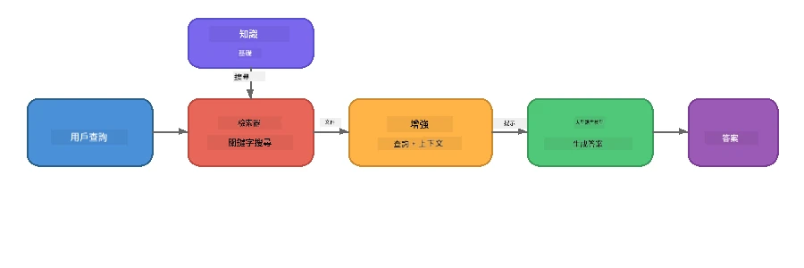

# 第4部分：用 Foundry Local 構建 RAG 應用程式

## 概述

大型語言模型功能強大，但它們只能知道訓練數據中的內容。**檢索增強生成（RAG）** 通過在查詢時提供相關上下文——從您自己的文件、數據庫或知識庫中提取——來解決這個問題。

在此實驗中，您將使用 Foundry Local 构建一個完整的 RAG 流程，<strong>全部在您的設備上執行</strong>。無需雲端服務，無需向量數據庫，無需嵌入 API——僅使用本地檢索和本地模型。

## 學習目標

完成本實驗後，您將能夠：

- 解釋什麼是 RAG 以及它對 AI 應用的重要性
- 從文本文件構建本地知識庫
- 實現一個簡單的檢索功能以找到相關上下文
- 撰寫系統提示，使模型基於檢索到的事實
- 在設備上運行完整的檢索 → 增強 → 生成流水線
- 理解簡單關鍵詞檢索與向量檢索之間的權衡

---

## 前置條件

- 完成 [第3部分：使用 Foundry Local SDK 與 OpenAI](part3-sdk-and-apis.md)
- 安裝 Foundry Local CLI 並下載 `phi-3.5-mini` 模型

---

## 概念：什麼是 RAG？

沒有 RAG，LLM 只能根據其訓練數據回答問題——這些數據可能已過時、不完整或缺少您的私人資訊：

```
User: "What is Zava's return policy?"
LLM:  "I do not have information about Zava's return policy."  ← No context!
```

使用 RAG，您先<strong>檢索</strong>相關文件，再在<strong>生成</strong>回答之前用該上下文<strong>增強</strong>提示：



關鍵見解：**模型不需要“知道”答案；它只需要讀取正確的文件。**

---

## 實驗練習

### 練習1：理解知識庫

打開您語言的 RAG 範例並查看知識庫：

<details>
<summary><b>🐍 Python: <code>python/foundry-local-rag.py</code></b></summary>

知識庫是一個包含 `title` 和 `content` 欄位的簡單字典列表：

```python
KNOWLEDGE_BASE = [
    {
        "title": "Foundry Local Overview",
        "content": (
            "Foundry Local brings the power of Azure AI Foundry to your local "
            "device without requiring an Azure subscription..."
        ),
    },
    {
        "title": "Supported Hardware",
        "content": (
            "Foundry Local automatically selects the best model variant for "
            "your hardware. If you have an Nvidia CUDA GPU it downloads the "
            "CUDA-optimized model..."
        ),
    },
    # ... 更多條目
]
```

每個條目代表一個「知識塊」——針對一個主題的聚焦信息。

</details>

<details>
<summary><b>📘 JavaScript: <code>javascript/foundry-local-rag.mjs</code></b></summary>

知識庫結構相同，是一個物件陣列：

```javascript
const KNOWLEDGE_BASE = [
  {
    title: "Foundry Local Overview",
    content:
      "Foundry Local brings the power of Azure AI Foundry to your local " +
      "device without requiring an Azure subscription...",
  },
  {
    title: "Supported Hardware",
    content:
      "Foundry Local automatically selects the best model variant for " +
      "your hardware...",
  },
  // ... 更多條目
];
```

</details>

<details>
<summary><b>💜 C#: <code>csharp/RagPipeline.cs</code></b></summary>

知識庫使用具名元組列表：

```csharp
private static readonly List<(string Title, string Content)> KnowledgeBase =
[
    ("Foundry Local Overview",
     "Foundry Local brings the power of Azure AI Foundry to your local " +
     "device without requiring an Azure subscription..."),

    ("Supported Hardware",
     "Foundry Local automatically selects the best model variant for " +
     "your hardware..."),

    // ... more entries
];
```

</details>

> <strong>在真實應用中</strong>，知識庫會來自磁碟上的文件、資料庫、搜尋索引或 API。本實驗中，我們使用記憶體中的列表以簡化操作。

---

### 練習2：理解檢索函數

檢索步驟查找用戶問題最相關的知識塊。本示例用的是<strong>關鍵詞重合</strong>，即計算查詢中有多少詞彙同時出現在每個知識塊中：

<details>
<summary><b>🐍 Python</b></summary>

```python
def retrieve(query: str, top_k: int = 2) -> list[dict]:
    """Return the top-k knowledge chunks most relevant to the query."""
    query_words = set(query.lower().split())
    scored = []
    for chunk in KNOWLEDGE_BASE:
        chunk_words = set(chunk["content"].lower().split())
        overlap = len(query_words & chunk_words)
        scored.append((overlap, chunk))
    scored.sort(key=lambda x: x[0], reverse=True)
    return [item[1] for item in scored[:top_k]]
```

</details>

<details>
<summary><b>📘 JavaScript</b></summary>

```javascript
function retrieve(query, topK = 2) {
  const queryWords = new Set(query.toLowerCase().split(/\s+/));
  const scored = KNOWLEDGE_BASE.map((chunk) => {
    const chunkWords = new Set(chunk.content.toLowerCase().split(/\s+/));
    let overlap = 0;
    for (const w of queryWords) {
      if (chunkWords.has(w)) overlap++;
    }
    return { overlap, chunk };
  });
  scored.sort((a, b) => b.overlap - a.overlap);
  return scored.slice(0, topK).map((s) => s.chunk);
}
```

</details>

<details>
<summary><b>💜 C#</b></summary>

```csharp
private static List<(string Title, string Content)> Retrieve(string query, int topK = 2)
{
    var queryWords = new HashSet<string>(
        query.ToLowerInvariant().Split(' ', StringSplitOptions.RemoveEmptyEntries));

    return KnowledgeBase
        .Select(chunk =>
        {
            var chunkWords = new HashSet<string>(
                chunk.Content.ToLowerInvariant().Split(' ', StringSplitOptions.RemoveEmptyEntries));
            var overlap = queryWords.Intersect(chunkWords).Count();
            return (Overlap: overlap, Chunk: chunk);
        })
        .OrderByDescending(x => x.Overlap)
        .Take(topK)
        .Select(x => x.Chunk)
        .ToList();
}
```

</details>

**運作方式：**
1. 將查詢拆分為單字
2. 對每個知識塊，計算有多少查詢詞出現其中
3. 按重合分數排序（分數最高優先）
4. 返回前 k 個最相關的知識塊

> **取捨：** 關鍵詞重合簡單但有限制；它無法理解同義詞或語義。生產級 RAG 系統通常使用<strong>嵌入向量</strong>和<strong>向量資料庫</strong>進行語義檢索。不過關鍵詞重合是極好的起點，且不依賴額外組件。

---

### 練習3：理解增強提示

檢索到的上下文會注入到<strong>系統提示</strong>中，再傳入模型：

```python
system_prompt = (
    "You are a helpful assistant. Answer the user's question using ONLY "
    "the information provided in the context below. If the context does "
    "not contain enough information, say so.\n\n"
    f"Context:\n{context_text}"
)
```

設計關鍵點：
- **「只使用提供的信息」** —— 防止模型產生與上下文無關的幻覺事實
- **「如果上下文不夠，請坦率說明」** —— 鼓勵誠實回答「我不知道」
- 將上下文放在系統訊息中，使所有回答都受到影響

---

### 練習4：運行 RAG 流程

運行完整示例：

**Python:**
```bash
cd python
python foundry-local-rag.py
```

**JavaScript:**
```bash
cd javascript
node foundry-local-rag.mjs
```

**C#:**
```bash
cd csharp
dotnet run rag
```

您應該會看到三個輸出：
1. <strong>提問問題</strong>
2. <strong>檢索的上下文</strong>——從知識庫挑選的相關塊
3. <strong>回答</strong>——模型只基於上下文生成的答案

範例輸出：
```
Question: How do I install Foundry Local and what hardware does it support?

--- Retrieved Context ---
### Installation
On Windows install Foundry Local with: winget install Microsoft.FoundryLocal...

### Supported Hardware
Foundry Local automatically selects the best model variant for your hardware...
-------------------------

Answer: To install Foundry Local, you can use the following methods depending
on your operating system: On Windows, run `winget install Microsoft.FoundryLocal`.
On macOS, use `brew install microsoft/foundrylocal/foundrylocal`...
```

請注意模型的答案是<strong>基於檢索上下文而來</strong>，只提及知識庫文件中的事實。

---

### 練習5：實驗與擴展

嘗試以下修改來加深理解：

1. <strong>改變問題</strong> - 問知識庫有的和沒有的問題：
   ```python
   question = "What programming languages does Foundry Local support?"  # ← 在語境中
   question = "How much does Foundry Local cost?"                       # ← 不在語境中
   ```
   當答案不在上下文時，模型是否正確回答「我不知道」？

2. <strong>新增知識塊</strong> - 向 `KNOWLEDGE_BASE` 附加新條目：
   ```python
   {
       "title": "Pricing",
       "content": "Foundry Local is completely free and open source under the MIT license.",
   }
   ```
   再問關於價格的問題。

3. **改變 `top_k`** - 檢索更多或更少知識塊：
   ```python
   context_chunks = retrieve(question, top_k=3)  # 更多上下文
   context_chunks = retrieve(question, top_k=1)  # 較少上下文
   ```
   上下文量如何影響答案質量？

4. <strong>移除扎根指令</strong> - 將系統提示改為「你是一個樂於助人的助理。」觀察模型是否會開始幻覺事實。

---

## 深入探討：優化裝置上 RAG 性能

在設備上運行 RAG 有別於雲端：記憶體有限，無專用 GPU（僅 CPU/NPU 執行），模型上下文視窗較小。以下設計決策直接針對這些限制，基於用 Foundry Local 架構的生產風格本地 RAG 應用實踐。

### 分塊策略：固定大小滑動視窗

如何把文件拆分成片段是任一 RAG 系統中最重要的決策之一。對於裝置上的場景，推薦起點是<strong>固定大小滑動視窗並有重疊</strong>：

| 參數 | 推薦值 | 理由 |
|-----------|------------------|-----|
| <strong>分塊大小</strong> | 約 200 代幣 | 保持檢索上下文簡潔，為 Phi-3.5 Mini 的上下文視窗留出系統提示、對話紀錄和生成輸出的空間 |
| <strong>重疊部分</strong> | 約 25 代幣（12.5%） | 避免知識塊邊界信息丟失——重要於程序和步驟指引 |
| <strong>斷詞方式</strong> | 空白分割 | 無依賴、免用 tokenizer 庫。所有計算資源貢獻給 LLM |

重疊工作原理如滑動視窗：每個新分塊從前一塊結束前 25 代幣開始，因此跨分塊的句子會出現在兩塊中。

> **為何不用其他策略？**
> - <strong>基於句子拆分</strong>導致分塊大小不可預測；某些安全程序是長句，難以合適拆分
> - <strong>基於章節拆分</strong>（`##` 標題）造成塊大小差異過大，有的太小，有的太大，不適合模型上下文
> - <strong>語義分塊</strong>（嵌入話題偵測）檢索質量最佳，但需要在記憶中同時運行第二模型，對硬件（8-16 GB 共用記憶）風險大

### 提升檢索：TF-IDF 向量

本實驗關鍵詞重合有效，但若想提升檢索且不想額外嵌入模型，**TF-IDF（詞頻-逆文檔頻率）** 是極佳中間方案：

```
Keyword Overlap  →  TF-IDF Vectors  →  Embedding Models
    (this lab)     (lightweight upgrade)   (production)
  Simple & fast    Better ranking,         Best quality,
  No dependencies  still no ML model       requires embedding model
  ~Basic matching  ~1ms retrieval          ~100-500ms per query
```

TF-IDF 會基於某詞對該知識塊的重要性（割據於所有塊的比較）將塊轉為數值向量。查詢也同樣向量化，透過餘弦相似度做比較。您可用 SQLite 與純 JavaScript/Python 實作——無需向量庫，無需嵌入 API。

> <strong>效能</strong>：基於固定大小分塊的 TF-IDF 余弦相似度檢索，通常在約 1 毫秒內完成，而嵌入模型編碼查詢需 100-500 毫秒不等。20 多個文件可在一秒內完成分塊及索引。

### 約束設備的邊緣/緊湊模式

在非常有限的硬體（舊筆電、平板、現場設備）上運行，可透過縮減三個參數節省資源：

| 設定 | 標準模式 | 邊緣/緊湊模式 |
|---------|--------------|-------------------|
| <strong>系統提示</strong> | 約 300 代幣 | 約 80 代幣 |
| <strong>最大輸出代幣</strong> | 1024 | 512 |
| **檢索知識塊數（top-k）** | 5 | 3 |

檢索知識塊減少，模型處理的上下文變少，降低延遲與記憶體壓力。縮短系統提示讓上下文視窗更多空間給答案。此權衡對代幣有限的設備尤其適合。

### 記憶體中只用一個模型

本地 RAG 最重要一點是：<strong>只保留一個模型佔用內存</strong>。若用嵌入模型檢索<em>和</em>語言模型生成，將分散有限的 NPU/記憶體資源。輕量檢索（關鍵詞重合、TF-IDF）完全避免了這點：

- 無嵌入模型與 LLM 競爭記憶體
- 冷啟動快——只需載入一個模型
- 記憶體使用可預測，LLM 擁有全部資源
- 支援最低 8 GB RAM 的機器

### SQLite 作為本地向量存儲

對於中小規模文件集合（幾百到低千個分塊），<strong>SQLite 足夠快</strong>完成暴力餘弦相似度檢索，且不需新增基礎架構：

- 單個 `.db` 檔案存磁碟——無需伺服器程序或配置
- 各主要語言執行環境預載（Python `sqlite3`，Node.js `better-sqlite3`，.NET `Microsoft.Data.Sqlite`）
- 將文檔分塊與 TF-IDF 向量存在一個資料表
- 在此規模下無需 Pinecone、Qdrant、Chroma 或 FAISS

### 性能總結

這些設計合力令 RAG 在消費級硬體上響應靈敏：

| 指標 | 裝置端性能 |
|--------|----------------------|
| <strong>檢索延遲</strong> | 約 1 毫秒（TF-IDF）至約 5 毫秒（關鍵詞重合） |
| <strong>攝入速度</strong> | 20 份文件分塊並建立索引少於1秒 |
| <strong>記憶體中的模型數</strong> | 1（僅 LLM 無嵌入模型） |
| <strong>存儲開銷</strong> | SQLite 中分塊+向量小於1 MB |
| <strong>冷啟動</strong> | 單模型載入，無嵌入模型啟動時間 |
| <strong>硬體需求底線</strong> | 8 GB RAM，CPU 執行（無需 GPU） |

> <strong>何時升級</strong>：若您需處理數百篇長文，混合型內容（表格、程式碼、論述），或需高級語義查詢理解，可考慮加入嵌入模型並切換向量相似度檢索。大多數針對特定文檔集的本地用例，TF-IDF 與 SQLite 已能以最少資源提供優異結果。

---

## 關鍵概念

| 概念 | 說明 |
|---------|-------------|
| <strong>檢索</strong> | 根據用戶查詢從知識庫找出相關文檔 |
| <strong>增強</strong> | 將檢索到文件插入提示作上下文 |
| <strong>生成</strong> | LLM 產生基於上下文的答案 |
| <strong>分塊</strong> | 將大文檔拆成小、聚焦的片段 |
| <strong>扎根</strong> | 限制模型僅用提供的上下文（減少幻想） |
| **Top-k** | 檢索出的最相關分塊數量 |

---

## 生產環境 RAG 與本實驗對比

| 項目 | 本實驗 | 裝置端優化 | 雲端生產 |
|--------|----------|--------------------|-----------------|
| <strong>知識庫</strong> | 記憶體列表 | 磁碟檔案，SQLite | 資料庫，搜尋索引 |
| <strong>檢索</strong> | 關鍵詞重合 | TF-IDF + 餘弦相似度 | 向量嵌入 + 相似度搜尋 |
| <strong>嵌入</strong> | 無需 | 無需——TF-IDF 向量 | 嵌入模型（本地或雲端） |
| <strong>向量庫</strong> | 無需 | SQLite（單一 `.db` 檔案） | FAISS、Chroma、Azure AI Search 等 |
| <strong>分塊</strong> | 手動 | 固定大小滑動視窗（約 200 代幣，25 代幣重疊） | 語義或遞迴分塊 |
| <strong>記憶體中模型數</strong> | 1（LLM） | 1（LLM） | 2+（嵌入+LLM） |
| <strong>檢索延遲</strong> | 約5毫秒 | 約1毫秒 | 約100-500毫秒 |
| <strong>規模</strong> | 5份文件 | 數百份文件 | 百萬份文件 |

你在這裡學到的模式（檢索、增強、生成）在任何規模下都是相同的。檢索方法會改進，但整體架構保持一致。中間欄展示了使用輕量技術在裝置上可達成的效果，通常是本地應用的理想選擇，因為你以隱私、離線能力和對外部服務零延遲為代價，換得不依賴雲端規模。

---

## 主要重點

| 概念 | 你學到了什麼 |
|---------|------------------|
| RAG 模式 | 檢索 + 增強 + 生成：給模型合適的上下文，它就能回答有關你資料的問題 |
| 裝置端 | 所有運行皆本地完成，不需雲端API或向量資料庫訂閱 |
| 錨定指示 | 系統提示限制對防止幻覺至關重要 |
| 關鍵詞重疊 | 一個簡單但有效的檢索起點 |
| TF-IDF + SQLite | 一條輕量級升級路徑，無需嵌入模型即能實現低於1毫秒的檢索 |
| 單一模型在記憶體中 | 避免在受限硬件上與LLM同時載入嵌入模型 |
| 區塊大小 | 約200個字元並且有重疊，平衡了檢索精度與上下文視窗效率 |
| 邊緣/緊湊模式 | 對極其受限的裝置使用更少區塊與更短提示詞 |
| 通用模式 | 同一個RAG架構適用於任何資料來源：文件、資料庫、API或維基 |

> **想看完整裝置端RAG應用嗎？** 請參考 [Gas Field Local RAG](https://github.com/leestott/local-rag)，這是一個使用Foundry Local和Phi-3.5 Mini打造的生產級離線RAG代理，展示了這些優化模式與真實文件集。

---

## 下一步

繼續閱讀 [第5部分：建構AI代理](part5-single-agents.md)，了解如何利用Microsoft Agent Framework建立具備人格、指令與多回合會話的智能代理。