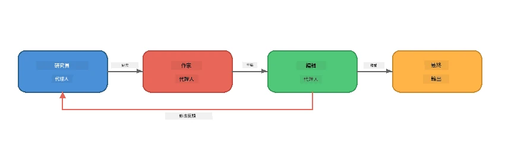
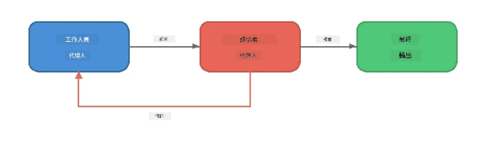
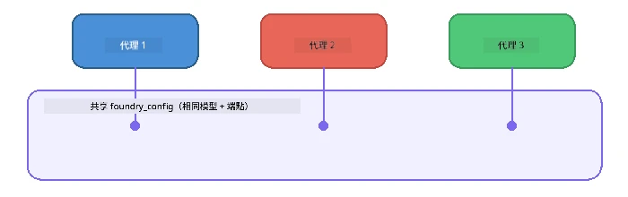

# 第6部分：多代理工作流程

> **目標：** 結合多個專門代理成協調管線，將複雜任務分配給協作代理 — 所有操作均本地執行於 Foundry Local。

## 為何選擇多代理？

單一代理能處理許多任務，但複雜工作流程受益於<strong>專業化</strong>。非得讓一個代理同時研究、寫作和編輯，你可以將工作分割成聚焦的角色：



| 模式 | 說明 |
|---------|-------------|
| <strong>串聯</strong> | 代理 A 的輸出作為代理 B 的輸入 → 代理 C |
| <strong>反饋回路</strong> | 評估代理可以將工作退回要求修訂 |
| <strong>共享上下文</strong> | 所有代理用同一模型/端點，但指令不同 |
| <strong>類型化輸出</strong> | 代理產生結構化結果（JSON）以確保可靠交接 |

---

## 練習

### 練習 1 - 運行多代理管線

本工作坊包含完整的研究員 → 作家 → 編輯工作流程。

<details>
<summary><strong>🐍 Python</strong></summary>

**設定：**
```bash
cd python
python -m venv venv

# Windows（PowerShell）：
venv\Scripts\Activate.ps1
# macOS：
source venv/bin/activate

pip install -r requirements.txt
```

**執行：**
```bash
python foundry-local-multi-agent.py
```

**會發生什麼：**
1. <strong>研究員</strong> 接收主題並返回重點事實清單
2. <strong>作家</strong> 利用研究資料草擬一篇部落格文章（3-4段）
3. <strong>編輯</strong> 審查文章品質並返回接受或修訂評語

</details>

<details>
<summary><strong>📦 JavaScript</strong></summary>

**設定：**
```bash
cd javascript
npm install
```

**執行：**
```bash
node foundry-local-multi-agent.mjs
```

<strong>相同三階段管線</strong> - 研究員 → 作家 → 編輯。

</details>

<details>
<summary><strong>💜 C#</strong></summary>

**設定：**
```bash
cd csharp
dotnet restore
```

**執行：**
```bash
dotnet run multi
```

<strong>相同三階段管線</strong> - 研究員 → 作家 → 編輯。

</details>

---

### 練習 2 - 管線結構剖析

研究代理如何定義與連接：

**1. 共享模型客戶端**

所有代理共用相同 Foundry Local 模型：

```python
# Python - FoundryLocalClient 處理所有事務
from agent_framework_foundry_local import FoundryLocalClient

client = FoundryLocalClient(model_id="phi-3.5-mini")
```

```javascript
// JavaScript - OpenAI SDK 指向 Foundry 本地
const client = new OpenAI({
  baseURL: manager.urls[0] + "/v1",
  apiKey: "foundry-local",
});
```

```csharp
// C# - OpenAIClient pointed at Foundry Local
var key = new ApiKeyCredential("foundry-local");
var client = new OpenAIClient(key, new OpenAIClientOptions
{
    Endpoint = new Uri(manager.Urls[0] + "/v1")
});
var chatClient = client.GetChatClient(model.Id);
```

**2. 專門指令**

每個代理有不同人格設定：

| 代理 | 指令摘要 |
|-------|----------------------|
| 研究員 |「提供關鍵事實、統計數據與背景。以項目符號組織。」 |
| 作家 |「根據研究筆記撰寫一篇吸引人的部落格文章（3-4段）。不可捏造事實。」 |
| 編輯 |「檢視清晰度、文法和事實一致性。裁決：接受或修訂。」 |

**3. 代理間資料流**

```python
# 第一步 - 研究員嘅輸出成為作家嘅輸入
research_result = await researcher.run(f"Research: {topic}")

# 第二步 - 作家嘅輸出成為編輯嘅輸入
writer_result = await writer.run(f"Write using:\n{research_result}")

# 第三步 - 編輯會審閱研究同文章
editor_result = await editor.run(
    f"Research:\n{research_result}\n\nArticle:\n{writer_result}"
)
```

```csharp
// C# - same pattern, async calls with AIAgent
var researchNotes = await researcher.RunAsync(
    $"Research the following topic and provide key facts:\n{topic}");

var draft = await writer.RunAsync(
    $"Write a blog post based on these research notes:\n\n{researchNotes}");

var verdict = await editor.RunAsync(
    $"Review this article for quality and accuracy.\n\n" +
    $"Research notes:\n{researchNotes}\n\n" +
    $"Article:\n{draft}");
```

> **關鍵見解：** 每個代理接收前一代理累積的上下文。編輯可看到原始研究與草稿，方便核對事實一致性。

---

### 練習 3 - 新增第四個代理

擴展管線加入新代理。選擇一個：

| 代理 | 目的 | 指令 |
|-------|---------|-------------|
| <strong>事實查核員</strong> | 驗證文章中的主張 | `"你負責核實事實主張。針對每個主張，說明是否有研究筆記支援。回傳包含已驗證/未驗證項目的 JSON。" ` |
| <strong>標題寫手</strong> | 創作吸睛標題 | `"為文章產生5個標題選項。風格多樣：資訊型、誘餌型、疑問型、清單型、情感型。" ` |
| <strong>社群媒體</strong> | 製作宣傳貼文 | `"製作3則宣傳此文章的社群媒體貼文：一則 Twitter（280字）、一則 LinkedIn（專業語調）、一則 Instagram（輕鬆並附表情符號建議）。"` |

<details>
<summary><strong>🐍 Python - 新增標題寫手</strong></summary>

```python
headline_agent = client.as_agent(
    name="HeadlineWriter",
    instructions=(
        "You are a headline specialist. Given an article, generate exactly "
        "5 headline options. Vary the style: informative, question-based, "
        "listicle, emotional, and provocative. Return them as a numbered list."
    ),
)

# 編輯接受後，產生標題
headline_result = await headline_agent.run(
    f"Generate headlines for this article:\n\n{writer_result}"
)
print(f"\n--- Headlines ---\n{headline_result}")
```

</details>

<details>
<summary><strong>📦 JavaScript - 新增標題寫手</strong></summary>

```javascript
const headlineAgent = new ChatAgent({
  client,
  modelId: modelInfo.id,
  instructions:
    "You are a headline specialist. Given an article, generate exactly " +
    "5 headline options. Vary the style: informative, question-based, " +
    "listicle, emotional, and provocative. Return them as a numbered list.",
  name: "HeadlineWriter",
});

const headlineResult = await headlineAgent.run(
  `Generate headlines for this article:\n\n${writerResult.text}`
);
console.log(`\n--- Headlines ---\n${headlineResult.text}`);
```

</details>

<details>
<summary><strong>💜 C# - 新增標題寫手</strong></summary>

```csharp
AIAgent headlineAgent = chatClient.AsAIAgent(
    name: "HeadlineWriter",
    instructions:
        "You are a headline specialist. Given an article, generate exactly " +
        "5 headline options. Vary the style: informative, question-based, " +
        "listicle, emotional, and provocative. Return them as a numbered list."
);

// After the editor accepts, generate headlines
var headlines = await headlineAgent.RunAsync(
    $"Generate headlines for this article:\n\n{draft}");
Console.WriteLine($"\n--- Headlines ---\n{headlines}");
```

</details>

---

### 練習 4 - 設計你自己的工作流程

設計一個不同領域的多代理管線。以下是幾個概念：

| 領域 | 代理 | 流程 |
|--------|--------|------|
| <strong>程式碼審查</strong> | 分析器 → 審查者 → 摘要者 | 分析程式結構 → 審查問題 → 產生摘要報告 |
| <strong>客戶支援</strong> | 分類器 → 回覆者 → 品管 | 分類工單 → 草擬回覆 → 品質審核 |
| <strong>教育</strong> | 測驗創建者 → 學生模擬器 → 評分者 | 產生測驗 → 模擬答題 → 評分與解釋 |
| <strong>數據分析</strong> | 解讀者 → 分析師 → 報告者 | 解讀資料需求 → 分析模式 → 撰寫報告 |

**步驟：**
1. 定義3個以上具有明確 `instructions` 的代理
2. 決定資料流向 — 每個代理接收與輸出什麼？
3. 依照練習1-3的模式實作管線
4. 若需，一個代理可作為評估者加入反饋回路

---

## 編排模式

以下為適用於任意多代理系統的編排模式（於[第7部分](part7-zava-creative-writer.md)中深入探討）：

### 串聯管線


每個代理處理前一代理的輸出。簡單且可預測。

### 反饋回路



評估代理能觸發前面階段重執行。Zava Writer 中，編輯可將反饋回傳給研究員與作家。

### 共享上下文



所有代理共用同一 `foundry_config`，因此使用相同模型與端點。

---

## 重要重點

| 概念 | 你所學習的 |
|---------|-----------------|
| 代理專業化 | 每個代理透過明確指令擅長一件事 |
| 資料交接 | 一代理的輸出作為下一代理的輸入 |
| 反饋回路 | 評估者可以觸發重試以提升品質 |
| 結構化輸出 | JSON 格式回應確保代理間可靠溝通 |
| 編排 | 協調者管理管線順序與錯誤處理 |
| 生產模式 | 運用於[第7部分：Zava 創意寫手](part7-zava-creative-writer.md) |

---

## 後續步驟

繼續查看[第7部分：Zava 創意寫手 - 專題應用](part7-zava-creative-writer.md)，探索一個生產級多代理應用，有4個專業代理、串流輸出、產品搜尋與反饋回路，提供 Python、JavaScript 和 C# 版本。