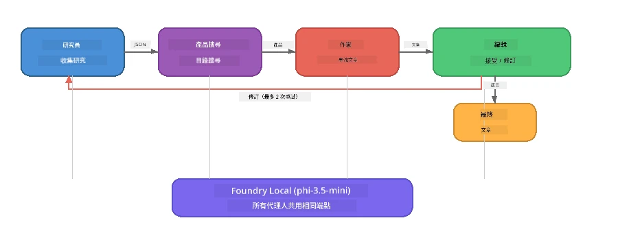

# 第 7 部分：Zava 創意作家－系統整合應用

> **目標：** 探索一個生產環境風格的多智能體應用，四個專責智能體協作，為 Zava Retail DIY 製作雜誌品質的文章－完全在你的裝置上使用 Foundry Local 運行。

這是工作坊的<strong>壓軸實驗室</strong>。它整合了你所學的一切－SDK 整合（第3部分）、從本地資料檢索（第4部分）、智能體角色設定（第5部分）以及多智能體編排（第6部分）－變成完整應用，提供 **Python**、**JavaScript** 和 **C#** 三種版本。

---

## 你將探索的內容

| 概念 | 在 Zava 作家中位置 |
|---------|----------------------------|
| 4 步驟模型載入 | 共享設定模組啟動 Foundry Local |
| RAG 風格檢索 | 產品智能體搜索本地目錄 |
| 智能體專責 | 4 個採用不同系統提示的智能體 |
| 串流輸出 | 作家即時產出分詞 |
| 結構化交接 | 研究員 → JSON，編輯 → JSON 決策 |
| 反饋迴路 | 編輯可觸發重執行（最多 2 次重試） |

---

## 架構

Zava 創意作家採用<strong>順序管線搭配評估者驅動反饋</strong>。三種語言實作均遵循相同架構：



### 四個智能體

| 智能體 | 輸入 | 輸出 | 目的 |
|-------|-------|--------|---------|
| **Researcher（研究員）** | 主題 + 選用反饋 | `{"web": [{url, name, description}, ...]}` | 通過 LLM 收集背景研究資料 |
| **Product Search（產品搜索）** | 產品上下文字串 | 符合的產品清單 | LLM 生成查詢 + 關鍵字對本地目錄搜尋 |
| **Writer（作家）** | 研究 + 產品 + 任務 + 反饋 | 串流文章文本（以 `---` 分割） | 實時撰寫雜誌品質文章草稿 |
| **Editor（編輯）** | 文章 + 作家自我反饋 | `{"decision": "accept/revise", "editorFeedback": "...", "researchFeedback": "..."}` | 審核品質，必要時觸發重試 |

### 管線流程

1. <strong>研究員</strong> 收到主題並產生結構化的研究筆記（JSON）
2. <strong>產品搜索</strong> 以 LLM 生成的搜尋詞查詢本地產品目錄
3. <strong>作家</strong> 合併研究 + 產品 + 任務，串流產出文章，於 `---` 分隔符後附加自我反饋
4. <strong>編輯</strong> 審核文章並回傳 JSON 判決：
   - `"accept"` → 管線完成
   - `"revise"` → 回饋送回研究員與作家（最多 2 次重試）

---

## 前置條件

- 完成 [第 6 部分：多智能體工作流程](part6-multi-agent-workflows.md)
- 已安裝 Foundry Local CLI 並下載 `phi-3.5-mini` 模型

---

## 練習

### 練習 1 - 執行 Zava 創意作家

選擇你的語言並執行應用：

<details>
<summary><strong>🐍 Python - FastAPI 網路服務</strong></summary>

Python 版本作為<strong>網路服務</strong>搭配 REST API 運行，展示如何構建生產後端。

**設定：**
```bash
cd zava-creative-writer-local/src/api
python -m venv venv

# Windows（PowerShell）：
venv\Scripts\Activate.ps1
# macOS：
source venv/bin/activate

pip install -r requirements.txt
```

**運行：**
```bash
uvicorn main:app --reload
```

**測試：**
```bash
curl -X POST http://localhost:8000/api/article \
  -H "Content-Type: application/json" \
  -d '{
    "research": "DIY home improvement trends",
    "products": "power tools and paints",
    "assignment": "Write an article about weekend renovation projects for DIY enthusiasts"
  }'
```

回應以換行分隔的 JSON 訊息串流返回，顯示每個智能體的進程。

</details>

<details>
<summary><strong>📦 JavaScript - Node.js CLI</strong></summary>

JavaScript 版本作為<strong>CLI 應用</strong>執行，於控制台印出智能體進度與文章。

**設定：**
```bash
cd zava-creative-writer-local/src/javascript
npm install
```

**執行：**
```bash
node main.mjs
```

你將看到：
1. Foundry Local 模型載入（下載時會有進度條）
2. 每個智能體依序執行並顯示狀態消息
3. 文章實時串流輸出至控制台
4. 編輯的接受／要求修訂決策

</details>

<details>
<summary><strong>💜 C# - .NET 控制台應用</strong></summary>

C# 版本作為<strong>.NET 控制台應用</strong>執行，具備同樣的管線與串流輸出。

**設定：**
```bash
cd zava-creative-writer-local/src/csharp
dotnet restore
```

**執行：**
```bash
dotnet run
```

輸出模式與 JavaScript 類似－智能體狀態消息、串流文章與編輯判決。

</details>

---

### 練習 2 - 研究程式碼結構

各語言實作皆擁有相同邏輯組件。比對結構：

**Python** (`src/api/`)：
| 檔案 | 用途 |
|------|---------|
| `foundry_config.py` | 共享 Foundry Local 管理器、模型與用戶端（4 步驟初始化） |
| `orchestrator.py` | 管線協調與反饋迴路實作 |
| `main.py` | FastAPI 端點（`POST /api/article`） |
| `agents/researcher/researcher.py` | 基於 LLM 的研究，輸出 JSON |
| `agents/product/product.py` | LLM 查詢生成 + 關鍵字搜尋 |
| `agents/writer/writer.py` | 串流文章生成 |
| `agents/editor/editor.py` | JSON 格式接受/修訂決策 |

**JavaScript** (`src/javascript/`)：
| 檔案 | 用途 |
|------|---------|
| `foundryConfig.mjs` | 共享 Foundry Local 配置（4 步驟初始化含進度條） |
| `main.mjs` | 編排器 + CLI 入口 |
| `researcher.mjs` | LLM 研究智能體 |
| `product.mjs` | LLM 查詢生成 + 關鍵字搜尋 |
| `writer.mjs` | 串流文章生成（異步生成器） |
| `editor.mjs` | JSON 接受/修訂決策 |
| `products.mjs` | 產品目錄資料 |

**C#** (`src/csharp/`)：
| 檔案 | 用途 |
|------|---------|
| `Program.cs` | 完整管線：模型載入、智能體、編排器、反饋迴路 |
| `ZavaCreativeWriter.csproj` | .NET 9 項目，含 Foundry Local + OpenAI 套件 |

> **設計說明：** Python 將每個智能體分離成獨立檔案/目錄（適合大型團隊）；JavaScript 為每智能體使用一模組（適中規模專案適用）；C# 則以單一檔含本地函式呈現（適合示範範例）。正式開發時，請選擇符合團隊慣例的架構。

---

### 練習 3 - 追蹤共享配置

管線中每個智能體共用相同 Foundry Local 模型客戶端。檢視各語言的設定方式：

<details>
<summary><strong>🐍 Python - foundry_config.py</strong></summary>

```python
from foundry_local import FoundryLocalManager

MODEL_ALIAS = "phi-3.5-mini"

# 第一步：建立管理員並啟動 Foundry Local 服務
manager = FoundryLocalManager()
manager.start_service()

# 第二步：檢查模型是否已下載
cached = manager.list_cached_models()
catalog_info = manager.get_model_info(MODEL_ALIAS)
is_cached = any(m.id == catalog_info.id for m in cached) if catalog_info else False

if not is_cached:
    manager.download_model(MODEL_ALIAS)

# 第三步：將模型載入記憶體
manager.load_model(MODEL_ALIAS)
model_id = manager.get_model_info(MODEL_ALIAS).id

# 共享 OpenAI 客戶端
client = openai.OpenAI(base_url=manager.endpoint, api_key=manager.api_key)
```

所有智能體皆從 `foundry_config` 匯入 `client, model_id`。

</details>

<details>
<summary><strong>📦 JavaScript - foundryConfig.mjs</strong></summary>

```javascript
import { FoundryLocalManager } from "foundry-local-sdk";
import { OpenAI } from "openai";

FoundryLocalManager.create({ appName: "ZavaCreativeWriter" });
const manager = FoundryLocalManager.instance;
await manager.startWebService();

// 檢查快取 → 下載 → 載入（新 SDK 模式）
const catalog = manager.catalog;
const model = await catalog.getModel(MODEL_ALIAS);
if (!model.isCached) {
  console.log(`Downloading model: ${MODEL_ALIAS}...`);
  await model.download();
}
await model.load();

const client = new OpenAI({ baseURL: manager.urls[0] + "/v1", apiKey: "foundry-local" });
const modelId = model.id;
export { client, modelId };
```

所有智能體皆從 `./foundryConfig.mjs` 匯入 `{ client, modelId }`。

</details>

<details>
<summary><strong>💜 C# - Program.cs 檔首</strong></summary>

```csharp
await FoundryLocalManager.CreateAsync(
    new Configuration
    {
        AppName = "ZavaCreativeWriter",
        Web = new Configuration.WebService { Urls = "http://127.0.0.1:0" }
    }, NullLogger.Instance, default);
var manager = FoundryLocalManager.Instance;
await manager.StartWebServiceAsync(default);

var catalog = await manager.GetCatalogAsync(default);
var catalogModel = await catalog.GetModelAsync(alias, default);
var isCached = await catalogModel.IsCachedAsync(default);
if (!isCached)
    await catalogModel.DownloadAsync(null, default);

await catalogModel.LoadAsync(default);
var key = new ApiKeyCredential("foundry-local");
var chatClient = new OpenAIClient(key, new OpenAIClientOptions
{
    Endpoint = new Uri(manager.Urls[0] + "/v1")
}).GetChatClient(catalogModel.Id);
```

`chatClient` 隨後傳入同檔案中所有智能體函式。

</details>

> **關鍵模式：** 模型載入流程（啟動服務 → 檢查快取 → 下載 → 載入）確保用戶可見明確進度，且模型僅下載一次。這是任何 Foundry Local 應用的最佳實踐。

---

### 練習 4 - 理解反饋迴路

反饋迴路讓這管線變得「聰明」－編輯可要求作業重做。追蹤邏輯：

```
Orchestrator:
  1. researcher.research(topic, "No Feedback")    ← first pass
  2. product.findProducts(productContext)
  3. writer.write(research, products, assignment)  ← streams article
  4. Split article at "---" → article + writerFeedback
  5. editor.edit(article, writerFeedback)

  WHILE editor says "revise" AND retryCount < 2:
    6. researcher.research(topic, editor.researchFeedback)  ← refined
    7. writer.write(research, products, editor.editorFeedback)
    8. editor.edit(newArticle, newWriterFeedback)
    9. retryCount++
```

**思考問題：**
- 為什麼重試限制設為 2 次？若增加會怎樣？
- 為何研究員取得 `researchFeedback`，作家取得 `editorFeedback`？
- 若編輯總是回「修訂」，會發生什麼？

---

### 練習 5 - 修改智能體

嘗試改變某個智能體的行為，觀察對管線的影響：

| 修改 | 變更項目 |
|-------------|----------------|
| <strong>更嚴格的編輯</strong> | 修改編輯系統提示，永遠至少要求一次修訂 |
| <strong>更長的文章</strong> | 將作家提示從「800-1000 字」改為「1500-2000 字」 |
| <strong>不同產品</strong> | 新增或修改產品目錄的產品 |
| <strong>新研究主題</strong> | 更改 `researchContext` 預設主題 |
| **純 JSON 研究員** | 讓研究員回傳 10 筆而非 3-5 筆 |

> **提示：** 三種語言均實作相同架構，請選擇你最熟悉的語言進行改動。

---

### 練習 6 - 新增第五個智能體

擴展管線加入新智能體。以下是一些點子：

| 智能體 | 管線中位置 | 目的 |
|-------|-------------------|---------|
| **Fact-Checker（事實查核員）** | 作家之後、編輯之前 | 驗證研究資料中的聲明 |
| **SEO 優化員** | 編輯接受後 | 新增 meta 描述、關鍵字、Slug |
| <strong>插畫師</strong> | 編輯接受後 | 為文章產生圖像提示 |
| <strong>翻譯員</strong> | 編輯接受後 | 翻譯文章成其他語言 |

**步驟：**
1. 編寫智能體系統提示
2. 建立智能體函式（符合你語言中既有模式）
3. 在編排器合適位置插入該智能體
4. 更新輸出與日誌，展示新智能體貢獻

---

## Foundry Local 與智能體框架如何協同

此應用展示使用 Foundry Local 建構多智能體系統的推薦模式：

| 層級 | 元件 | 角色 |
|-------|-----------|------|
| <strong>執行時</strong> | Foundry Local | 本地下載、管理並服務模型 |
| <strong>客戶端</strong> | OpenAI SDK | 發送聊天補全請求至本地端點 |
| <strong>智能體</strong> | 系統提示 + 聊天呼叫 | 透過聚焦指令實現專責行為 |
| <strong>編排器</strong> | 管線協調者 | 管理資料流、執行序與反饋迴路 |
| <strong>框架</strong> | 微軟智能體框架 | 提供 `ChatAgent` 抽象與模式 |

核心觀點：**Foundry Local 取代雲端後端，但不改變應用架構。** 先前適用於雲端模型的智能體模式、編排策略與結構化交接，一模一樣適用於本地模型－你只需改為指向本地端點，替代 Azure 端點即可。

---

## 重要心得

| 概念 | 學習重點 |
|---------|-----------------|
| 生產架構 | 如何架構多智能體應用，具共享設定且智能體分開管理 |
| 4 步驟模型載入 | 啟動 Foundry Local 的最佳實踐，含用戶可見進度 |
| 智能體專責 | 四個智能體均有聚焦指令與專屬輸出格式 |
| 串流生成 | 作家實時產出分詞，支援感應式 UI |
| 反饋迴路 | 編輯驅動的重試改善輸出，無需人工作業介入 |
| 跨語言模式 | 相同架構可於 Python、JavaScript 與 C# 實作 |
| 本地即生產 | Foundry Local 支援完全相容雲端的 OpenAI API |

---

## 下一步

繼續至 [第 8 部分：評估主導開發](part8-evaluation-led-development.md)，為你的智能體建立系統化評估框架，採用金標資料集、規則檢查和 LLM 擔任裁判的分數評估。