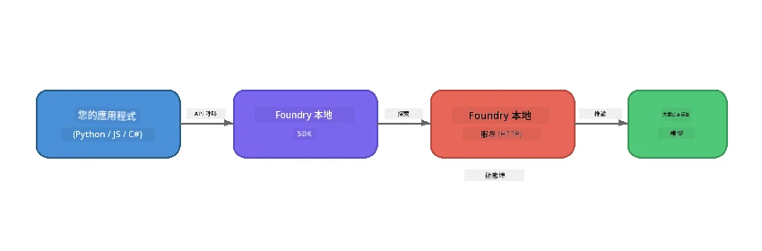

# Part 1: Getting Started with Foundry Local


## What is Foundry Local?

[Foundry Local](https://foundrylocal.ai) 讓你可以 <strong>直接在你的電腦上</strong> 運行開源的 AI 語言模型 — 無需網路、無需雲端費用，並且完全保障資料私隱。它：

- <strong>下載並本地運行模型</strong>，自動根據硬件優化（GPU、CPU 或 NPU）
- **提供與 OpenAI 相容的 API**，讓你使用熟悉的 SDK 和工具
- **無需 Azure 訂閱** 或註冊 — 只需安裝即可開始建立

可以把它視為在你機器上完全運行的私人 AI。

## Learning Objectives

完成本實驗後，你將可以：

- 在你的作業系統上安裝 Foundry Local CLI
- 了解什麼是模型別名及其運作方式
- 下載並運行你的第一個本地 AI 模型
- 從命令列向本地模型發送聊天訊息
- 理解本地 AI 模型與雲端托管模型的差異

---

## Prerequisites

### System Requirements

| Requirement | Minimum | Recommended |
|-------------|---------|-------------|
| **RAM** | 8 GB | 16 GB |
| **Disk Space** | 5 GB (for models) | 10 GB |
| **CPU** | 4 cores | 8+ cores |
| **GPU** | Optional | NVIDIA with CUDA 11.8+ |
| **OS** | Windows 10/11 (x64/ARM), Windows Server 2025, macOS 13+ | - |

> **Note:** Foundry Local 會自動選擇最適合你的硬件的模型版本。如果你有 NVIDIA GPU，會使用 CUDA 加速；如果有 Qualcomm NPU，則會使用它。否則會回落使用經過優化的 CPU 版本。

### Install Foundry Local CLI

**Windows** (PowerShell):
```powershell
winget install Microsoft.FoundryLocal
```

**macOS** (Homebrew):
```bash
brew tap microsoft/foundrylocal
brew install foundrylocal
```

> **Note:** Foundry Local 目前僅支援 Windows 和 macOS。不支援 Linux。

Verify the installation:
```bash
foundry --version
```

---

## Lab Exercises

### Exercise 1: Explore Available Models

Foundry Local 包含一個預先優化的開源模型目錄。列出它們：

```bash
foundry model list
```

你會看到像以下的模型：
- `phi-3.5-mini` - 微軟的 3.8B 參數模型（快速，品質不錯）
- `phi-4-mini` - 較新且功能更強的 Phi 模型
- `phi-4-mini-reasoning` - 具備鏈式思考 (`<think>` 標籤) 的 Phi 模型
- `phi-4` - 微軟最大的 Phi 模型（10.4 GB）
- `qwen2.5-0.5b` - 非常小且快速（適合資源受限裝置）
- `qwen2.5-7b` - 強大的通用模型，支援呼叫工具
- `qwen2.5-coder-7b` - 優化用於程式碼生成
- `deepseek-r1-7b` - 強大推理模型
- `gpt-oss-20b` - 大型開源模型（MIT 許可，12.5 GB）
- `whisper-base` - 語音轉文字轉錄（383 MB）
- `whisper-large-v3-turbo` - 高精度轉錄（9 GB）

> **What is a model alias?** 像 `phi-3.5-mini` 這樣的別名是捷徑。使用別名時，Foundry Local 會自動下載對你的硬件最優的版本（NVIDIA GPU 會用 CUDA，加速，否則使用 CPU 優化版）。你無需煩惱選擇哪個版本。

### Exercise 2: Run Your First Model

下載並開始與模型互動聊天：

```bash
foundry model run phi-3.5-mini
```

你第一次執行時，Foundry Local 會：
1. 偵測你的硬件
2. 下載最佳模型版本（可能需要幾分鐘）
3. 將模型載入記憶體
4. 啟動交互式聊天會話

試著問它一些問題：
```
You: What is the golden ratio?
You: Can you explain it as if I were 10 years old?
You: Write a haiku about mathematics
```

輸入 `exit` 或按 `Ctrl+C` 退出。

### Exercise 3: Pre-download a Model

如果想要下載模型而不啟動聊天：

```bash
foundry model download phi-3.5-mini
```

查看哪些模型已經下載到你的機器：

```bash
foundry cache list
```

### Exercise 4: Understand the Architecture

Foundry Local 以 **本地 HTTP 服務** 運行，並暴露 OpenAI 相容的 REST API。這表示：

1. 服務會啟動在 <strong>動態端口</strong>（每次都可能不同）
2. 你使用 SDK 來發現實際的端點 URL
3. 你可以用 <strong>任意</strong> OpenAI 相容的用戶端庫與它通訊



> **Important:** Foundry Local 每次啟動時會分配 <strong>動態端口</strong>。切勿硬編碼像 `localhost:5272` 的端口號。要始終使用 SDK 來發現當前 URL（例如 Python 的 `manager.endpoint` 或 JavaScript 的 `manager.urls[0]`）。

---

## Key Takeaways

| Concept | What You Learned |
|---------|------------------|
| On-device AI | Foundry Local 完全在你的裝置上運行模型，無需雲端、API 金鑰或費用 |
| Model aliases | 像 `phi-3.5-mini` 這樣的別名會自動選擇最適硬件的版本 |
| Dynamic ports | 服務運行在動態端口；始終使用 SDK 來發現端點 |
| CLI and SDK | 你可以通過 CLI (`foundry model run`) 或 SDK 程式化操作模型 |

---

## Next Steps

繼續閱讀 [Part 2: Foundry Local SDK Deep Dive](part2-foundry-local-sdk.md)，深入掌握管理模型、服務及快取的 SDK API。