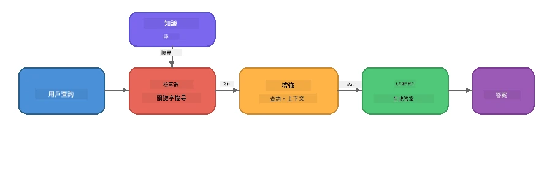

# 第4部分：使用 Foundry Local 建立 RAG 應用程式

## 概覽

大型語言模型功能強大，但它們只知道訓練資料中的內容。**檢索增強生成（Retrieval-Augmented Generation，RAG）** 通過在查詢時提供相關上下文來解決這個問題——這些上下文來自您自己的文件、資料庫或知識庫。

在本實驗中，您將建立一個完整的 RAG 管道，<strong>完全在您的裝置上運行</strong>，使用 Foundry Local。不依賴雲端服務，無向量資料庫，無嵌入 API——只用本地檢索和本地模型。

## 學習目標

完成本實驗後，您將能夠：

- 解釋什麼是 RAG 以及它為什麼對 AI 應用程式重要
- 從文本文件建立本地知識庫
- 實作簡單的檢索函數以尋找相關上下文
- 撰寫系統提示以將模型基於檢索到的事實進行定位
- 在裝置上執行完整的檢索 → 增強 → 生成流程
- 理解簡單關鍵字檢索和向量搜索之間的權衡

---

## 先決條件

- 完成[第3部分：使用 Foundry Local SDK 與 OpenAI](part3-sdk-and-apis.md)
- 已安裝 Foundry Local CLI 並下載 `phi-3.5-mini` 模型

---

## 概念：什麼是 RAG？

沒有 RAG，LLM 只能從它的訓練資料中回答問題——這些資料可能過時、不完整或缺少您的私人資訊：

```
User: "What is Zava's return policy?"
LLM:  "I do not have information about Zava's return policy."  ← No context!
```

有了 RAG，您先<strong>檢索</strong>相關文件，再在<strong>生成</strong>回應前將這些上下文<strong>增強</strong>到提示中：



關鍵見解：**模型不需要“知道”答案；它只需要閱讀正確的文件。**

---

## 實驗練習

### 練習1：了解知識庫

打開你選擇語言的 RAG 範例並檢視知識庫：

<details>
<summary><b>🐍 Python: <code>python/foundry-local-rag.py</code></b></summary>

知識庫是一個包含 `title` 和 `content` 欄位的字典列表：

```python
KNOWLEDGE_BASE = [
    {
        "title": "Foundry Local Overview",
        "content": (
            "Foundry Local brings the power of Azure AI Foundry to your local "
            "device without requiring an Azure subscription..."
        ),
    },
    {
        "title": "Supported Hardware",
        "content": (
            "Foundry Local automatically selects the best model variant for "
            "your hardware. If you have an Nvidia CUDA GPU it downloads the "
            "CUDA-optimized model..."
        ),
    },
    # ... 更多條目
]
```

每條記錄代表一個“知識塊”——針對某個主題的集中資訊。

</details>

<details>
<summary><b>📘 JavaScript: <code>javascript/foundry-local-rag.mjs</code></b></summary>

知識庫使用相同結構的物件陣列：

```javascript
const KNOWLEDGE_BASE = [
  {
    title: "Foundry Local Overview",
    content:
      "Foundry Local brings the power of Azure AI Foundry to your local " +
      "device without requiring an Azure subscription...",
  },
  {
    title: "Supported Hardware",
    content:
      "Foundry Local automatically selects the best model variant for " +
      "your hardware...",
  },
  // ... 更多條目
];
```

</details>

<details>
<summary><b>💜 C#: <code>csharp/RagPipeline.cs</code></b></summary>

知識庫使用命名元組清單：

```csharp
private static readonly List<(string Title, string Content)> KnowledgeBase =
[
    ("Foundry Local Overview",
     "Foundry Local brings the power of Azure AI Foundry to your local " +
     "device without requiring an Azure subscription..."),

    ("Supported Hardware",
     "Foundry Local automatically selects the best model variant for " +
     "your hardware..."),

    // ... more entries
];
```

</details>

> <strong>在真實應用中</strong>，知識庫會來自磁碟上的檔案、資料庫、搜尋索引或 API。為了本實驗，我們使用記憶體中的清單以保持簡單。

---

### 練習2：了解檢索函數

檢索步驟搜尋最相關的知識塊以回答使用者問題。本例使用<strong>關鍵字重疊</strong>——統計查詢中有多少詞出現於每個塊中：

<details>
<summary><b>🐍 Python</b></summary>

```python
def retrieve(query: str, top_k: int = 2) -> list[dict]:
    """Return the top-k knowledge chunks most relevant to the query."""
    query_words = set(query.lower().split())
    scored = []
    for chunk in KNOWLEDGE_BASE:
        chunk_words = set(chunk["content"].lower().split())
        overlap = len(query_words & chunk_words)
        scored.append((overlap, chunk))
    scored.sort(key=lambda x: x[0], reverse=True)
    return [item[1] for item in scored[:top_k]]
```

</details>

<details>
<summary><b>📘 JavaScript</b></summary>

```javascript
function retrieve(query, topK = 2) {
  const queryWords = new Set(query.toLowerCase().split(/\s+/));
  const scored = KNOWLEDGE_BASE.map((chunk) => {
    const chunkWords = new Set(chunk.content.toLowerCase().split(/\s+/));
    let overlap = 0;
    for (const w of queryWords) {
      if (chunkWords.has(w)) overlap++;
    }
    return { overlap, chunk };
  });
  scored.sort((a, b) => b.overlap - a.overlap);
  return scored.slice(0, topK).map((s) => s.chunk);
}
```

</details>

<details>
<summary><b>💜 C#</b></summary>

```csharp
private static List<(string Title, string Content)> Retrieve(string query, int topK = 2)
{
    var queryWords = new HashSet<string>(
        query.ToLowerInvariant().Split(' ', StringSplitOptions.RemoveEmptyEntries));

    return KnowledgeBase
        .Select(chunk =>
        {
            var chunkWords = new HashSet<string>(
                chunk.Content.ToLowerInvariant().Split(' ', StringSplitOptions.RemoveEmptyEntries));
            var overlap = queryWords.Intersect(chunkWords).Count();
            return (Overlap: overlap, Chunk: chunk);
        })
        .OrderByDescending(x => x.Overlap)
        .Take(topK)
        .Select(x => x.Chunk)
        .ToList();
}
```

</details>

**運作方式：**
1. 將查詢拆分成單字
2. 對每個知識塊計算有多少查詢字出現
3. 按重疊分數排序（最高優先）
4. 回傳前 k 個最相關的塊

> <strong>權衡點：</strong>關鍵字重疊簡單但有限，無法理解同義詞或語意。生產型 RAG 系統通常使用<strong>嵌入向量</strong>和<strong>向量資料庫</strong>做語義搜尋。不過，關鍵字重疊是個很好的起點，且不需要額外依賴。

---

### 練習3：了解增強提示

檢索到的上下文會被注入至<strong>系統提示</strong>，再傳給模型：

```python
system_prompt = (
    "You are a helpful assistant. Answer the user's question using ONLY "
    "the information provided in the context below. If the context does "
    "not contain enough information, say so.\n\n"
    f"Context:\n{context_text}"
)
```

設計要點：
- **「僅使用所提供的資訊」**──防止模型憑空捏造上下文明顯外的事實
- **「若上下文資訊不足，請表示不確定」**──鼓勵誠實回答「我不知道」
- 將上下文放在系統訊息中，以塑造所有回答

---

### 練習4：執行 RAG 管道

執行完整示例：

**Python:**
```bash
cd python
python foundry-local-rag.py
```

**JavaScript:**
```bash
cd javascript
node foundry-local-rag.mjs
```

**C#:**
```bash
cd csharp
dotnet run rag
```

你應該會看到三件事輸出：
1. <strong>被提問的問題</strong>
2. <strong>檢索到的上下文</strong>——從知識庫選出的知識塊
3. <strong>回答</strong>——模型僅用該上下文生成的答案

範例輸出：
```
Question: How do I install Foundry Local and what hardware does it support?

--- Retrieved Context ---
### Installation
On Windows install Foundry Local with: winget install Microsoft.FoundryLocal...

### Supported Hardware
Foundry Local automatically selects the best model variant for your hardware...
-------------------------

Answer: To install Foundry Local, you can use the following methods depending
on your operating system: On Windows, run `winget install Microsoft.FoundryLocal`.
On macOS, use `brew install microsoft/foundrylocal/foundrylocal`...
```

注意模型答案是<strong>基於檢索上下文</strong>——只提及知識庫文件中的事實。

---

### 練習5：嘗試與擴展

試試以下修改以加深理解：

1. <strong>改變問題</strong>——問一個知識庫有的問題與一個沒有的問題：
   ```python
   question = "What programming languages does Foundry Local support?"  # ← 在語境中
   question = "How much does Foundry Local cost?"                       # ← 不在語境中
   ```
   當答案不在上下文中時，模型是否正確回答「我不知道」？

2. <strong>新增知識塊</strong>——在 `KNOWLEDGE_BASE` 尾端新增條目：
   ```python
   {
       "title": "Pricing",
       "content": "Foundry Local is completely free and open source under the MIT license.",
   }
   ```
   再次詢問定價問題。

3. **改變 `top_k`**——檢索更多或更少知識塊：
   ```python
   context_chunks = retrieve(question, top_k=3)  # 更多上下文
   context_chunks = retrieve(question, top_k=1)  # 較少上下文
   ```
   上下文量如何影響答案品質？

4. <strong>移除定位指示</strong>——將系統提示改為「你是個有幫助的助理。」看看模型是否開始捏造事實。

---

## 深入探討：優化 RAG 以適用裝置端效能

在裝置端執行 RAG 會遇到雲端沒有的限制：記憶體有限、無專用 GPU（CPU/NPU 執行）、模型上下文窗口小。以下設計決策直接針對這些限制，並基於使用 Foundry Local 建立的生產級本地 RAG 應用範式。

### 分塊策略：固定大小滑動視窗

如何將文件拆成塊，是任何 RAG 系統中最具影響力的決策之一。對於裝置端場景，推薦使用 <strong>固定大小且有重疊的滑動視窗</strong> 起步：

| 參數 | 推薦值 | 理由 |
|-------|--------|-----|
| <strong>塊大小</strong> | 約 200 個 token | 保持檢索上下文精簡，給 Phi-3.5 Mini 的上下文窗口留空間放系統提示、對話歷史和生成輸出 |
| <strong>重疊長度</strong> | 約 25 個 token (12.5%) | 防止塊界信息遺失——對程序和逐步指令尤其重要 |
| <strong>分詞</strong> | 空白字符拆分 | 無依賴，無須分詞庫。算力全部用於 LLM |

重疊像滑動視窗：每個新塊起點比前一個塊結尾早 25 token，因此跨越塊界的句子會同時出現在兩個塊中。

> **為何不採用其他策略？**
> - <strong>句子拆分</strong>會產生不可預測大小的塊，有些安全程序是長句子，不易拆分
> - <strong>章節拆分</strong>（依 `##` 標題）產生大小不一的塊，部分過小，部分超出模型上下文窗口範圍
> - <strong>語義分塊</strong>（基於嵌入的主題偵測）能提供最佳檢索品質，但需額外模型常駐記憶體，與 Phi-3.5 Mini 搭配使用時對 8-16 GB 共用記憶體裝置風險較高

### 進階檢索：TF-IDF 向量

本實驗的關鍵字重疊方法可用，但若想提升檢索品質且不想額外使用嵌入模型，**TF-IDF（詞頻-逆文件頻率）** 是絕佳的中間選擇：

```
Keyword Overlap  →  TF-IDF Vectors  →  Embedding Models
    (this lab)     (lightweight upgrade)   (production)
  Simple & fast    Better ranking,         Best quality,
  No dependencies  still no ML model       requires embedding model
  ~Basic matching  ~1ms retrieval          ~100-500ms per query
```

TF-IDF 將每個知識塊轉成數值向量，基於該詞在塊中相對於所有塊的重要性。查詢時，同樣將問題向量化，並透過餘弦相似度比對。您可用 SQLite 和純 JavaScript/Python 實作——無需向量資料庫或嵌入 API。

> **效能：**TF-IDF 餘弦相似度於固定大小知識塊上通常實現約<strong>1毫秒檢索速度</strong>，相比之下，嵌入模型對每次查詢編碼需約 100-500 毫秒。20 多份文件切塊和建立索引在不到一秒完成。

### 節省模式：適用資源有限的裝置

在資源非常受限的硬體上（舊筆電、平板、野外裝置），可透過縮減三個參數降低資源消耗：

| 設定 | 標準模式 | 節省/精簡模式 |
|-------|-----------|--------------|
| <strong>系統提示長度</strong> | 約 300 token | 約 80 token |
| **最大輸出 token 數** | 1024 | 512 |
| **檢索塊數 (top-k)** | 5 | 3 |

檢索到的塊數減少，模型處理的上下文變少，降低延遲與記憶體壓力。更短的系統提示為生成答案留更多上下文窗口空間。此權衡在每個上下文 token 都寶貴的裝置上值得嘗試。

### 確保只載入單一模型

裝置端 RAG 最重要原則之一：<strong>僅載入一個模型</strong>。若使用嵌入模型做檢索，且語言模型做生成，會在有限的 NPU/RAM 資源間分裂。輕量級檢索（關鍵字重疊、TF-IDF）可完全避免此問題：

- 無嵌入模型與 LLM 競爭記憶體
- 啟動速度更快——只需載入一個模型
- 記憶體使用可預期——全部資源給 LLM
- 可在 8 GB RAM 裝置運行

### SQLite 作為本地向量庫

對於中小型文件集（數百至低千級的知識塊），**SQLite 速度足夠快**，可直接用於暴力餘弦相似度搜尋且無需額外基礎建設：

- 單一 `.db` 檔案存磁碟——無服務程序，無設定需求
- 主要語言執行環境皆隨附支持（Python `sqlite3`，Node.js `better-sqlite3`，.NET `Microsoft.Data.Sqlite`）
- 在同一張表中儲存文件塊與其 TF-IDF 向量
- 這個規模不需 Pinecone、Qdrant、Chroma 或 FAISS

### 效能摘要

這些設計決策結合起來，在消費級硬體上提供靈敏的 RAG 體驗：

| 指標 | 裝置端效能 |
|-------|-------------|
| <strong>檢索延遲</strong> | 約 1 毫秒（TF-IDF）到約 5 毫秒（關鍵字重疊） |
| <strong>索引速度</strong> | 20 份文件切塊並建立索引不到 1 秒 |
| <strong>內存模型數量</strong> | 1 個（只有 LLM，無嵌入模型） |
| <strong>存儲開銷</strong> | SQLite 中的塊與向量合計小於 1 MB |
| <strong>冷啟動時間</strong> | 單模型載入，無嵌入模型啟動時間 |
| <strong>硬體需求下限</strong> | 8 GB RAM，僅 CPU 支援（無需 GPU） |

> <strong>何時升級？</strong>當規模擴到上百份長文檔，包含混合內容（表格、程式碼、散文），或需語義理解查詢時，考慮加入嵌入模型並改成向量相似度搜尋。對大多數專注文件的裝置端應用，TF-IDF + SQLite 已能用極少資源取得優異效果。

---

## 關鍵概念

| 概念 | 說明 |
|-------|------|
| <strong>檢索</strong> | 根據使用者查詢從知識庫找到相關文件 |
| <strong>增強</strong> | 將檢索到的文件置入提示作為上下文 |
| <strong>生成</strong> | LLM 基於提供的上下文生成答案 |
| <strong>分塊</strong> | 將大型文件拆成較小、聚焦的片段 |
| <strong>定位</strong> | 限制模型只使用所提供上下文（減少幻覺） |
| **Top-k** | 要檢索的最相關塊數量 |

---

## 生產環境 RAG 與本實驗的比較

| 方面 | 本實驗 | 裝置端優化版本 | 雲端生產環境 |
|-------|---------|----------------|-------------|
| <strong>知識庫</strong> | 記憶體清單 | 磁碟文件、SQLite | 資料庫、搜尋索引 |
| <strong>檢索方式</strong> | 關鍵字重疊 | TF-IDF + 餘弦相似度 | 向量嵌入 + 相似度搜尋 |
| <strong>嵌入</strong> | 不需 | 不需，使用 TF-IDF 向量 | 嵌入模型（本地或雲端） |
| <strong>向量存儲</strong> | 不需 | SQLite（單一 `.db` 檔案） | FAISS、Chroma、Azure AI 搜尋等 |
| <strong>分塊方法</strong> | 手動 | 固定大小滑動視窗（約 200 token，重疊 25 token） | 語義或遞歸分塊 |
| <strong>模型數量</strong> | 1（LLM） | 1（LLM） | 2+（嵌入 + LLM） |
| <strong>檢索延遲</strong> | 約5毫秒 | 約1毫秒 | 約100-500毫秒 |
| <strong>規模</strong> | 5份文件 | 幾百份文件 | 百萬份文件 |

您在這裡學到的模式（檢索、增強、生成）在任何規模下都是相同的。檢索方法會改進，但整體架構保持一致。中間欄展示了在設備上使用輕量技術可達成的效果，通常是本地應用的最佳選擇，在那裡您以隱私、離線能力和對外部服務零延遲來交換雲端規模。

---

## 主要重點

| 概念 | 您學到的內容 |
|---------|------------------|
| RAG 模式 | 檢索 + 增強 + 生成：給模型正確的上下文，它就能回答有關您的數據的問題 |
| 設備端 | 所有運算在本地執行，無需雲端 API 或向量數據庫訂閱 |
| 鞏固指令 | 系統提示限制對防止幻覺至關重要 |
| 關鍵字重疊 | 一個簡單但有效的檢索起點 |
| TF-IDF + SQLite | 一條輕量升級路徑，保持檢索在1毫秒以內，無需嵌入模型 |
| 一個模型在記憶體中 | 避免在受限硬件上同時加載嵌入模型和大型語言模型 |
| 片段大小 | 大約200個詞元並帶重疊，在檢索精度和上下文窗口效率之間取得平衡 |
| 邊緣/緊湊模式 | 對非常受限的設備使用較少的片段和較短的提示 |
| 通用模式 | 相同的 RAG 架構適用於任何數據來源：文件、數據庫、API或維基 |

> **想看看完整的設備端 RAG 應用？** 請參閱[Gas Field Local RAG](https://github.com/leestott/local-rag)，這是一個使用 Foundry Local 和 Phi-3.5 Mini 建立的生產級離線 RAG 代理，展示了這些優化模式與真實文件集的應用。

---

## 接下來的步驟

繼續閱讀[第5部分：構建 AI 代理](part5-single-agents.md)，了解如何使用 Microsoft Agent Framework 建立具有角色設定、指令和多輪對話的智能代理。