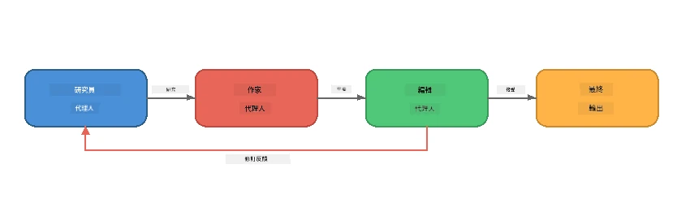
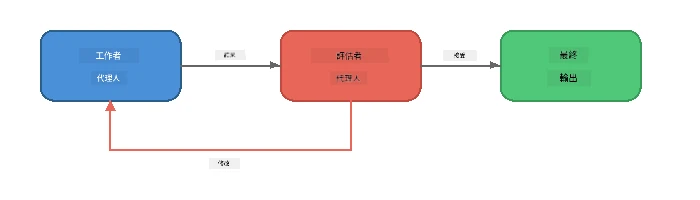

# 第6部分：多智能體工作流程

> **目標：** 將多個專門化智能體結合成協調的流程管線，將複雜任務分配給合作智能體 —— 全部在 Foundry Local 本地運行。

## 為什麼要多智能體？

單一智能體能處理許多任務，但複雜工作流程得益於<strong>專門化</strong>。不是讓一個智能體同時做研究、寫作和編輯，而是將工作劃分為專注的角色：



| 模式 | 描述 |
|---------|-------------|
| <strong>串聯</strong> | 智能體 A 的輸出輸入至智能體 B → 智能體 C |
| <strong>反饋迴路</strong> | 評估智能體可將工作發回以供修訂 |
| <strong>共享上下文</strong> | 所有智能體使用同一模型/端點，但指令不同 |
| <strong>類型化輸出</strong> | 智能體產出結構化結果（JSON）以確保可靠交接 |

---

## 練習

### 練習 1 - 執行多智能體管線

工作坊包含完整的研究員 → 作家 → 編輯流程。

<details>
<summary><strong>🐍 Python</strong></summary>

**安裝設定：**
```bash
cd python
python -m venv venv

# Windows（PowerShell）：
venv\Scripts\Activate.ps1
# macOS：
source venv/bin/activate

pip install -r requirements.txt
```

**執行：**
```bash
python foundry-local-multi-agent.py
```

**發生的事：**
1. <strong>研究員</strong> 接收主題並回傳要點事實
2. <strong>作家</strong> 以研究資料草擬部落格文章（3-4段落）
3. <strong>編輯</strong> 審核文章質量並回覆接受或修訂

</details>

<details>
<summary><strong>📦 JavaScript</strong></summary>

**安裝設定：**
```bash
cd javascript
npm install
```

**執行：**
```bash
node foundry-local-multi-agent.mjs
```

<strong>相同三階段管線</strong> - 研究員 → 作家 → 編輯。

</details>

<details>
<summary><strong>💜 C#</strong></summary>

**安裝設定：**
```bash
cd csharp
dotnet restore
```

**執行：**
```bash
dotnet run multi
```

<strong>相同三階段管線</strong> - 研究員 → 作家 → 編輯。

</details>

---

### 練習 2 - 管線結構解析

研究智能體如何定義與連接：

**1. 共享模型客戶端**

所有智能體共用相同 Foundry Local 模型：

```python
# Python - FoundryLocalClient 處理所有事情
from agent_framework_foundry_local import FoundryLocalClient

client = FoundryLocalClient(model_id="phi-3.5-mini")
```

```javascript
// JavaScript - OpenAI SDK 指向 Foundry Local
const client = new OpenAI({
  baseURL: manager.urls[0] + "/v1",
  apiKey: "foundry-local",
});
```

```csharp
// C# - OpenAIClient pointed at Foundry Local
var key = new ApiKeyCredential("foundry-local");
var client = new OpenAIClient(key, new OpenAIClientOptions
{
    Endpoint = new Uri(manager.Urls[0] + "/v1")
});
var chatClient = client.GetChatClient(model.Id);
```

**2. 專門化指令**

每個智能體有明確角色：

| 智能體 | 指令（摘要） |
|-------|--------------|
| 研究員 |「提供關鍵事實、統計與背景。整理為要點。」 |
| 作家 |「根據研究筆記撰寫吸引人的部落格文章（3-4段落）。不可捏造事實。」 |
| 編輯 |「檢視清晰度、文法與事實一致性。判斷：接受或修訂。」 |

**3. 智能體間數據流**

```python
# 第一步 - 研究員的輸出變成作者的輸入
research_result = await researcher.run(f"Research: {topic}")

# 第二步 - 作者的輸出變成編輯的輸入
writer_result = await writer.run(f"Write using:\n{research_result}")

# 第三步 - 編輯審核研究及文章
editor_result = await editor.run(
    f"Research:\n{research_result}\n\nArticle:\n{writer_result}"
)
```

```csharp
// C# - same pattern, async calls with AIAgent
var researchNotes = await researcher.RunAsync(
    $"Research the following topic and provide key facts:\n{topic}");

var draft = await writer.RunAsync(
    $"Write a blog post based on these research notes:\n\n{researchNotes}");

var verdict = await editor.RunAsync(
    $"Review this article for quality and accuracy.\n\n" +
    $"Research notes:\n{researchNotes}\n\n" +
    $"Article:\n{draft}");
```

> **關鍵見解：** 每個智能體接收之前所有智能體累積的上下文。編輯同時看到原始研究與草稿，能檢查事實一致。

---

### 練習 3 - 新增第四個智能體

擴充管線加入新的智能體。可選擇之一：

| 智能體 | 目的 | 指令 |
|-------|---------|-------------|
| <strong>事實查核者</strong> | 驗證文章中的陳述 | `"你負責驗證事實聲明。對每項聲明，說明是否有研究筆記支持。回傳包含已驗證/未驗證項目的 JSON。"` |
| <strong>標題作家</strong> | 創作吸睛標題 | `"產生5個文章標題方案。風格多變：資訊性、誘點式、疑問句、列表型、情感型。"` |
| <strong>社群媒體</strong> | 製作宣傳貼文 | `"製作3則宣傳該文章的社群貼文：一條 Twitter（280字元），一條 LinkedIn（專業語氣），一條 Instagram（輕鬆口吻附表情符號建議）。"` |

<details>
<summary><strong>🐍 Python - 新增標題作家</strong></summary>

```python
headline_agent = client.as_agent(
    name="HeadlineWriter",
    instructions=(
        "You are a headline specialist. Given an article, generate exactly "
        "5 headline options. Vary the style: informative, question-based, "
        "listicle, emotional, and provocative. Return them as a numbered list."
    ),
)

# 編輯接受後，產生標題
headline_result = await headline_agent.run(
    f"Generate headlines for this article:\n\n{writer_result}"
)
print(f"\n--- Headlines ---\n{headline_result}")
```

</details>

<details>
<summary><strong>📦 JavaScript - 新增標題作家</strong></summary>

```javascript
const headlineAgent = new ChatAgent({
  client,
  modelId: modelInfo.id,
  instructions:
    "You are a headline specialist. Given an article, generate exactly " +
    "5 headline options. Vary the style: informative, question-based, " +
    "listicle, emotional, and provocative. Return them as a numbered list.",
  name: "HeadlineWriter",
});

const headlineResult = await headlineAgent.run(
  `Generate headlines for this article:\n\n${writerResult.text}`
);
console.log(`\n--- Headlines ---\n${headlineResult.text}`);
```

</details>

<details>
<summary><strong>💜 C# - 新增標題作家</strong></summary>

```csharp
AIAgent headlineAgent = chatClient.AsAIAgent(
    name: "HeadlineWriter",
    instructions:
        "You are a headline specialist. Given an article, generate exactly " +
        "5 headline options. Vary the style: informative, question-based, " +
        "listicle, emotional, and provocative. Return them as a numbered list."
);

// After the editor accepts, generate headlines
var headlines = await headlineAgent.RunAsync(
    $"Generate headlines for this article:\n\n{draft}");
Console.WriteLine($"\n--- Headlines ---\n{headlines}");
```

</details>

---

### 練習 4 - 設計你自己的工作流程

設計針對不同領域的多智能體管線。以下為幾個想法：

| 領域 | 智能體 | 流程 |
|--------|--------|------|
| <strong>程式碼審查</strong> | 分析員 → 審查員 → 總結員 | 分析程式碼結構 → 審查問題 → 產出總結報告 |
| <strong>客戶支援</strong> | 分類器 → 回覆員 → 品質管控 | 分類工單 → 草擬回覆 → 檢查質量 |
| <strong>教育</strong> | 題目製作 → 學生模擬 → 評分者 | 產生測驗題目 → 模擬答題 → 評分說明 |
| <strong>數據分析</strong> | 解譯員 → 分析員 → 報告員 | 解譯數據請求 → 分析模式 → 撰寫報告 |

**步驟：**
1. 定義 3+ 個擁有明確`instructions`的智能體
2. 決定數據流——每個智能體接收和產生什麼？
3. 參考練習1-3的模式實作管線
4. 如果有評估需求，加入反饋迴路讓智能體評價他人工作

---

## 協調模式

以下為適用於任何多智能體系統的協調模式（在[第7部分](part7-zava-creative-writer.md)中深入探討）：

### 串聯管線


每個智能體處理前一個智能體的輸出。簡單且可預期。

### 反饋迴路



評估智能體可觸發重執行早期階段。Zava 作家正是這樣；編輯可將反饋發回研究員與作家。

### 共享上下文


所有智能體共用一個 `foundry_config`，使用相同模型與端點。

---

## 重要重點

| 概念 | 你學到了什麼 |
|---------|-------------|
| 智能體專門化 | 每個智能體透過專注指令做好一件事 |
| 數據交接 | 一個智能體的輸出成為下一個的輸入 |
| 反饋迴路 | 評估者可觸發重試以提升品質 |
| 結構化輸出 | JSON 格式回應促成可靠智能體間溝通 |
| 協調管理 | 協調員管理管線順序及錯誤處理 |
| 生產模式 | 在[第7部分：Zava 創意作家](part7-zava-creative-writer.md)中應用 |

---

## 下一步

繼續參考[第7部分：Zava 創意作家 - 專題應用](part7-zava-creative-writer.md)，探索帶有4個專門化智能體、串流輸出、產品搜索與反饋迴路的生產級多智能體應用 —— 支援 Python、JavaScript 和 C#。