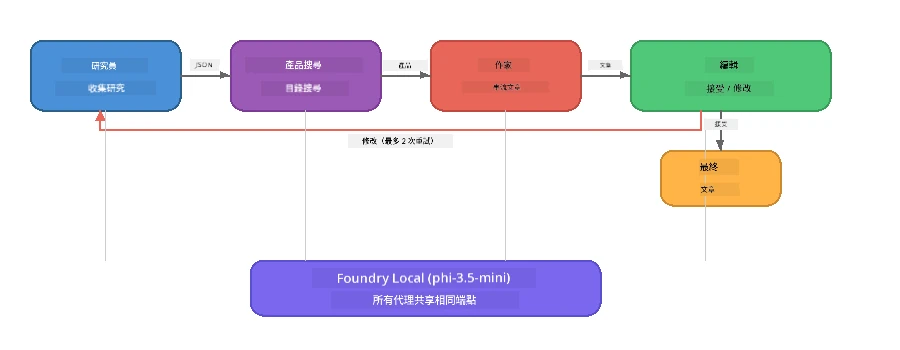

# 第7部分：Zava 創意作家 - 巔峰應用

> **目標：** 探索一個生產風格的多代理應用，四個專業代理協作，為 Zava Retail DIY 製作雜誌品質的文章—使用 Foundry Local 完全在您的裝置上運行。

這是研討會的<strong>巔峰實驗</strong>。它將您所學的一切結合起來 - SDK整合（第3部分）、本地數據檢索（第4部分）、代理人格（第5部分）、多代理協調（第6部分）- 成為一個完整的應用，可用<strong>Python</strong>、<strong>JavaScript</strong>和<strong>C#</strong>提供。

---

## 您將探索的內容

| 概念 | 在 Zava Writer 的位置 |
|---------|----------------------------|
| 4步驟模型加載 | 共用配置模組啟動 Foundry Local |
| RAG式檢索 | 產品代理搜索本地目錄 |
| 代理專精化 | 4個代理擁有不同系統提示 |
| 流式輸出 | Writer 實時輸出標記 |
| 結構化交接 | 研究者 → JSON，編輯 → JSON決策 |
| 反饋回路 | 編輯可觸發重試（最多2次） |

---

## 架構

Zava 創意作家使用<strong>評估者驅動回饋的順序管線</strong>。三種程式語言實現均遵循相同架構：



### 四個代理

| 代理 | 輸入 | 輸出 | 目的 |
|-------|-------|--------|---------|
| <strong>研究者</strong> | 主題 + 選擇性回饋 | `{"web": [{url, name, description}, ...]}` | 透過 LLM 收集背景研究資料 |
| <strong>產品搜尋</strong> | 產品上下文字串 | 匹配產品列表 | LLM生成查詢 + 關鍵字搜索本地目錄 |
| <strong>作者</strong> | 研究 + 產品 + 作業指派 + 回饋 | 實時串流文章文字（以`---`分隔） | 寫出雜誌品質文章的草稿 |
| <strong>編輯</strong> | 文章 + 作者自我回饋 | `{"decision": "accept/revise", "editorFeedback": "...", "researchFeedback": "..."}` | 審查品質，必要時觸發重執行 |

### 管線流程

1. <strong>研究者</strong>收到主題並產出結構化研究筆記（JSON）
2. <strong>產品搜尋</strong>用LLM生成查詢詞檢索本地產品目錄
3. <strong>作者</strong>結合研究 + 產品 + 指派內容，以串流方式撰寫文章，並於`---`分隔符後追加自我回饋
4. <strong>編輯</strong>審查文章並回傳JSON判決：
   - `"accept"` → 管線結束
   - `"revise"` → 回饋傳回研究者與作者（最多重試2次）

---

## 先決條件

- 完成[第6部分：多代理工作流程](part6-multi-agent-workflows.md)
- 安裝 Foundry Local CLI 並下載 `phi-3.5-mini` 模型

---

## 練習

### 練習1 - 運行 Zava 創意作家

選擇您的程式語言並運行應用：

<details>
<summary><strong>🐍 Python - FastAPI 網絡服務</strong></summary>

Python 版本以<strong>網絡服務</strong>形式運行，提供REST API，展示如何建置生產後端。

**設定：**
```bash
cd zava-creative-writer-local/src/api
python -m venv venv

# Windows（PowerShell）：
venv\Scripts\Activate.ps1
# macOS：
source venv/bin/activate

pip install -r requirements.txt
```

**運行：**
```bash
uvicorn main:app --reload
```

**測試：**
```bash
curl -X POST http://localhost:8000/api/article \
  -H "Content-Type: application/json" \
  -d '{
    "research": "DIY home improvement trends",
    "products": "power tools and paints",
    "assignment": "Write an article about weekend renovation projects for DIY enthusiasts"
  }'
```

回應以換行分隔的 JSON 訊息串流回傳，顯示每個代理的進度。

</details>

<details>
<summary><strong>📦 JavaScript - Node.js CLI</strong></summary>

JavaScript 版本以<strong>命令列應用</strong>運行，於控制台打印代理進度及文章內容。

**設定：**
```bash
cd zava-creative-writer-local/src/javascript
npm install
```

**運行：**
```bash
node main.mjs
```

您將看到：
1. Foundry Local 模型加載（下載時有進度條）
2. 每個代理依序執行並顯示狀態訊息
3. 文章即時串流到控制台
4. 編輯的接受/修訂決定

</details>

<details>
<summary><strong>💜 C# - .NET 控制台應用</strong></summary>

C# 版本以<strong>.NET控制台應用</strong>形式執行，具有相同的管線與流式輸出。

**設定：**
```bash
cd zava-creative-writer-local/src/csharp
dotnet restore
```

**運行：**
```bash
dotnet run
```

輸出模式與JavaScript版本相同—代理狀態訊息、文章串流與編輯判決。

</details>

---

### 練習2 - 研究程式結構

各語言版本有相同邏輯元件。比對結構：

**Python** (`src/api/`):
| 檔案 | 目的 |
|------|---------|
| `foundry_config.py` | 共享 Foundry Local 管理器、模型及用戶端（4步驟初始化） |
| `orchestrator.py` | 管線協調與反饋回路 |
| `main.py` | FastAPI 端點 (`POST /api/article`) |
| `agents/researcher/researcher.py` | 基於LLM的研究，輸出JSON |
| `agents/product/product.py` | LLM生成查詢詞 + 關鍵字搜尋 |
| `agents/writer/writer.py` | 流式文章生成 |
| `agents/editor/editor.py` | JSON格式接受/修訂決定 |

**JavaScript** (`src/javascript/`):
| 檔案 | 目的 |
|------|---------|
| `foundryConfig.mjs` | 共享 Foundry Local 配置（有進度條的4步驟初始化） |
| `main.mjs` | 管理者 + CLI 進入點 |
| `researcher.mjs` | 基於LLM的研究代理 |
| `product.mjs` | LLM查詢生成 + 關鍵字搜尋 |
| `writer.mjs` | 流式文章生成（非同步產生器） |
| `editor.mjs` | JSON接受/修訂決定 |
| `products.mjs` | 產品目錄資料 |

**C#** (`src/csharp/`):
| 檔案 | 目的 |
|------|---------|
| `Program.cs` | 完整管線：模型加載、代理、協調者、回饋回路 |
| `ZavaCreativeWriter.csproj` | .NET 9 專案，含 Foundry Local 與 OpenAI 套件 |

> **設計說明：** Python 將每個代理分散在各文件/資料夾（適合大型團隊）。JavaScript 每代理一模組（適合中型專案）。C# 全部保留在同一檔案內使用本地函式（適合自含範例）。生產環境可依團隊習慣選擇模式。

---

### 練習3 - 追蹤共用配置

管線中所有代理共用同一 Foundry Local 模型用戶端。研究各語言中的設置：

<details>
<summary><strong>🐍 Python - foundry_config.py</strong></summary>

```python
from foundry_local import FoundryLocalManager

MODEL_ALIAS = "phi-3.5-mini"

# 第一步：建立管理器並啟動 Foundry Local 服務
manager = FoundryLocalManager()
manager.start_service()

# 第二步：檢查模型是否已下載
cached = manager.list_cached_models()
catalog_info = manager.get_model_info(MODEL_ALIAS)
is_cached = any(m.id == catalog_info.id for m in cached) if catalog_info else False

if not is_cached:
    manager.download_model(MODEL_ALIAS)

# 第三步：將模型載入記憶體
manager.load_model(MODEL_ALIAS)
model_id = manager.get_model_info(MODEL_ALIAS).id

# 共享的 OpenAI 用戶端
client = openai.OpenAI(base_url=manager.endpoint, api_key=manager.api_key)
```

所有代理由 `from foundry_config import client, model_id` 匯入。

</details>

<details>
<summary><strong>📦 JavaScript - foundryConfig.mjs</strong></summary>

```javascript
import { FoundryLocalManager } from "foundry-local-sdk";
import { OpenAI } from "openai";

FoundryLocalManager.create({ appName: "ZavaCreativeWriter" });
const manager = FoundryLocalManager.instance;
await manager.startWebService();

// 檢查快取 → 下載 → 載入（新 SDK 模式）
const catalog = manager.catalog;
const model = await catalog.getModel(MODEL_ALIAS);
if (!model.isCached) {
  console.log(`Downloading model: ${MODEL_ALIAS}...`);
  await model.download();
}
await model.load();

const client = new OpenAI({ baseURL: manager.urls[0] + "/v1", apiKey: "foundry-local" });
const modelId = model.id;
export { client, modelId };
```

所有代理從 `./foundryConfig.mjs` 匯入 `{ client, modelId }`。

</details>

<details>
<summary><strong>💜 C# - Program.cs 頂部</strong></summary>

```csharp
await FoundryLocalManager.CreateAsync(
    new Configuration
    {
        AppName = "ZavaCreativeWriter",
        Web = new Configuration.WebService { Urls = "http://127.0.0.1:0" }
    }, NullLogger.Instance, default);
var manager = FoundryLocalManager.Instance;
await manager.StartWebServiceAsync(default);

var catalog = await manager.GetCatalogAsync(default);
var catalogModel = await catalog.GetModelAsync(alias, default);
var isCached = await catalogModel.IsCachedAsync(default);
if (!isCached)
    await catalogModel.DownloadAsync(null, default);

await catalogModel.LoadAsync(default);
var key = new ApiKeyCredential("foundry-local");
var chatClient = new OpenAIClient(key, new OpenAIClientOptions
{
    Endpoint = new Uri(manager.Urls[0] + "/v1")
}).GetChatClient(catalogModel.Id);
```

`chatClient` 隨後傳遞給同一檔案中的所有代理函式。

</details>

> **關鍵模式：** 模型加載模式（啟動服務 → 檢查快取 → 下載 → 載入）確保使用者可看到明確進度，且模型只下載一次。這是任何 Foundry Local 應用的最佳實踐。

---

### 練習4 - 理解反饋回路

反饋回路使這個管線「智慧化」—編輯可將作品退回修改。追蹤邏輯：

```
Orchestrator:
  1. researcher.research(topic, "No Feedback")    ← first pass
  2. product.findProducts(productContext)
  3. writer.write(research, products, assignment)  ← streams article
  4. Split article at "---" → article + writerFeedback
  5. editor.edit(article, writerFeedback)

  WHILE editor says "revise" AND retryCount < 2:
    6. researcher.research(topic, editor.researchFeedback)  ← refined
    7. writer.write(research, products, editor.editorFeedback)
    8. editor.edit(newArticle, newWriterFeedback)
    9. retryCount++
```

**待思考問題：**
- 為何重試限制設定為2？增加會發生什麼事？
- 為何研究者取得 `researchFeedback`，作者取得 `editorFeedback`？
- 若編輯總是要求「修訂」，結果會怎樣？

---

### 練習5 - 修改一個代理

嘗試調整其中一個代理的行為，觀察管線影響：

| 修改 | 調整內容 |
|-------------|----------------|
| <strong>更嚴格的編輯</strong> | 變更編輯系統提示，總是要求至少一次修訂 |
| <strong>更長的文章</strong> | 將作者提示從「800-1000字」改為「1500-2000字」 |
| <strong>不同產品</strong> | 新增或修改產品目錄中的產品 |
| <strong>新研究主題</strong> | 將預設 `researchContext` 改為其他主題 |
| **只輸出JSON研究者** | 讓研究者返回10項而非3-5項 |

> **提示：** 三種語言皆實現相同架構，您可在最擅長的語言中做相同修改。

---

### 練習6 - 新增第五代理

擴充管線，插入新代理。幾個構想：

| 代理 | 管線插入點 | 目的 |
|-------|-------------------|---------|
| <strong>事實核查者</strong> | 作者之後，編輯之前 | 根據研究資料驗證論述準確性 |
| **SEO 優化器** | 編輯接受後 | 增加meta描述、關鍵字、URL別名 |
| <strong>插畫家</strong> | 編輯接受後 | 為文章生成圖像提示 |
| <strong>翻譯者</strong> | 編輯接受後 | 將文章翻譯成其他語言 |

**步驟：**
1. 撰寫代理系統提示
2. 創建代理函式（符合您語言現有模式）
3. 於協調器中適當位置插入代理
4. 更新輸出/日誌展示新代理成果

---

## Foundry Local 與代理框架如何協同工作

本應用示範建構多代理系統使用 Foundry Local 的推薦模式：

| 層級 | 元件 | 角色 |
|-------|-----------|------|
| <strong>執行時</strong> | Foundry Local | 本地下載、管理及服務模型 |
| <strong>用戶端</strong> | OpenAI SDK | 向本地端點送出聊天完成請求 |
| <strong>代理</strong> | 系統提示 + 聊天呼叫 | 透過專注指示實現專業行為 |
| <strong>協調者</strong> | 管線協調者 | 管理資料流、執行次序與反饋回圈 |
| <strong>框架</strong> | 微軟代理框架 | 提供 `ChatAgent` 抽象與設計模式 |

關鍵洞見：**Foundry Local 替代雲端後端，而非應用架構。** 同樣代理模式、編排策略與結構化交接在雲端託管模型與本地模型間通用 — 唯一差別是用戶端指向本地端點取代 Azure 端點。

---

## 主要收穫

| 概念 | 您學到了什麼 |
|---------|-----------------|
| 生產架構 | 如何結構化多代理應用，實現共用配置與分離代理 |
| 4步模型加載 | Foundry Local 初始化的最佳實踐，並可展示進度給用戶 |
| 代理專精化 | 四個代理各具專注指示及特定輸出格式 |
| 流式生成 | 作者可實時產出標記，支持互動式使用者介面 |
| 反饋回路 | 編輯驅動重試提升品質，無需人工介入 |
| 跨語言模式 | 相同架構在 Python、JavaScript 和 C# 都適用 |
| 本地 = 生產級 | Foundry Local 提供與雲端相容的 OpenAI API |

---

## 下一步

繼續前往[第8部分：以評估為導向的開發](part8-evaluation-led-development.md)，為您的代理建立系統化評估框架，利用黃金數據集、規則檢查與LLM評審打分。