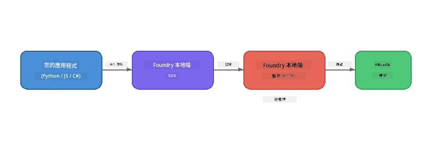

# Part 1: Getting Started with Foundry Local


## What is Foundry Local?

[Foundry Local](https://foundrylocal.ai) 讓你可以 <strong>直接在你的電腦上</strong> 執行開源的 AI 語言模型 — 不需要網路、不需雲端費用，並且完全保護數據隱私。它：

- <strong>下載並在本地執行模型</strong>，並自動根據硬體做最佳化（GPU、CPU 或 NPU）
- **提供相容於 OpenAI 的 API**，方便你使用熟悉的 SDK 和工具
- **不需要 Azure 訂閱** 或註冊 — 只要安裝即可開始開發

把它想像成擁有你自己的私人 AI，完全在你的機器上運行。

## Learning Objectives

完成本實驗後，你將能夠：

- 在你的作業系統上安裝 Foundry Local CLI
- 了解模型別名是什麼以及如何運作
- 下載並執行你的第一個本地 AI 模型
- 從命令列向本地模型發送聊天訊息
- 理解本地和雲端托管 AI 模型之間的差異

---

## Prerequisites

### System Requirements

| 需求 | 最低 | 推薦 |
|-------------|---------|-------------|
| **記憶體 (RAM)** | 8 GB | 16 GB |
| <strong>磁碟空間</strong> | 5 GB (模型) | 10 GB |
| **CPU** | 4 核心 | 8 核心以上 |
| **GPU** | 選用 | NVIDIA 且支援 CUDA 11.8+ |
| <strong>作業系統</strong> | Windows 10/11 (x64/ARM), Windows Server 2025, macOS 13+ | - |

> **注意：** Foundry Local 會自動選擇符合你硬體的最佳模型版本。如果你有 NVIDIA GPU，它會使用 CUDA 加速；如果你有 Qualcomm NPU，則會用該設備。否則會退回使用經過最佳化的 CPU 版本。

### Install Foundry Local CLI

**Windows** (PowerShell):  
```powershell
winget install Microsoft.FoundryLocal
```
  
**macOS** (Homebrew):  
```bash
brew tap microsoft/foundrylocal
brew install foundrylocal
```
  
> **注意：** Foundry Local 目前僅支援 Windows 和 macOS。暫時不支援 Linux。

驗證安裝：  
```bash
foundry --version
```
  
---

## Lab Exercises

### Exercise 1: Explore Available Models

Foundry Local 包含一份預先優化的開源模型目錄。列出它們：

```bash
foundry model list
```
  
你會看到如下模型：  
- `phi-3.5-mini` - 微軟的 3.8 億參數模型（快速且品質良好）  
- `phi-4-mini` - 更新、更有能力的 Phi 模型  
- `phi-4-mini-reasoning` - 具備連鎖思考推理（`<think>` 標籤）的 Phi 模型  
- `phi-4` - 微軟最大的 Phi 模型（10.4 GB）  
- `qwen2.5-0.5b` - 非常小且快速（適合資源有限設備）  
- `qwen2.5-7b` - 強大的多用途模型，支援工具呼叫  
- `qwen2.5-coder-7b` - 針對程式碼生成優化  
- `deepseek-r1-7b` - 強力的推理模型  
- `gpt-oss-20b` - 大型開源模型（MIT 授權，12.5 GB）  
- `whisper-base` - 語音轉文字轉錄（383 MB）  
- `whisper-large-v3-turbo` - 高精度轉錄（9 GB）

> **什麼是模型別名？** 像 `phi-3.5-mini` 這樣的別名是快捷方式。使用別名時，Foundry Local 會自動下載適合你硬體的最佳版本（NVIDIA GPU 用 CUDA，其他則用 CPU 優化版本），你不需擔心選擇哪個版本。

### Exercise 2: Run Your First Model

下載並開始與模型互動聊天：

```bash
foundry model run phi-3.5-mini
```
  
你第一次執行時，Foundry Local 將會：  
1. 偵測你的硬體  
2. 下載最佳模型版本（可能需要幾分鐘）  
3. 將模型載入記憶體  
4. 啟動互動式聊天會話

試著問一些問題：  
```
You: What is the golden ratio?
You: Can you explain it as if I were 10 years old?
You: Write a haiku about mathematics
```
  
輸入 `exit` 或按 `Ctrl+C` 退出。

### Exercise 3: Pre-download a Model

如果你想先下載模型但不啟動聊天對話：

```bash
foundry model download phi-3.5-mini
```
  
查看你機器上已下載的模型：

```bash
foundry cache list
```
  
### Exercise 4: Understand the Architecture

Foundry Local 作為一個 **本地 HTTP 服務** 運行，並暴露出相容於 OpenAI 的 REST API。這代表：

1. 服務會在一個 <strong>動態通訊埠</strong> 啟動（每次不同）  
2. 你需要使用 SDK 來獲取實際的端點 URL  
3. 你可以使用 <strong>任何</strong> 相容 OpenAI 的客戶端函式庫與之溝通



> **重要：** Foundry Local 每次啟動會分配一個 <strong>動態通訊埠</strong>。千萬不要硬編碼像 `localhost:5272` 這類的埠號。請始終用 SDK 去取得目前的 URL（例如 Python 的 `manager.endpoint` 或 JavaScript 的 `manager.urls[0]`）。

---

## Key Takeaways

| 概念 | 你學到了什麼 |
|---------|------------------|
| 裝置端 AI | Foundry Local 完全在你的裝置上執行模型，無需雲端、無需 API 金鑰，也不花錢 |
| 模型別名 | `phi-3.5-mini` 等別名會自動選擇適合你硬體的最佳版本 |
| 動態通訊埠 | 服務在動態埠口執行；總是透過 SDK 來發現端點 |
| CLI 與 SDK | 你可以透過 CLI（`foundry model run`）或程式化調用 SDK 與模型互動 |

---

## Next Steps

繼續前往 [Part 2: Foundry Local SDK Deep Dive](part2-foundry-local-sdk.md)，深入掌握用程式管理模型、服務和快取的 SDK API。