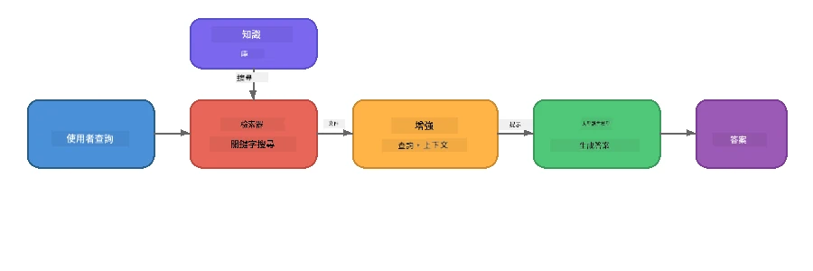

# 第四部分：使用 Foundry Local 構建 RAG 應用程式

## 概述

大型語言模型非常強大，但它們僅知道訓練數據中的內容。**檢索增強生成（Retrieval-Augmented Generation, RAG）** 透過在查詢時提供相關上下文來解決這個問題——這些上下文來自您自己的文件、資料庫或知識庫。

在本實驗中，您將使用 Foundry Local 建立完整的 RAG 管線，<strong>全部在您的設備上運行</strong>。無需雲端服務、向量資料庫或嵌入 API —— 完全使用本地檢索和本地模型。

## 學習目標

完成本實驗後，您將能夠：

- 解釋 RAG 是什麼以及為什麼它對 AI 應用重要
- 從文本文件構建本地知識庫
- 實現簡單的檢索功能以找到相關上下文
- 組合一個系統提示，讓模型根據檢索到的事實作答
- 執行完整的檢索 → 增強 → 生成管線於設備上
- 理解簡單關鍵字檢索和向量搜尋之間的權衡

---

## 先決條件

- 完成 [第三部分：使用 Foundry Local SDK 與 OpenAI](part3-sdk-and-apis.md)
- 安裝 Foundry Local CLI 且下載 `phi-3.5-mini` 模型

---

## 概念：什麼是 RAG？

沒有 RAG，LLM 僅能從其訓練數據回答問題——但這些資料可能過時、不完整，或缺少您的私有資訊：

```
User: "What is Zava's return policy?"
LLM:  "I do not have information about Zava's return policy."  ← No context!
```

而有了 RAG，您先<strong>檢索</strong>相關文件，再用該上下文<strong>增強</strong>提示，最後<strong>生成</strong>回答：



關鍵洞見是：**模型不需要「知道」答案；它只需要讀到正確的文件。**

---

## 實驗練習

### 練習 1：了解知識庫

打開您所使用語言的 RAG 範例並查看知識庫：

<details>
<summary><b>🐍 Python: <code>python/foundry-local-rag.py</code></b></summary>

知識庫是一個簡單的字典列表，每個字典包含 `title` 和 `content` 欄位：

```python
KNOWLEDGE_BASE = [
    {
        "title": "Foundry Local Overview",
        "content": (
            "Foundry Local brings the power of Azure AI Foundry to your local "
            "device without requiring an Azure subscription..."
        ),
    },
    {
        "title": "Supported Hardware",
        "content": (
            "Foundry Local automatically selects the best model variant for "
            "your hardware. If you have an Nvidia CUDA GPU it downloads the "
            "CUDA-optimized model..."
        ),
    },
    # ... 更多條目
]
```

每個條目代表一個「知識片段」——針對單一主題的聚焦資訊。

</details>

<details>
<summary><b>📘 JavaScript: <code>javascript/foundry-local-rag.mjs</code></b></summary>

知識庫結構相同，為物件陣列：

```javascript
const KNOWLEDGE_BASE = [
  {
    title: "Foundry Local Overview",
    content:
      "Foundry Local brings the power of Azure AI Foundry to your local " +
      "device without requiring an Azure subscription...",
  },
  {
    title: "Supported Hardware",
    content:
      "Foundry Local automatically selects the best model variant for " +
      "your hardware...",
  },
  // ... 更多條目
];
```

</details>

<details>
<summary><b>💜 C#: <code>csharp/RagPipeline.cs</code></b></summary>

知識庫使用具名元組列表：

```csharp
private static readonly List<(string Title, string Content)> KnowledgeBase =
[
    ("Foundry Local Overview",
     "Foundry Local brings the power of Azure AI Foundry to your local " +
     "device without requiring an Azure subscription..."),

    ("Supported Hardware",
     "Foundry Local automatically selects the best model variant for " +
     "your hardware..."),

    // ... more entries
];
```

</details>

> <strong>在實際應用中</strong>，知識庫會來自磁碟上的文件、資料庫、搜尋索引或 API。本實驗為簡化起見，使用記憶體中的清單。

---

### 練習 2：瞭解檢索函數

檢索步驟找到與用戶問題最相關的知識片段。此範例使用<strong>關鍵字重疊</strong>——計算查詢中有多少詞也出現在每個片段中：

<details>
<summary><b>🐍 Python</b></summary>

```python
def retrieve(query: str, top_k: int = 2) -> list[dict]:
    """Return the top-k knowledge chunks most relevant to the query."""
    query_words = set(query.lower().split())
    scored = []
    for chunk in KNOWLEDGE_BASE:
        chunk_words = set(chunk["content"].lower().split())
        overlap = len(query_words & chunk_words)
        scored.append((overlap, chunk))
    scored.sort(key=lambda x: x[0], reverse=True)
    return [item[1] for item in scored[:top_k]]
```

</details>

<details>
<summary><b>📘 JavaScript</b></summary>

```javascript
function retrieve(query, topK = 2) {
  const queryWords = new Set(query.toLowerCase().split(/\s+/));
  const scored = KNOWLEDGE_BASE.map((chunk) => {
    const chunkWords = new Set(chunk.content.toLowerCase().split(/\s+/));
    let overlap = 0;
    for (const w of queryWords) {
      if (chunkWords.has(w)) overlap++;
    }
    return { overlap, chunk };
  });
  scored.sort((a, b) => b.overlap - a.overlap);
  return scored.slice(0, topK).map((s) => s.chunk);
}
```

</details>

<details>
<summary><b>💜 C#</b></summary>

```csharp
private static List<(string Title, string Content)> Retrieve(string query, int topK = 2)
{
    var queryWords = new HashSet<string>(
        query.ToLowerInvariant().Split(' ', StringSplitOptions.RemoveEmptyEntries));

    return KnowledgeBase
        .Select(chunk =>
        {
            var chunkWords = new HashSet<string>(
                chunk.Content.ToLowerInvariant().Split(' ', StringSplitOptions.RemoveEmptyEntries));
            var overlap = queryWords.Intersect(chunkWords).Count();
            return (Overlap: overlap, Chunk: chunk);
        })
        .OrderByDescending(x => x.Overlap)
        .Take(topK)
        .Select(x => x.Chunk)
        .ToList();
}
```

</details>

**工作流程：**
1. 將查詢拆分成單個詞
2. 對每個知識片段，計算查詢詞在片段中出現的次數
3. 根據重疊分數排序（分數高者優先）
4. 回傳前 k 個最相關片段

> <strong>權衡：</strong>關鍵字重疊簡單但有限；它無法理解同義詞或語義。生產等級的 RAG 系統通常使用<strong>嵌入向量</strong>與<strong>向量資料庫</strong>進行語義搜尋。不過關鍵字重疊是一個很好的入門點，且不需額外依賴。

---

### 練習 3：瞭解增強提示

檢索到的上下文會注入到<strong>系統提示</strong>中，再送給模型：

```python
system_prompt = (
    "You are a helpful assistant. Answer the user's question using ONLY "
    "the information provided in the context below. If the context does "
    "not contain enough information, say so.\n\n"
    f"Context:\n{context_text}"
)
```

主要設計決策：
- **「僅使用提供的資訊」** - 防止模型杜撰提示外的事實
- **「如果上下文資訊不足，請誠實告知」** - 鼓勵模型產生誠實的「我不知道」回答
- 將上下文放在系統訊息中，以塑造所有回應

---

### 練習 4：執行 RAG 管線

執行完整範例：

**Python:**
```bash
cd python
python foundry-local-rag.py
```

**JavaScript:**
```bash
cd javascript
node foundry-local-rag.mjs
```

**C#:**
```bash
cd csharp
dotnet run rag
```

您會看到三件事列印出來：
1. <strong>提出的問題</strong>
2. <strong>檢索的上下文</strong>——從知識庫中選出的片段
3. <strong>答案</strong>——模型只用這些上下文生成的回答

範例輸出：
```
Question: How do I install Foundry Local and what hardware does it support?

--- Retrieved Context ---
### Installation
On Windows install Foundry Local with: winget install Microsoft.FoundryLocal...

### Supported Hardware
Foundry Local automatically selects the best model variant for your hardware...
-------------------------

Answer: To install Foundry Local, you can use the following methods depending
on your operating system: On Windows, run `winget install Microsoft.FoundryLocal`.
On macOS, use `brew install microsoft/foundrylocal/foundrylocal`...
```

可以觀察模型的答案是<strong>基於</strong> 檢索來的上下文，僅提及知識庫文件中的事實。

---

### 練習 5：實驗與擴展

試著進行以下修改以深化理解：

1. <strong>更換問題</strong>——提問知識庫中有的問題，與沒有的問題：
   ```python
   question = "What programming languages does Foundry Local support?"  # ← 在上下文中
   question = "How much does Foundry Local cost?"                       # ← 不在上下文中
   ```
   當答案不在上下文，模型會正確回答「我不知道」嗎？

2. <strong>新增知識片段</strong>——向 `KNOWLEDGE_BASE` 附加新條目：
   ```python
   {
       "title": "Pricing",
       "content": "Foundry Local is completely free and open source under the MIT license.",
   }
   ```
   再次詢問價格相關問題。

3. **更改 `top_k` 數值**——檢索更多或更少的片段：
   ```python
   context_chunks = retrieve(question, top_k=3)  # 更多上下文
   context_chunks = retrieve(question, top_k=1)  # 較少上下文
   ```
   上下文量如何影響答案品質？

4. <strong>移除約束提示</strong>——將系統提示改成「你是一個樂於助人的助手。」看模型是否開始亂編事實。

---

## 深入探討：優化在設備上運行的 RAG

在設備上執行 RAG 有雲端無法面對的限制條件：有限的記憶體，無專屬 GPU（僅 CPU/NPU 執行），以及小型模型的上下文窗口。以下設計決策直接應對這些限制，結合 Foundry Local 生產級本地 RAG 應用的模式。

### 分片策略：固定大小滑動視窗

分片（如何切割文件成小塊）是任何 RAG 系統最關鍵的決策之一。對於設備端，推薦使用帶重疊的<strong>固定大小滑動視窗</strong>作為起點：

| 參數     | 建議值          | 原因                                                             |
|----------|-----------------|------------------------------------------------------------------|
| <strong>片段大小</strong> | 約 200 字元        | 保持檢索上下文精簡，給 Phi-3.5 Mini 的上下文窗口留足系統提示、對話歷史及輸出空間     |
| <strong>重疊量</strong> | 約 25 字元（12.5%） | 避免片段邊界資訊遺失，對程序式與逐步指令尤其重要                            |
| <strong>標記化</strong> | 以空白分詞         | 不需依賴額外分詞器庫，所有計算資源都留給 LLM                              |

重疊就像滑動視窗：每個新片段從前一片段結尾往前推 25 字元開始，跨片段句子同時出現在兩個片段中。

> **為什麼不採用其他策略？**
> - <strong>句子切割</strong>產生不可預測的片段長度；有些安全流程是長句，不適合切割
> - <strong>章節切割</strong>（按 `##` 標題）產生片段大小不均，有些太小有些過大，不適合模型上下文窗口
> - <strong>語義切割</strong>（基於嵌入辨識主題）檢索品質最佳，但需額外同時載入另一模型於記憶體，對 8-16GB 記憶體設備風險較高

### 更進階的檢索：TF-IDF 向量

本實驗中使用的關鍵字重疊能用，但若想在不增加嵌入模型的前提下提升檢索品質，**TF-IDF（詞頻-逆文件頻率）** 是一個很棒的中間方案：

```
Keyword Overlap  →  TF-IDF Vectors  →  Embedding Models
    (this lab)     (lightweight upgrade)   (production)
  Simple & fast    Better ranking,         Best quality,
  No dependencies  still no ML model       requires embedding model
  ~Basic matching  ~1ms retrieval          ~100-500ms per query
```

TF-IDF 將每個片段轉成數值向量，反映該詞在該片段相對於整體所有片段中的重要程度。查詢時，以相同向量化方法表示問題，並以餘弦相似度比對。您可以用 SQLite 及純 JavaScript/Python 實作——不需向量資料庫，也不需嵌入 API。

> <strong>效能：</strong>固定大小片段上，TF-IDF 餘弦相似度的檢索時間約為 **~1 毫秒**，相比使用嵌入模型對每個查詢編碼的約 100-500 毫秒更快。20 多份文件的切片與索引時間都低於 1 秒。

### 約束裝置的 Edge/Compact 模式

在非常受限的硬體（舊筆電、平板、野外設備）上執行時，可通過縮減三個參數降低資源用量：

| 設置           | 標準模式         | Edge/Compact 模式       |
|----------------|-----------------|----------------------|
| <strong>系統提示長度</strong>    | 約 300 字元       | 約 80 字元              |
| <strong>最大輸出字元數</strong>   | 1024            | 512                  |
| **檢索片段數 (top-k)** | 5               | 3                    |

較少的檢索片段意味模型處理較少上下文，降低延遲與記憶體壓力。較短的系統提示釋放更多上下文窗口空間給答案生成。在上下文窗口非常寶貴的設備上，這個權衡非常值得。

### 記憶體中只載入單一模型

設備端 RAG 的重要原則之一是：<strong>只載入一個模型</strong>。若同時有嵌入模型供檢索與語言模型供生成，會分散有限的 NPU/RAM 資源。輕量檢索（關鍵字重疊、TF-IDF）則完全避免此問題：

- 無嵌入模型與 LLM 搶記憶體
- 冷啟動速度快——只需載入一個模型
- 記憶體使用可預估——LLM 獨佔資源
- 可在僅 8 GB RAM 的設備上運作

### SQLite 作為本地向量存儲

對小到中型文檔集（數百至低千量級分片），**SQLite 足夠快**，可用於暴力餘弦相似度搜尋且無需額外基礎架構：

- 單一 `.db` 檔案儲存——無需伺服器進程或配置
- 主流語言執行環境均內建支持（Python `sqlite3`、Node.js `better-sqlite3`、.NET `Microsoft.Data.Sqlite`）
- 將文檔片段及其 TF-IDF 向量存入同一資料表
- 這個規模下無需使用 Pinecone、Qdrant、Chroma 或 FAISS

### 效能總結

這些設計決策合力在消費級硬體上帶來流暢的 RAG 體驗：

| 指標          | 設備端表現             |
|---------------|-----------------------|
| <strong>檢索延遲</strong>     | 約 1 毫秒（TF-IDF）到約 5 毫秒（關鍵字重疊） |
| <strong>建立索引速度</strong>   | 20 份文檔切片並建索引 < 1 秒 |
| <strong>記憶體中模型數量</strong> | 1（僅 LLM，無嵌入模型）       |
| <strong>存儲空間開銷</strong>   | < 1 MB（SQLite 中片段+向量）   |
| <strong>冷啟動時間</strong>    | 單模型載入，無嵌入運行時啟動      |
| <strong>硬體需求底限</strong>   | 8 GB RAM，CPU 執行（無需 GPU）  |

> <strong>何時升級：</strong>若您規模擴展到數百份長文件、多種類型內容（表格、程式碼、散文），或需語義理解查詢，建議增設嵌入模型並切換至向量相似度搜尋。對大多數設備端使用情境、且文件集集中，TF-IDF 與 SQLite 提供絕佳的效果與極低資源使用。

---

## 重要概念

| 概念       | 說明                          |
|------------|-------------------------------|
| <strong>檢索</strong>       | 根據使用者查詢從知識庫找到相關文件          |
| <strong>增強</strong>       | 將檢索到的文件插入提示中，作為上下文          |
| <strong>生成</strong>       | LLM 產生基於提供上下文的回答                |
| <strong>分片</strong>       | 將大型文件拆成較小、有焦點的部分             |
| **約束（Grounding）** | 限制模型只能使用提供的上下文（減少幻覺現象）    |
| **Top-k**    | 檢索回傳最相關文件片段的數量                  |

---

## 生產環境的 RAG 與本實驗的比較

| 項目         | 本實驗        | 設備端優化           | 雲端生產環境           |
|--------------|--------------|---------------------|---------------------|
| <strong>知識庫</strong>      | 記憶體列表      | 磁碟文件、SQLite      | 資料庫、搜尋索引         |
| <strong>檢索方式</strong>     | 關鍵字重疊      | TF-IDF + 餘弦相似度     | 向量嵌入 + 相似度搜尋     |
| <strong>嵌入向量</strong>     | 不需要        | 不需要（使用 TF-IDF）   | 嵌入模型（本地或雲端）      |
| <strong>向量存儲</strong>     | 不需要        | SQLite（單一 `.db` 檔案） | FAISS、Chroma、Azure AI Search 等 |
| <strong>分片方式</strong>     | 手動         | 固定大小滑動視窗（約 200 字元，25 字元重疊） | 語義切割或遞歸切割          |
| <strong>記憶體中模型數量</strong> | 1（LLM）      | 1（LLM）             | 2 個以上（嵌入 + LLM）      |
| <strong>檢索延遲</strong> | 約5毫秒 | 約1毫秒 | 約100-500毫秒 |
| <strong>規模</strong> | 5份文件 | 數百份文件 | 百萬份文件 |

您在此學到的模式（檢索、增強、生成）在任何規模下都是相同的。檢索方法會改進，但整體架構保持不變。中間欄顯示的是可在裝置端利用輕量技術達成的效果，這通常是本地應用的黃金交叉點，您以隱私、離線能力和零延遲訪問外部服務換取雲端規模。

---

## 主要重點

| 概念 | 您所學 |
|---------|------------------|
| RAG 模式 | 檢索 + 增強 + 生成：將正確的上下文提供給模型，它即可回答關於您資料的問題 |
| 裝置端 | 全部在本地執行，無需雲端 API 或向量資料庫訂閱 |
| 基礎指令 | 系統提示約束對防止幻覺十分關鍵 |
| 關鍵字重疊 | 簡單但有效的檢索起點 |
| TF-IDF + SQLite | 一種輕量升級路徑，保持檢索時間低於1毫秒，無需嵌入模型 |
| 記憶體中唯一模型 | 避免在受限硬體上同時載入嵌入模型與大型語言模型 |
| 區塊大小 | 約200個標記並帶有重疊，平衡檢索精度與上下文視窗效率 |
| 邊緣/精簡模式 | 對非常受限的裝置使用更少區塊與更短提示 |
| 通用模式 | 相同的 RAG 架構適用於任何資料來源：文件、資料庫、API 或維基 |

> **想看到完整的裝置端 RAG 應用嗎？** 請參考 [Gas Field Local RAG](https://github.com/leestott/local-rag)，這是一個使用 Foundry Local 與 Phi-3.5 Mini 建立的生產等級離線 RAG 代理，透過真實世界文件集展現這些優化模式。

---

## 後續步驟

繼續參考 [第5部分：建立 AI 代理](part5-single-agents.md)，學習如何使用 Microsoft Agent Framework 建構具有人格、指令和多輪對話功能的智慧代理。