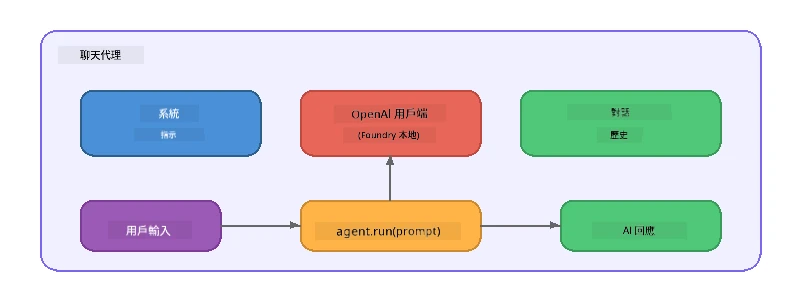

# 第五部分：使用 Agent Framework 建立 AI 代理

> **目標：** 使用 Foundry Local 透過本地模型，建立第一個擁有持久指令和明確角色設定的 AI 代理。

## 什麼是 AI 代理？

AI 代理會將語言模型包裝在<strong>系統指令</strong>中，以定義其行為、個性和限制。與單次聊天完成呼叫不同，代理提供：

- <strong>角色</strong> — 一致的身分認同（「你是一位有幫助的程式碼審查員」）
- <strong>記憶</strong> — 跨回合的對話歷史
- <strong>專精</strong> — 由精心設計的指令驅動的專注行為



---

## Microsoft Agent Framework

**Microsoft Agent Framework**（AGF）提供一個跨不同模型後端使用的標準代理抽象。在本工作坊中，我們將它與 Foundry Local 搭配使用，讓一切都在你的機器上執行——不需上雲。

| 概念 | 描述 |
|---------|-------------|
| `FoundryLocalClient` | Python：處理服務啟動、模型下載/載入，並建立代理 |
| `client.as_agent()` | Python：從 Foundry Local 用戶端創建代理 |
| `AsAIAgent()` | C#：`ChatClient`上的擴充方法 —— 創建一個`AIAgent` |
| `instructions` | 定義代理行為的系統提示 |
| `name` | 易讀標籤，多代理場景中很有用 |
| `agent.run(prompt)` / `RunAsync()` | 傳送用戶訊息並回傳代理回應 |

> **注意：** Agent Framework 有 Python 與 .NET SDK。對於 JavaScript，我們實作一個輕量的 `ChatAgent` 類別，直接使用 OpenAI SDK，模擬相同模式。

---

## 練習

### 練習 1 - 了解 Agent 模式

寫程式碼前，先了解代理的關鍵組成：

1. <strong>模型用戶端</strong> — 連線至 Foundry Local 的 OpenAI 相容 API
2. <strong>系統指令</strong> — 「個性」提示
3. <strong>執行迴圈</strong> — 傳送用戶輸入，接收輸出

> **思考：** 系統指令與一般用戶訊息有何不同？如果更改指令會發生什麼？

---

### 練習 2 - 執行單一代理範例

<details>
<summary><strong>🐍 Python</strong></summary>

**先決條件：**
```bash
cd python
python -m venv venv

# Windows（PowerShell）：
venv\Scripts\Activate.ps1
# macOS：
source venv/bin/activate

pip install -r requirements.txt
```

**執行：**
```bash
python foundry-local-with-agf.py
```

<strong>程式解析</strong> (`python/foundry-local-with-agf.py`)：

```python
import asyncio
from agent_framework_foundry_local import FoundryLocalClient

async def main():
    alias = "phi-4-mini"

    # FoundryLocalClient 處理服務啟動、模型下載與載入
    client = FoundryLocalClient(model_id=alias)
    print(f"Client Model ID: {client.model_id}")

    # 使用系統指令建立代理
    agent = client.as_agent(
        name="Joker",
        instructions="You are good at telling jokes.",
    )

    # 非串流：一次獲取完整回應
    result = await agent.run("Tell me a joke about a pirate.")
    print(f"Agent: {result}")

    # 串流：在產生過程中即時獲取結果
    async for chunk in agent.run("Tell me another joke.", stream=True):
        if chunk.text:
            print(chunk.text, end="", flush=True)

asyncio.run(main())
```

**重點：**
- `FoundryLocalClient(model_id=alias)` 一次處理服務啟動、下載及模型載入
- `client.as_agent()` 建立含系統指令和名稱的代理
- `agent.run()` 支援非串流和串流兩種模式
- 使用 `pip install agent-framework-foundry-local --pre` 安裝

</details>

<details>
<summary><strong>📦 JavaScript</strong></summary>

**先決條件：**
```bash
cd javascript
npm install
```

**執行：**
```bash
node foundry-local-with-agent.mjs
```

<strong>程式解析</strong> (`javascript/foundry-local-with-agent.mjs`)：

```javascript
import { OpenAI } from "openai";
import { FoundryLocalManager } from "foundry-local-sdk";

class ChatAgent {
  constructor({ client, modelId, instructions, name }) {
    this.client = client;
    this.modelId = modelId;
    this.instructions = instructions;
    this.name = name;
    this.history = [];
  }

  async run(userMessage) {
    const messages = [
      { role: "system", content: this.instructions },
      ...this.history,
      { role: "user", content: userMessage },
    ];
    const response = await this.client.chat.completions.create({
      model: this.modelId,
      messages,
    });
    const assistantMessage = response.choices[0].message.content;

    // 保留對話歷史以進行多輪互動
    this.history.push({ role: "user", content: userMessage });
    this.history.push({ role: "assistant", content: assistantMessage });
    return { text: assistantMessage };
  }
}

async function main() {
  FoundryLocalManager.create({ appName: "FoundryLocalWorkshop" });
  const manager = FoundryLocalManager.instance;
  await manager.startWebService();

  const catalog = manager.catalog;
  const model = await catalog.getModel("phi-3.5-mini");
  if (!model.isCached) {
    console.log("Downloading model: phi-3.5-mini...");
    await model.download();
  }
  await model.load();

  const client = new OpenAI({
    baseURL: manager.urls[0] + "/v1",
    apiKey: "foundry-local",
  });

  const agent = new ChatAgent({
    client,
    modelId: model.id,
    instructions: "You are good at telling jokes.",
    name: "Joker",
  });

  const result = await agent.run("Tell me a joke about a pirate.");
  console.log(result.text);
}

main();
```

**重點：**
- JavaScript 實作自家 `ChatAgent` 類別，模擬 Python AGF 模式
- `this.history` 儲存對話回合支持多回合
- 明確呼叫 `startWebService()` → 快取檢查 → `model.download()` → `model.load()`，透明可見流程

</details>

<details>
<summary><strong>💜 C#</strong></summary>

**先決條件：**
```bash
cd csharp
dotnet restore
```

**執行：**
```bash
dotnet run agent
```

<strong>程式解析</strong> (`csharp/SingleAgent.cs`)：

```csharp
using Microsoft.AI.Foundry.Local;
using Microsoft.Extensions.Logging.Abstractions;
using Microsoft.Agents.AI;
using OpenAI;
using System.ClientModel;

// 1. Start Foundry Local and load a model
var alias = "phi-3.5-mini";
await FoundryLocalManager.CreateAsync(
    new Configuration
    {
        AppName = "FoundryLocalSamples",
        Web = new Configuration.WebService { Urls = "http://127.0.0.1:0" }
    }, NullLogger.Instance, default);
var manager = FoundryLocalManager.Instance;
await manager.StartWebServiceAsync(default);

var catalog = await manager.GetCatalogAsync(default);
var model = await catalog.GetModelAsync(alias, default);

var isCached = await model.IsCachedAsync(default);
if (!isCached)
{
    Console.WriteLine($"Downloading model: {alias}...");
    await model.DownloadAsync(null, default);
}
await model.LoadAsync(default);

var key = new ApiKeyCredential("foundry-local");
var client = new OpenAIClient(key, new OpenAIClientOptions
{
    Endpoint = new Uri(manager.Urls[0] + "/v1")
});

// 2. Create an AIAgent using the Agent Framework extension method
AIAgent joker = client
    .GetChatClient(model.Id)
    .AsAIAgent(
        instructions: "You are good at telling jokes. Keep your jokes short and family-friendly.",
        name: "Joker"
    );

// 3. Run the agent (non-streaming)
var response = await joker.RunAsync("Tell me a joke about a pirate.");
Console.WriteLine($"Joker: {response}");

// 4. Run with streaming
await foreach (var update in joker.RunStreamingAsync("Tell me another joke."))
{
    Console.Write(update);
}
```

**重點：**
- `AsAIAgent()` 是來自 `Microsoft.Agents.AI.OpenAI` 的擴充方法 — 不需自訂 `ChatAgent` 類別
- `RunAsync()` 回傳完整回應；`RunStreamingAsync()` 逐代幣串流
- 使用 `dotnet add package Microsoft.Agents.AI.OpenAI --version 1.0.0-rc3` 安裝

</details>

---

### 練習 3 - 更改角色設定

修改代理的 `instructions`，建立不同角色。嘗試每一種，看輸出如何改變：

| 角色 | 指令 |
|---------|-------------|
| 程式碼審查員 | `"你是一位專業的程式碼審查員。提供專注於可讀性、效能和正確性的建設性反饋。"` |
| 旅遊導遊 | `"你是一位親切的旅遊導遊。提供目的地、活動和在地美食的個人化推薦。"` |
| 蘇格拉底式導師 | `"你是一位蘇格拉底式導師。絕不直接回答——而是用深思熟慮的問題引導學生。"` |
| 技術作家 | `"你是一位技術作家。清晰簡潔地解釋概念。使用範例。避免行話。"` |

**試試看：**
1. 從上述表格挑選一個角色
2. 替換程式碼中的 `instructions` 字串
3. 調整用戶提示以符合（例如請程式碼審查員審查一段函式）
4. 再次執行範例並比較結果

> **提示：** 代理的品質高度仰賴指令。具體且結構良好的指令比模糊的指令產生更佳結果。

---

### 練習 4 - 新增多回合對話

擴充範例以支援多回合聊天迴圈，方便你與代理互動。

<details>
<summary><strong>🐍 Python - 多回合迴圈</strong></summary>

```python
import asyncio
from agent_framework_foundry_local import FoundryLocalClient

async def main():
    client = FoundryLocalClient(model_id="phi-4-mini")

    agent = client.as_agent(
        name="Assistant",
        instructions="You are a helpful assistant.",
    )

    print("Chat with the agent (type 'quit' to exit):\n")
    while True:
        user_input = input("You: ")
        if user_input.strip().lower() in ("quit", "exit"):
            break
        result = await agent.run(user_input)
        print(f"Agent: {result}\n")

asyncio.run(main())
```

</details>

<details>
<summary><strong>📦 JavaScript - 多回合迴圈</strong></summary>

```javascript
import { OpenAI } from "openai";
import { FoundryLocalManager } from "foundry-local-sdk";
import * as readline from "node:readline/promises";

// （重複使用練習 2 中的 ChatAgent 類別）

async function main() {
  FoundryLocalManager.create({ appName: "FoundryLocalWorkshop" });
  const manager = FoundryLocalManager.instance;
  await manager.startWebService();

  const catalog = manager.catalog;
  const model = await catalog.getModel("phi-3.5-mini");
  if (!model.isCached) {
    console.log("Downloading model: phi-3.5-mini...");
    await model.download();
  }
  await model.load();

  const client = new OpenAI({
    baseURL: manager.urls[0] + "/v1",
    apiKey: "foundry-local",
  });

  const agent = new ChatAgent({
    client,
    modelId: model.id,
    instructions: "You are a helpful assistant.",
    name: "Assistant",
  });

  const rl = readline.createInterface({
    input: process.stdin,
    output: process.stdout,
  });

  console.log("Chat with the agent (type 'quit' to exit):\n");
  while (true) {
    const userInput = await rl.question("You: ");
    if (["quit", "exit"].includes(userInput.trim().toLowerCase())) break;
    const result = await agent.run(userInput);
    console.log(`Agent: ${result.text}\n`);
  }
  rl.close();
}

main();
```

</details>

<details>
<summary><strong>💜 C# - 多回合迴圈</strong></summary>

```csharp
using Microsoft.AI.Foundry.Local;
using Microsoft.Extensions.Logging.Abstractions;
using Microsoft.Agents.AI;
using OpenAI;
using System.ClientModel;

var alias = "phi-3.5-mini";
var config = new Configuration
{
    AppName = "FoundryLocalSamples",
    Web = new Configuration.WebService { Urls = "http://127.0.0.1:0" }
};
await FoundryLocalManager.CreateAsync(config, NullLogger.Instance, default);
var manager = FoundryLocalManager.Instance;
await manager.StartWebServiceAsync(default);

var catalog = await manager.GetCatalogAsync(default);
var model = await catalog.GetModelAsync(alias, default);

var isCached = await model.IsCachedAsync(default);
if (!isCached)
{
    Console.WriteLine($"Downloading model: {alias}...");
    await model.DownloadAsync(null, default);
}
await model.LoadAsync(default);

var key = new ApiKeyCredential("foundry-local");
var client = new OpenAIClient(key, new OpenAIClientOptions
{
    Endpoint = new Uri(manager.Urls[0] + "/v1")
});

AIAgent agent = client
    .GetChatClient(model.Id)
    .AsAIAgent(
        instructions: "You are a helpful assistant.",
        name: "Assistant"
    );

Console.WriteLine("Chat with the agent (type 'quit' to exit):\n");
while (true)
{
    Console.Write("You: ");
    var userInput = Console.ReadLine();
    if (string.IsNullOrWhiteSpace(userInput) ||
        userInput.Equals("quit", StringComparison.OrdinalIgnoreCase) ||
        userInput.Equals("exit", StringComparison.OrdinalIgnoreCase))
        break;

    var result = await agent.RunAsync(userInput);
    Console.WriteLine($"Agent: {result}\n");
}
```

</details>

注意代理會記住先前回合——問追蹤問題看看上下文是否串起來。

---

### 練習 5 - 結構化輸出

指示代理總是以特定格式（例如 JSON）回應，並解析結果：

<details>
<summary><strong>🐍 Python - JSON 輸出</strong></summary>

```python
import asyncio
import json
from agent_framework_foundry_local import FoundryLocalClient

async def main():
    client = FoundryLocalClient(model_id="phi-4-mini")

    agent = client.as_agent(
        name="SentimentAnalyzer",
        instructions=(
            "You are a sentiment analysis agent. "
            "For every user message, respond ONLY with valid JSON in this format: "
            '{"sentiment": "positive|negative|neutral", "confidence": 0.0-1.0, "summary": "brief reason"}'
        ),
    )

    result = await agent.run("I absolutely loved the new restaurant downtown!")
    print("Raw:", result)

    try:
        parsed = json.loads(str(result))
        print(f"Sentiment: {parsed['sentiment']} (confidence: {parsed['confidence']})")
    except json.JSONDecodeError:
        print("Agent did not return valid JSON - try refining the instructions.")

asyncio.run(main())
```

</details>

<details>
<summary><strong>💜 C# - JSON 輸出</strong></summary>

```csharp
using System.Text.Json;

AIAgent analyzer = chatClient.AsAIAgent(
    name: "SentimentAnalyzer",
    instructions:
        "You are a sentiment analysis agent. " +
        "For every user message, respond ONLY with valid JSON in this format: " +
        "{\"sentiment\": \"positive|negative|neutral\", \"confidence\": 0.0-1.0, \"summary\": \"brief reason\"}"
);

var response = await analyzer.RunAsync("I absolutely loved the new restaurant downtown!");
Console.WriteLine($"Raw: {response}");

try
{
    var parsed = JsonSerializer.Deserialize<JsonElement>(response.ToString());
    Console.WriteLine($"Sentiment: {parsed.GetProperty("sentiment")} " +
                      $"(confidence: {parsed.GetProperty("confidence")})");
}
catch (JsonException)
{
    Console.WriteLine("Agent did not return valid JSON - try refining the instructions.");
}
```

</details>

> **注意：** 較小的本地模型可能無法總是產生完全有效的 JSON。可在指令中加入範例，並非常明確預期格式，以提升可靠度。

---

## 主要重點

| 概念 | 你學到了什麼 |
|---------|-----------------|
| 代理 vs 原始 LLM 呼叫 | 代理為模型包裹指令和記憶體 |
| 系統指令 | 控制代理行為最重要的槓桿 |
| 多回合對話 | 代理可跨多個用戶互動攜帶上下文 |
| 結構化輸出 | 指令可強制輸出格式（JSON、Markdown 等） |
| 本地執行 | 透過 Foundry Local 在裝置端執行，無需雲端 |

---

## 下一步

在 **[第 6 部分：多代理工作流程](part6-multi-agent-workflows.md)**，你將結合多個代理成協調管線，每個代理有專門角色。