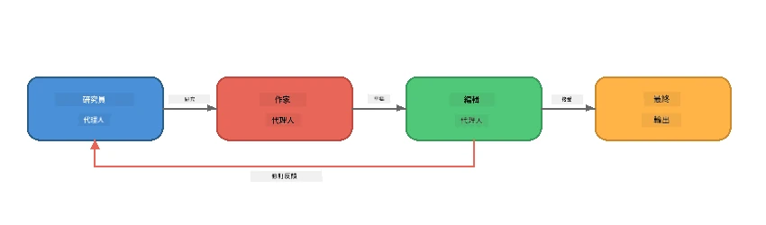
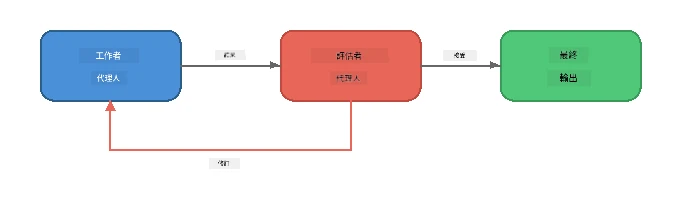
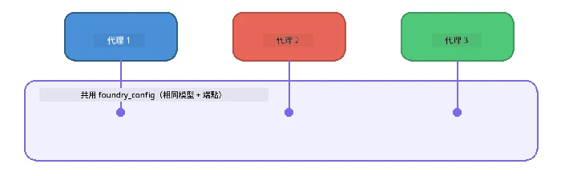

# 第六部分：多代理工作流程

> **目標：** 將多個專門化代理組合成協調的工作管線，讓合作代理分擔複雜任務 - 全部在 Foundry Local 本地運行。

## 為什麼選擇多代理？

單一代理可以處理許多任務，但複雜的工作流程更適合使用<strong>專門化</strong>。與其讓同一代理同時做研究、寫作和編輯，不如將工作拆分成專注的角色：



| 模式 | 說明 |
|---------|-------------|
| <strong>序列式</strong> | 代理 A 的輸出流入代理 B → 代理 C |
| <strong>反饋迴圈</strong> | 評估者代理可將作品退回重新修訂 |
| <strong>共享上下文</strong> | 所有代理使用相同模型/端點，但指令不同 |
| <strong>類型化輸出</strong> | 代理產生結構化結果（JSON），以確保可靠交接 |

---

## 練習

### 練習 1 - 執行多代理管線

工作坊包含完整的研究員 → 作家 → 編輯工作流程。

<details>
<summary><strong>🐍 Python</strong></summary>

**設定：**
```bash
cd python
python -m venv venv

# Windows（PowerShell）：
venv\Scripts\Activate.ps1
# macOS：
source venv/bin/activate

pip install -r requirements.txt
```

**執行：**
```bash
python foundry-local-multi-agent.py
```

**發生了什麼：**
1. <strong>研究員</strong> 接收主題並返回重點事實清單
2. <strong>作家</strong> 根據研究撰寫博文草稿（3-4 段）
3. <strong>編輯</strong> 審查文章品質並返回接受（ACCEPT）或修訂（REVISE）

</details>

<details>
<summary><strong>📦 JavaScript</strong></summary>

**設定：**
```bash
cd javascript
npm install
```

**執行：**
```bash
node foundry-local-multi-agent.mjs
```

<strong>相同的三階段管線</strong> - 研究員 → 作家 → 編輯。

</details>

<details>
<summary><strong>💜 C#</strong></summary>

**設定：**
```bash
cd csharp
dotnet restore
```

**執行：**
```bash
dotnet run multi
```

<strong>相同的三階段管線</strong> - 研究員 → 作家 → 編輯。

</details>

---

### 練習 2 - 管線結構解析

研究代理如何定義與連結：

**1. 共享模型客戶端**

所有代理共用相同的 Foundry Local 模型:

```python
# Python - FoundryLocalClient 處理所有事務
from agent_framework_foundry_local import FoundryLocalClient

client = FoundryLocalClient(model_id="phi-3.5-mini")
```

```javascript
// JavaScript - OpenAI SDK 指向 Foundry Local
const client = new OpenAI({
  baseURL: manager.urls[0] + "/v1",
  apiKey: "foundry-local",
});
```

```csharp
// C# - OpenAIClient pointed at Foundry Local
var key = new ApiKeyCredential("foundry-local");
var client = new OpenAIClient(key, new OpenAIClientOptions
{
    Endpoint = new Uri(manager.Urls[0] + "/v1")
});
var chatClient = client.GetChatClient(model.Id);
```

**2. 專門化指令**

每個代理有獨特角色：

| 代理 | 指令（摘要） |
|-------|----------------------|
| 研究員 | "提供關鍵事實、統計數據及背景，並條列組織。" |
| 作家 | "根據研究筆記撰寫引人入勝的部落格文章（3-4 段）。不要虛構事實。" |
| 編輯 | "審查文意清晰度、文法及事實一致性。判定：接受或修訂。" |

**3. 代理間資料流**

```python
# 第一步 - 研究者的輸出成為撰稿者的輸入
research_result = await researcher.run(f"Research: {topic}")

# 第二步 - 撰稿者的輸出成為編輯者的輸入
writer_result = await writer.run(f"Write using:\n{research_result}")

# 第三步 - 編輯者審核研究和文章兩者
editor_result = await editor.run(
    f"Research:\n{research_result}\n\nArticle:\n{writer_result}"
)
```

```csharp
// C# - same pattern, async calls with AIAgent
var researchNotes = await researcher.RunAsync(
    $"Research the following topic and provide key facts:\n{topic}");

var draft = await writer.RunAsync(
    $"Write a blog post based on these research notes:\n\n{researchNotes}");

var verdict = await editor.RunAsync(
    $"Review this article for quality and accuracy.\n\n" +
    $"Research notes:\n{researchNotes}\n\n" +
    $"Article:\n{draft}");
```

> **關鍵洞見：** 每個代理接收前面代理累積的上下文。編輯同時看到原始研究與草稿，使其能檢查事實一致性。

---

### 練習 3 - 新增第四個代理

擴充管線新增代理，擇一：

| 代理 | 目的 | 指令 |
|-------|---------|-------------|
| <strong>事實查核員</strong> | 驗證文章中的主張 | `"你負責驗證事實。對每個主張說明是否由研究筆記支持。以 JSON 回傳核實與未核實項目。"` |
| <strong>標題撰寫者</strong> | 創作吸睛標題 | `"為文章生成 5 個標題選項。風格多元：資訊型、誘餌、問題、清單、情感。"` |
| <strong>社群媒體</strong> | 製作推廣貼文 | `"創作 3 則社群貼文推廣本篇：一則 Twitter（280 字以內），一則 LinkedIn（專業口吻），一則 Instagram（隨意並附 emoji 建議）。"` |

<details>
<summary><strong>🐍 Python - 新增標題撰寫者</strong></summary>

```python
headline_agent = client.as_agent(
    name="HeadlineWriter",
    instructions=(
        "You are a headline specialist. Given an article, generate exactly "
        "5 headline options. Vary the style: informative, question-based, "
        "listicle, emotional, and provocative. Return them as a numbered list."
    ),
)

# 在編輯接受後，產生標題
headline_result = await headline_agent.run(
    f"Generate headlines for this article:\n\n{writer_result}"
)
print(f"\n--- Headlines ---\n{headline_result}")
```

</details>

<details>
<summary><strong>📦 JavaScript - 新增標題撰寫者</strong></summary>

```javascript
const headlineAgent = new ChatAgent({
  client,
  modelId: modelInfo.id,
  instructions:
    "You are a headline specialist. Given an article, generate exactly " +
    "5 headline options. Vary the style: informative, question-based, " +
    "listicle, emotional, and provocative. Return them as a numbered list.",
  name: "HeadlineWriter",
});

const headlineResult = await headlineAgent.run(
  `Generate headlines for this article:\n\n${writerResult.text}`
);
console.log(`\n--- Headlines ---\n${headlineResult.text}`);
```

</details>

<details>
<summary><strong>💜 C# - 新增標題撰寫者</strong></summary>

```csharp
AIAgent headlineAgent = chatClient.AsAIAgent(
    name: "HeadlineWriter",
    instructions:
        "You are a headline specialist. Given an article, generate exactly " +
        "5 headline options. Vary the style: informative, question-based, " +
        "listicle, emotional, and provocative. Return them as a numbered list."
);

// After the editor accepts, generate headlines
var headlines = await headlineAgent.RunAsync(
    $"Generate headlines for this article:\n\n{draft}");
Console.WriteLine($"\n--- Headlines ---\n{headlines}");
```

</details>

---

### 練習 4 - 設計你自己的工作流程

設計一個不同領域的多代理管線。提供一些想法：

| 領域 | 代理 | 流程 |
|--------|--------|------|
| <strong>程式碼審查</strong> | 分析者 → 審查者 → 總結者 | 分析程式結構 → 審查問題 → 產生報告總結 |
| <strong>客戶支援</strong> | 分類器 → 回覆者 → 品質檢核 | 分類工單 → 草擬回覆 → 審查品質 |
| <strong>教育</strong> | 題庫製作 → 學生模擬 → 評分 | 產生測驗題 → 模擬答題 → 評分並解說 |
| <strong>資料分析</strong> | 解譯者 → 分析師 → 報告撰寫者 | 解讀資料請求 → 分析模式 → 撰寫報告 |

**步驟：**
1. 定義三個以上不同 `instructions` 的代理
2. 決定資料流 - 每個代理收取與產出什麼？
3. 使用練習 1-3 的模式實作管線
4. 若有代理需評估其他代理，可加入反饋迴圈

---

## 編排模式

以下是適用於任何多代理系統的編排模式（在 [第七部分](part7-zava-creative-writer.md)深入探討）：

### 序列式管線


每個代理處理前一代理的輸出。簡單且可預測。

### 反饋迴圈



評估者代理可觸發早期階段重新執行。Zava 作家即使用此模式：編輯可將反饋發回研究員與作家。

### 共享上下文



所有代理共用同一 `foundry_config`，因此使用相同模型與端點。

---

## 重要重點

| 概念 | 你學到了什麼 |
|---------|-----------------|
| 代理專門化 | 每個代理專注完成一項任務，遵循明確指令 |
| 資料交接 | 一個代理的輸出成為下一個代理的輸入 |
| 反饋迴圈 | 評估者代理可觸發重試以提高品質 |
| 結構化輸出 | JSON 格式回應支持可靠的代理間溝通 |
| 編排 | 協調者管理管線的序列與錯誤處理 |
| 生產模式 | 在[第七部分：Zava 創意作家](part7-zava-creative-writer.md)中應用 |

---

## 下一步

繼續閱讀 [第七部分：Zava 創意作家 - 總結應用](part7-zava-creative-writer.md)，探索具備 4 個專門代理、串流輸出、產品搜尋與反饋迴圈的生產風格多代理應用，提供 Python、JavaScript 與 C# 範例。