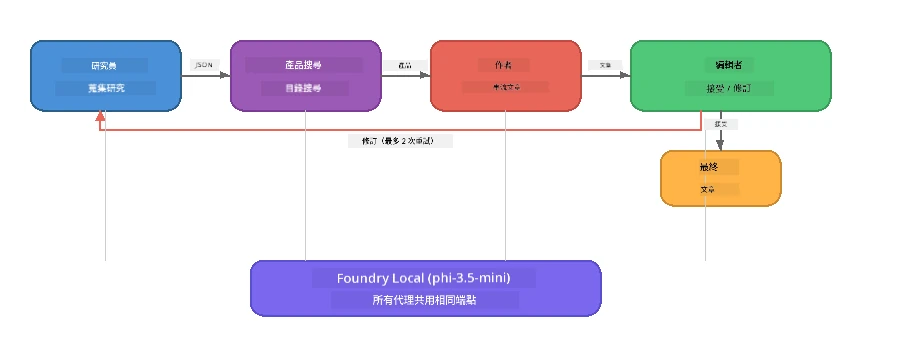

# 第7部分：Zava 創意作家 - 壓軸應用

> **目標：** 探索一個生產級的多代理應用，其中四個專業代理協同合作，為 Zava Retail DIY 製作雜誌品質的文章—完全在您的裝置上運行並使用 Foundry Local。

這是本工作坊的 <strong>壓軸實驗</strong>。它將您學到的一切結合起來——SDK 整合（第3部分）、本地資料檢索（第4部分）、代理角色扮演（第5部分）、多代理協作（第6部分）——打造出一個完整的應用，提供 **Python**、**JavaScript** 和 **C#** 三種語言版本。

---

## 您將探索的內容

| 概念 | 在 Zava Writer 中的位置 |
|---------|----------------------------|
| 4步模型載入 | 共享配置模組啟動 Foundry Local |
| RAG風格檢索 | 產品代理搜尋本地目錄 |
| 代理專業化 | 4個代理擁有不同的系統提示 |
| 串流輸出 | Writer 實時輸出 token |
| 結構化交接 | 研究員 → JSON，編輯 → JSON 決策 |
| 反饋迴路 | 編輯可觸發重執行（最多2次重試） |

---

## 架構

Zava 創意作家採用 <strong>由評估者驅動反饋的順序流程</strong>。三種程式語言的實作皆遵循相同架構：



### 四個代理

| 代理 | 輸入 | 輸出 | 目的 |
|-------|-------|--------|---------|
| <strong>研究員</strong> | 主題 + 選填反饋 | `{"web": [{url, name, description}, ...]}` | 透過 LLM 進行背景研究 |
| <strong>產品搜尋</strong> | 產品情境字串 | 符合的產品清單 | LLM 產生查詢 + 關鍵字搜尋本地目錄 |
| <strong>作者</strong> | 研究 + 產品 + 任務 + 反饋 | 以串流形式產出的文章文字（以 `---` 分隔） | 實時草擬雜誌品質文章 |
| <strong>編輯</strong> | 文章 + 作者自我反饋 | `{"decision": "accept/revise", "editorFeedback": "...", "researchFeedback": "..."}` | 審核品質，必要時觸發重試 |

### 流程

1. <strong>研究員</strong> 收到主題並產生結構化的研究筆記（JSON）
2. <strong>產品搜尋</strong> 使用 LLM 產生的搜尋詞查詢本地產品目錄
3. <strong>作者</strong> 結合研究、產品、任務，串流產出文章，自我反饋附於 `---` 分隔符之後
4. <strong>編輯</strong> 審閱文章並返回 JSON 判決：
   - `"accept"` → 流程完成
   - `"revise"` → 反饋送回研究員與作者（最多2次重試）

---

## 前置條件

- 完成[第6部分：多代理工作流程](part6-multi-agent-workflows.md)
- 已安裝 Foundry Local CLI 且下載 `phi-3.5-mini` 模型

---

## 練習

### 練習1 - 執行 Zava 創意作家

選擇您的程式語言，執行應用程式：

<details>
<summary><strong>🐍 Python - FastAPI 網路服務</strong></summary>

Python 版本以 <strong>網路服務</strong> 方式執行，提供 REST API，示範如何構建生產後端。

**設定：**
```bash
cd zava-creative-writer-local/src/api
python -m venv venv

# Windows（PowerShell）：
venv\Scripts\Activate.ps1
# macOS：
source venv/bin/activate

pip install -r requirements.txt
```

**執行：**
```bash
uvicorn main:app --reload
```

**測試：**
```bash
curl -X POST http://localhost:8000/api/article \
  -H "Content-Type: application/json" \
  -d '{
    "research": "DIY home improvement trends",
    "products": "power tools and paints",
    "assignment": "Write an article about weekend renovation projects for DIY enthusiasts"
  }'
```

回應會以換行分隔的 JSON 訊息串流返回，顯示每個代理的進度。

</details>

<details>
<summary><strong>📦 JavaScript - Node.js CLI</strong></summary>

JavaScript 版本作為 **CLI 應用** 執行，將代理進度及文章直接印出於主控台。

**設定：**
```bash
cd zava-creative-writer-local/src/javascript
npm install
```

**執行：**
```bash
node main.mjs
```

您將看到：
1. Foundry Local 模型載入（下載時顯示進度條）
2. 代理依序執行並顯示狀態訊息
3. 文章實時串流至主控台
4. 編輯的接受/修改決策

</details>

<details>
<summary><strong>💜 C# - .NET 主控台程式</strong></summary>

C# 版本以 **.NET 主控台應用** 執行，具有相同的流程與串流輸出。

**設定：**
```bash
cd zava-creative-writer-local/src/csharp
dotnet restore
```

**執行：**
```bash
dotnet run
```

輸出模式與 JavaScript 相同—代理狀態訊息、串流文章、及編輯判決。

</details>

---

### 練習2 - 研究程式架構

每個語言實作皆擁有相同邏輯元件。比較結構：

**Python** (`src/api/`)：
| 檔案 | 目的 |
|------|---------|
| `foundry_config.py` | 共享 Foundry Local 管理器、模型與客戶端（4步初始化） |
| `orchestrator.py` | 流程協調及反饋迴路 |
| `main.py` | FastAPI 端點 (`POST /api/article`) |
| `agents/researcher/researcher.py` | 基於 LLM 的研究，輸出 JSON |
| `agents/product/product.py` | LLM 生成查詢 + 關鍵字搜尋 |
| `agents/writer/writer.py` | 串流產出文章 |
| `agents/editor/editor.py` | JSON 格式的接受/修改決策 |

**JavaScript** (`src/javascript/`)：
| 檔案 | 目的 |
|------|---------|
| `foundryConfig.mjs` | 共享 Foundry Local 配置（4步初始化含進度條） |
| `main.mjs` | 流程協調與 CLI 入口點 |
| `researcher.mjs` | 基於 LLM 的研究代理 |
| `product.mjs` | 生成查詢與關鍵字搜尋 |
| `writer.mjs` | 串流文章生成（非同步生成器） |
| `editor.mjs` | JSON 格式接受/修改決策 |
| `products.mjs` | 產品目錄資料 |

**C#** (`src/csharp/`)：
| 檔案 | 目的 |
|------|---------|
| `Program.cs` | 完整流程：模型載入、代理、協調者、反饋迴路 |
| `ZavaCreativeWriter.csproj` | .NET 9 專案，包含 Foundry Local 和 OpenAI 套件 |

> **設計說明：** Python 將每個代理拆分成獨立檔案/目錄（適合大型團隊）；JavaScript 每個代理一個模組（適合中型專案）；C# 則全部寫在單一檔案，利用區域方法（適合自含範例）。生產環境中，請根據團隊慣例選擇最佳模式。

---

### 練習3 - 追蹤共享配置

流程中所有代理共用一個 Foundry Local 模型客戶端。研究各語言的設置方式：

<details>
<summary><strong>🐍 Python - foundry_config.py</strong></summary>

```python
from foundry_local import FoundryLocalManager

MODEL_ALIAS = "phi-3.5-mini"

# 第一步：建立管理員並啟動 Foundry Local 服務
manager = FoundryLocalManager()
manager.start_service()

# 第二步：檢查模型是否已下載
cached = manager.list_cached_models()
catalog_info = manager.get_model_info(MODEL_ALIAS)
is_cached = any(m.id == catalog_info.id for m in cached) if catalog_info else False

if not is_cached:
    manager.download_model(MODEL_ALIAS)

# 第三步：將模型載入記憶體
manager.load_model(MODEL_ALIAS)
model_id = manager.get_model_info(MODEL_ALIAS).id

# 共用 OpenAI 用戶端
client = openai.OpenAI(base_url=manager.endpoint, api_key=manager.api_key)
```

所有代理皆從 `foundry_config` 匯入 `client` 和 `model_id`。

</details>

<details>
<summary><strong>📦 JavaScript - foundryConfig.mjs</strong></summary>

```javascript
import { FoundryLocalManager } from "foundry-local-sdk";
import { OpenAI } from "openai";

FoundryLocalManager.create({ appName: "ZavaCreativeWriter" });
const manager = FoundryLocalManager.instance;
await manager.startWebService();

// 檢查快取 → 下載 → 載入（新的 SDK 模式）
const catalog = manager.catalog;
const model = await catalog.getModel(MODEL_ALIAS);
if (!model.isCached) {
  console.log(`Downloading model: ${MODEL_ALIAS}...`);
  await model.download();
}
await model.load();

const client = new OpenAI({ baseURL: manager.urls[0] + "/v1", apiKey: "foundry-local" });
const modelId = model.id;
export { client, modelId };
```

所有代理皆匯入 `{ client, modelId }` 從 `"./foundryConfig.mjs"`。

</details>

<details>
<summary><strong>💜 C# - Program.cs 頂部</strong></summary>

```csharp
await FoundryLocalManager.CreateAsync(
    new Configuration
    {
        AppName = "ZavaCreativeWriter",
        Web = new Configuration.WebService { Urls = "http://127.0.0.1:0" }
    }, NullLogger.Instance, default);
var manager = FoundryLocalManager.Instance;
await manager.StartWebServiceAsync(default);

var catalog = await manager.GetCatalogAsync(default);
var catalogModel = await catalog.GetModelAsync(alias, default);
var isCached = await catalogModel.IsCachedAsync(default);
if (!isCached)
    await catalogModel.DownloadAsync(null, default);

await catalogModel.LoadAsync(default);
var key = new ApiKeyCredential("foundry-local");
var chatClient = new OpenAIClient(key, new OpenAIClientOptions
{
    Endpoint = new Uri(manager.Urls[0] + "/v1")
}).GetChatClient(catalogModel.Id);
```

隨後 `chatClient` 會傳入同檔案中的所有代理函式。

</details>

> **關鍵模式：** 模型載入流程（啟動服務→檢查快取→下載→載入）確保用戶能看到清楚的進度，且模型只會下載一次。這是任何 Foundry Local 應用的最佳實踐。

---

### 練習4 - 理解反饋迴路

反饋迴路使該流程變得「智慧」—編輯能將工作退回修改。追蹤流程邏輯：

```
Orchestrator:
  1. researcher.research(topic, "No Feedback")    ← first pass
  2. product.findProducts(productContext)
  3. writer.write(research, products, assignment)  ← streams article
  4. Split article at "---" → article + writerFeedback
  5. editor.edit(article, writerFeedback)

  WHILE editor says "revise" AND retryCount < 2:
    6. researcher.research(topic, editor.researchFeedback)  ← refined
    7. writer.write(research, products, editor.editorFeedback)
    8. editor.edit(newArticle, newWriterFeedback)
    9. retryCount++
```

**考慮問題：**
- 為何重試限制設為2？增加會發生什麼？
- 為何研究員獲得 `researchFeedback`，而作者獲得 `editorFeedback`？
- 若編輯始終要求「修改」會怎樣？

---

### 練習5 - 修改代理

嘗試改變某個代理的行為，觀察其對流程的影響：

| 變更 | 修改內容 |
|-------------|----------------|
| <strong>嚴格編輯</strong> | 修改編輯的系統提示，讓其一定要要求至少一次修改 |
| <strong>更長文章</strong> | 將作者系統提示中的「800-1000 字」改成「1500-2000 字」 |
| <strong>不同產品</strong> | 新增或修改產品目錄中的產品 |
| <strong>新研究主題</strong> | 將預設的 `researchContext` 改成不同主題 |
| **只回傳JSON的研究員** | 讓研究員回傳10則資料，而非3-5則 |

> **提示：** 三種語言都實作相同架構，您可選擇最熟悉的語言修改。

---

### 練習6 - 新增第五個代理

擴展流程，加入新代理。範例想法：

| 代理 | 流程位置 | 目的 |
|-------|-------------------|---------|
| <strong>事實核查</strong> | Writer 後、Editor 前 | 根據研究資料核實聲明正確性 |
| **SEO優化** | Editor 接受後 | 加入描述、關鍵字、URL 片段 |
| <strong>插畫師</strong> | Editor 接受後 | 產生文章插圖提示 |
| <strong>翻譯者</strong> | Editor 接受後 | 將文章翻譯成其他語言 |

**步驟：**
1. 撰寫代理系統提示
2. 建立代理函式（符合您語言的現有模式）
3. 在協調者中合適位置插入代理
4. 更新輸出/日誌，顯示新代理貢獻

---

## Foundry Local 與代理框架如何協同運作

本應用展示了使用 Foundry Local 架構多代理系統的推薦模式：

| 層級 | 元件 | 角色 |
|-------|-----------|------|
| <strong>執行時</strong> | Foundry Local | 本地下載、管理與提供模型服務 |
| <strong>客戶端</strong> | OpenAI SDK | 向本地端點傳送聊天補全請求 |
| <strong>代理</strong> | 系統提示 + 聊天調用 | 以特定指令實現專業行為 |
| <strong>協調者</strong> | 流程協調員 | 管理資料流、序列與反饋迴路 |
| <strong>框架</strong> | Microsoft Agent Framework | 提供 `ChatAgent` 抽象與模式 |

關鍵洞察：**Foundry Local 取代的是雲端後端，而非應用架構。** 同樣的代理模式、協調策略及結構化交接，無論是雲端模型還是本地模型，皆能使用—只需將用戶端指向本地端點，而非 Azure 端點。

---

## 重要收穫

| 概念 | 所學內容 |
|---------|-----------------|
| 生產架構 | 如何構建帶共享配置與分離代理的多代理應用 |
| 4步模型載入 | 讓用戶可見進度的 Foundry Local 初始化最佳實踐 |
| 代理專業化 | 4個代理各有專注指令與特定輸出格式 |
| 串流生成 | Writer 實時產出 token，支援互動式 UI |
| 反饋迴路 | 編輯驅動重試增進輸出品質，免人力干預 |
| 跨語言模式 | 同一架構在 Python、JavaScript 和 C# 都適用 |
| 本地即生產 | Foundry Local 提供與雲端相容的 OpenAI API |

---

## 下一步

請繼續到[第8部分：以評估為導向的開發](part8-evaluation-led-development.md)，為您的代理建立系統性的評估框架，運用黃金資料集、基於規則的檢查以及 LLM 作為裁判的評分機制。